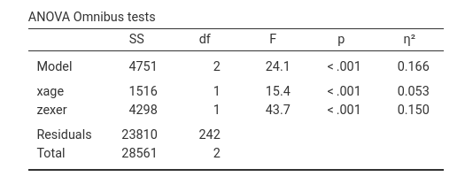
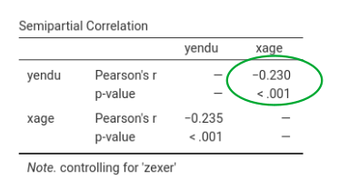
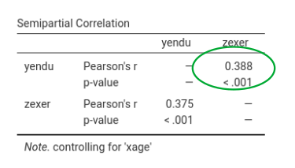
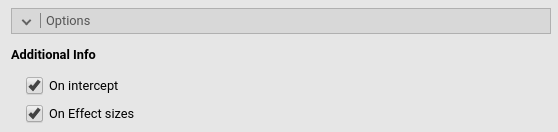
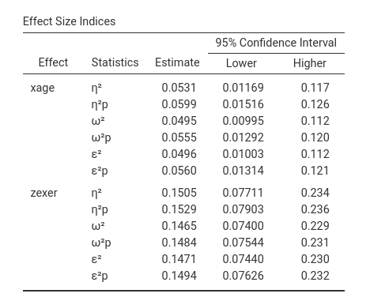

```{r echo=FALSE,results='hide'}
source("../R/functions.R")
options(scipen=999)
```

`r keywords("jamovi, GLM, effect size indices, omega-squared, eta-squared, epsilon-squared")`

`r version("2.6.1")` 

  
# Introduction

Standardized Effect size indices produced by GLM module are the following:

  - $\beta$ : standardized regression coefficients
  - $\eta^2$: (semi-partial) eta-squared 
  - $\eta^2$p : partial eta-squared
  - $\omega^2$ : omega-squared 
  - $\omega^2$p : partial omega-squared 
  - $\epsilon^2$ :  epsilon-squared 
  - $\epsilon^2$p : partial epsilon-squared 

All coefficients but the betas are computed with the approapriate function of the R package [effectsize](https://cran.r-project.org/web/packages/effectsize/index.html), with some adjustment.

# $\beta$ : beta

For continuous variables, it simply corresponds to the B coefficient obtained after standardizing all variables in the model. The standardization of the continuous variables is done before any transformation is applied, so if a complex model requires interaction or polynomial terms, the terms are computed after standardization, and the $\beta$ are consistent.

For categorical variables, however, some comments are in order: Categorical variables are not standardized in `r gamlj()`, so the $\beta$ should be interpreted in terms of standardized differences in the dependent variable between the levels contrasted by the corresponding contrast. Consider the following example: Two groups (variable `groups`) of size 20 and 10 respectively, are compared on a variable Y. If one uses `r gamlj()` default contrast coding (`simple`), the B is the difference in groups means. The $\beta$ is the difference between the average z-scores of the dependent variable between the two groups. 
Assume these are the results:

`r pic("details/glm/effectsize_example1_1.png")`

The beta is 0.352, so it means that if we compute the mean difference  between groups in the standardized _y_, we obtain 0.352. In fact. 

`r pic("details/glm/effectsize_example1_2.png")`

However, the $\beta$ you obtain is not the correlation between _zy_ and _groups_. The correlation is 0.169:

`r pic("details/glm/effectsize_example1_3.png")`

Why is there this discrepancy? Because the groups are not balanced, so when the correlation is computed, the variable _groups_ is standardized, so the contrast coding values depend on the relative size of the groups. The actual groups coding values used by the Pearson's correlations are the following:

`r pic("details/glm/effectsize_example1_4.png")`

Thus, the correlation corresponds to running a regression with _zy_ as dependent variables and a continuous variable featuring either -.695 or 1.390 as values. The $\beta$ yielded by `r gamlj()`, instead, is the mean difference between X levels on the standardized Y. Please notice that other software may yield different  $\beta$'s for categorical variables. 

If the groups are balanced and homeschedastic, the $\beta$ associated with a `simple` contrast corresponds to the fully standardized coefficient.


# $\eta^2$: (semi-partial) eta-squared 

This is the proportion of total variance uniquely explained by the associated effect. Being $SS_{eff}$ the sum of squares of the effect, $SS_{res}$ the sum of squares of the residuals or of SS error, and $SS_{model}$ the sum of sum of squares of the whole model, we have:

$$\eta^2={{SS_{eff} \over {SS_{model}+SS_{res}}}}$$

where $SS_{model}+SS_{res}=SS_{total}$ and $SS_{total}=\sum(y_i-\bar{y})^2$ and $SS_{model}=\sum(\hat{y_i}-\bar{\hat{y}})^2$. 

Please notice that although the computation of the effect size indexes and their confidence intervals is carried out employing [effectsize R package](https://github.com/easystats/effectsize), `r gamlj()` makes a correction to the computation of $\eta^2$ and of the other non-partial indices. `effectsize` R package, infact, defines the total sum of squares as $SS_{total}^*=\sum{SS_{f}+SS_{res}}$, where $f$ is any effect in the model. For balanced designs and many other models, $SS_{total}^*=SS_{total}$, so no issue arises. However, there are certain models in which $SS_{total}^*\ne SS_{total}$, and so the index looses some of its properties when computed based on  $SS_{total}^*$. `r gamlj()` operates a correction such that all the non-partial indeces are always computed based on $SS_{total}=SS_{model}+SS_{res}$.

With the correction, one property $\eta^2$ retains even when $SS_{total}^*\ne SS_{total}$ is that $\eta^2=r_{sp}^2$, where $r_{sp}$ is the semi-partial correlation [@cohen2014applied]. We can use the `exercise` dataset from [@cohen2014applied] to see this in practice (refer to `r link_pages(nickname="exercise")` for a complete analysis). If we run a multiple regression `yendu~xage+zexer` and ask for the $\eta^2$'s, we obtain the following results:



Going in `r jamovi()`, `r opt("Regression->Partial correlation")` we can compute the semi-partial correlation of each IV coviariating the other. This gives:



Squaring it gives $r_{yx.z}^2=-0.230^2=`r (-0.230)^2`$, which is equal to the corrisponding $\eta^2=.053$.



Squaring the second $r_{sp}^2$ gives $r_{yz.x}^2=0.388^2=`r (0.3879)^2`$, considering rounding, which is equal to the corrisponding $\eta^2=.150$.

If we used $SS_{total}^*=\sum{SS_{f}}+SS_{res}$, results would be:

* $SS_{total}^*=1516+4298+23810=`r 1516+4298+23810`$
* $SS_{yx.z}^*=1516/29624 =`r 1516/29624`$
* $SS_{yz.x}^*=4298/29624 =`r 4298/29624`$

that are clearly not corresponding to the $r_{sp}^2$, as they should be. We should note, however, that the two methods of estimation usually give very similar results, even when $SS_{total}^* \ne SS_{total}$ and exact the same results when $SS_{total}^*=SS_{total}$.

The same reasoning holds for all the non-partial indices.

## Isn't this weird (technical stuff)?

For many people, the fact that $\sum{SS_{f}} \ne SS_{model}$ may come as a surprise. Maybe because in the ANOVA tradition, with balanced designs, $\sum{SS_{f}}$ is always equal to $SS_{model}$, or maybe because it would be nicer if it was always like in the ANOVA. Since we have to accept that in the GLM $\sum{SS_{f}}$ is not necessarily equal to $SS_{model}$, let us see when this happens. 

There are two cases: The easiest to understand is when $\sum{SS_{f}} \lt SS_{model}$. This case happens when the independent variables are correlated so each variable explains a unique part of the variance, but the model sum of square involves also some shared variance, which ends up in $SS_{model}$ but not in $\sum{SS_{f}}$.

A little trickier is the case when $\sum{SS_{f}} \gt SS_{model}$, because it seems strange that the sum of effects is larger than the overall combined effect.

Consider a regression $y=a+b_{yx.z}x+b_{yz.x}z$. Recall the the $SS_{yx.z}$ ($x$ explains $y$ keeping constant $z$) is computed as $SS_{total}-SS_{yz}$, where $SS_{yz}$ is the sum of squares explained by $x$ without $z$ in the model, and $SS_{yz.x}=SS_{total}-SS_{yx}$. It follows that the   $\sum{SS_f}=2\cdot SS_{total}-SS_{yx}-SS_{yz}$ is larger than $SS_{total}$ when 
$SS_{total} > SS_{yx}+SS_{yz}$. This necessarily means that at least one variable explains more variance while keeping constant the other than alone. 

Indeed, in the example above about exercising, the SS of _age_ alone is 452, and _exer_ alone is 3234, which sum to `r 3234+452`, less than 4751, the multiple regression model SS. 

The question is now: when does this happen? Well, it happens when the $B_{yx}$, the coefficient associated with $x$ in simple regression, is smaller (in absolute value) than the partial coefficient of $B_{yx.z}$ of a multiple regression. Because $B_{yx.z}=B_{yx} - B_{yz.x}\cdot B_{xz}$, this happens when $B_{yx}$ and $B_{yz.x}\cdot B_{zx}$ have different signs: therefore, we have a suppression effect!


In the example above, focusing on _age_, we have $B_{yx.z}=-.257$, $B_{yz.x}=.916$ and $B_{zx}=.134$, thus  $B_{yz.x}\cdot B_{zx}=.916*.134=`r .916*.134`$, which has a different sign than $B_{yx.z}=-.257$. 


# $\eta^2$p : partial eta-squared

This is the proportion of partial variance uniquely explained by the associated effect. That is, the variance uniquely explained by the effect expressed as the proportion of variance not explained by the other effects. Here the variance explained by the other effects in the model is completely partialed out. Its formula is:

$$\eta^2p={{SS_{eff} \over {SS_{eff}+SS_{res}}}}$$

clearly, if there is only one independent variable, $\eta^2=\eta^2p$

# $\omega^2$ : omega-squared 

This is the _expected value in the population_ of the proportion of variance uniquely explained by the associated effect. In other words, it is the unbiased version of $\eta^2$. There are different formulas to visualize its computation, here is one. If $df_{res}$ are the degrees of freedon of the residual variance, $df_{eff}$ are the degrees of freedom of the effect, we have:

$$\omega^2={{SS_{eff}-SS_{res} \cdot ({df_{eff}/df_{res}) \cdot }}\over{ SS_{model}+SS_{res}(df_{res}+1)/df_{res}}}$$


It's clear that omega is similat to $\eta^2$, but applies a correction for the denominator.


# $\omega^2$p : partial omega-squared 

This is the _expected value in the population_ of the proportion of _partial_ variance uniquely explained by the associated effect. In other words,it is the unbiased version of $\eta^2p$. With N being the sample size, We have:

$$\omega^2p={{SS_{eff}-SS_{res} \cdot ({df_{eff}/df_{res}) \cdot }}\over{ SS_{eff}+SS_{res} \cdot [{(N-df_{eff})/df_{res}}]
}}$$


It's clear that omega is similat to $\eta^2p$, but applies a correction for the degress of freedom. In fact, as N increases, the two indices converge.


# $\epsilon^2$p : epsilon-squared 

Epsilon-squared is  another correction of $\eta^2$, but the correction involves only the estimation of the sum of squares of the effect, not the partial variance on which the effect is compared

$$\epsilon^2={{SS_{eff}-SS_{res} \cdot ({df_{eff}/df_{res}) \cdot }}\over{ SS_{model}+SS_{res}}}$$


# $\epsilon^2$p : partial epsilon-squared 

As for the non-partial Epsilon, the partial Epsilon-squared is  a correction of $\eta^2p$, but the correction involves only the estimation of the sum of squares of the effect, not the partial variance on which the effect is compared

$$\epsilon^2p={{SS_{eff}-SS_{res} \cdot ({df_{eff}/df_{res}) \cdot }}\over{ SS_{eff}+SS_{res}}}$$

# Simple Effects

From version 2.6.1 on, all the effect size indices are available also for the simple effects. To compute them, `r gamlj()` extracts the SS of the simple effect from `R emmeans` F-tests. The SS residuals and SS model is extracted from the model summary, given that both SS do not change when simple effects are computed. Then the indices are computed using the previously described formulas. 

In particular, if the simple effect is $se$:
$$SS_{res}=\sigma^2\cdot df_{res}$$

where $\sigma$ is extracted as `sigma(model)`. 

$$SS_{model}={{F_{model}\cdot df_{model}} \cdot {SS_{res} \over {df_{res}}}}$$

and 

$$SS_{se}={{F_{se}\cdot df_{se}} \cdot {SS_{res} \over {df_{res}}}}$$

# Confidence intervals

In option tab `Options` it is possible to ask additional tables for the effect size indices, containing the effect size indices and their confidence intervals (here an example with the `exercise` dataset)





Details for the confidence intervals computation can be found in [Ben-Shachar, Makowski & Lüdecke (2020). Compute and interpret indices of effect size. CRAN](https://github.com/easystats/effectsize)


`r issues()`

# Additional references