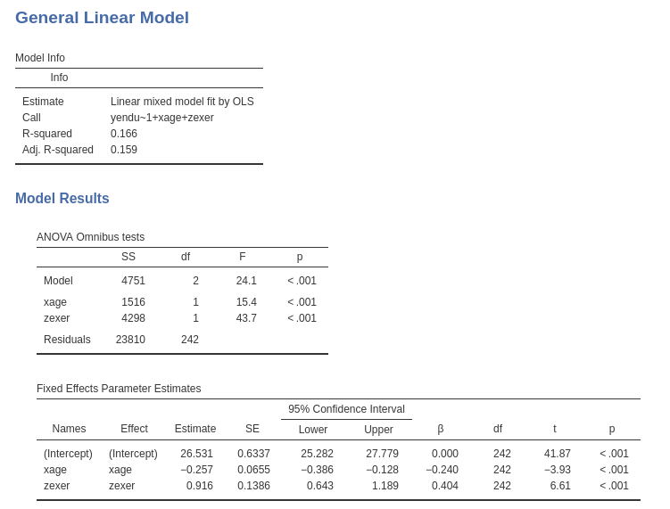
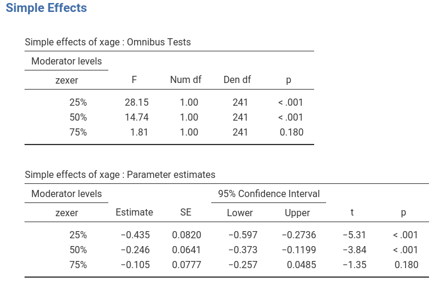
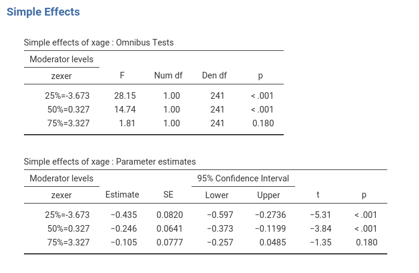
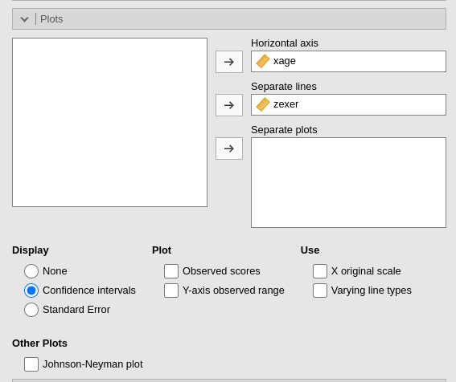
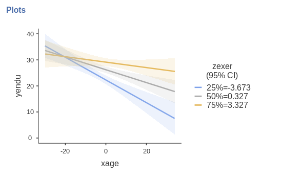
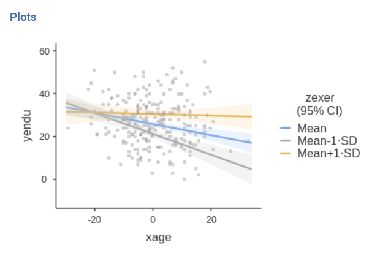

```{r echo=FALSE,results='hide'}
library(mcdocs)
mcdocs_init()
```


`r keywords("Multiple regression, moderated regression, simple slopes")`

In this example we tackle a moderated regression analysis with simple slopes analysis and simple slopes graphs. Data are from   [Cohen et al 2003](http://psycnet.apa.org/record/2002-18109-000) and can be downloaded  [here](https://github.com/mcfanda/gamlj_docs/blob/master/data/exercise.csv). A detailed comparison between the following results and results obtained with other software (SPSS, PROCESS, and R) can be found in `r link_pages(nickname="ros_exercise")`.

# The research design

The research is about physical endurance associated with age and physical exercise. 245 participants were measured while jogging on a treadmill. Endurance was measured in minutes ('yendu' in the file). Participants' age (`xage` in years) and number of years of physical exercise (`zexer` in years) were recorded as well (in jamovi `Exploration` -> `Descriptive`)  


The researcher is interested in studying the relationships between endurance, age, and exercising, with the hypothesis that the effect of age (expected to be  negative) is moderated by exercise, such that the more participants work out (higher levels of `exer`) the less age negatively affects endurance. 

# Understanding the problem

We can think about this analytic problem as a multiple regression, where the effect of age and exercise can be estimated while keeping constant the other variable. However, the researcher puts forward a _moderation hypothesis_, because s/he expects the effect of age to change for different levels of exercising. We than need an interaction between age and exercise.

We first run a multiple regression (to warm up), then we estimate a multiple regression with an interaction (moderated regression) and we probe the interaction with a simple slope analysis and simple slope graphs. Technical details can be found in [Cohen et al 2003](http://psycnet.apa.org/record/2002-18109-000), or in [Preacher website](http://quantpsy.org/interact/interactions.htm).

# GLM

## Multiple regression

jamovi GAMLj module for GLM requires to set the variables in the right field depending on their role in the model and their type. 


Thus, we push `yendu` in the `Dependent Variable` field and both `xage` and `zexer` in the `Covariates` field, being both variables quantitative.

As soon as the variables are set, jamovi  fills in the tables in the output panel with the estimation results. However, it is worth noticing that the statistical model has been defined by default by the software: We can see that in the `Model` tab.


jamovi, following a somehow old tradition established by SPSS, automatically includes continuous independent variables in the model without their interaction. For categorical variables the default behavior is to include both main effects and interactions.

Thus, the model we are estimating now is `yendu~xage+zexer`.

## Results



Results show that both age and exercising have an effect on endurance while keeping constant the other variable. The `Model Info` table shows the R-squared, R-squared=.166 (adjusted .159), indicating the the two independent variables together explain around 16% of the dependent variable variance.

The `Model Coefficients` table reports the estimates of the B coefficients. We can interpret the B coefficients (under `Estimate` column  of `Model Coefficients` table) because the units of the variables are intuitively clear:

* `xage` B=-.257: While keeping exercise constant, one year more in age corresponds on average to a decrease in endurance of .257 minutes. 
* `zexer` B=-.916: While keeping age constant, one year more of exercising corresponds on average to an increase in endurance of .916 minutes.

For each coefficient the confidence interval is also reported.

A special note should be made for the intercept (nobody interpret intercepts, but we do now). The intercept is the expected value (the mean) of the dependent variable, estimated for all independent variables equal to zero. In jamovi GLM, however, continuous variables are centered to their mean by default (this will prove very helpful later on), thus the interpretation of the intercept should be: the expected value of the dependent variable estimated for the average values of the independent variables. This is not bad, after all, because 26.5 is actually the mean of the dependent variables (see descriptives above), thus a plot of the effects will be centered around the dependent variable mean. In case we want the independent variables not to be centered, we can select a different scaling in the `Covariates Scaling' tab.

In general, we want to report standardized effect size indexes, for the sake of comparison, meta-analysis, APA task forces (and probably the Marvel Avengers league). jamovi GLM offers a plethora of them: 

* betas: standardized coefficients.
* eta-squared: variance explained over the total variance of the dependent variable (proportion).
* partial eta-squared: variance explained over the variance not explained by other effects (proportion).
* omega-squared: expected proportion of variance explained. It is computed as variance explained over the variance not explained by other effects, expected in the population.

By ticking the options in the variable definition panel, we obtain the ES indexes as follows.


## Moderated regression

To include the interaction we simply add the interaction effect in the `Model Terms` in the `Model` tab.


The interaction is pushed in the `Model Terms` by selecting the variables on the left side and clicking `interaction` in the "arrow" cascade menu.


## Results

Let's us first focus on the parameters estimates, the B coefficients.


The interaction term appears to be statistically significant, B=0.047, t(241)=3.48,p<.001,$\eta^2$=0.048, justifying interpreting the first-order effects as conditional effects. Because variables are centered to their means, we can interpret the first-order effect as "average" effects. On average:

* `xage` B=-.261:  one year more in age corresponds on average to a decrease in endurance of .26 minutes. 
* `zexer` B=-.972:  one year more of exercising corresponds on average to an increase in endurance of .97 minutes.

One can also report the betas (last column in the `Model Coefficients` table). Please notice that in jamovi GLM, the estimates of the betas are correct also in the presence of the interaction, because the variables are standardized before the interaction term is computed.

## Simple Slopes

We can now probe the interaction. We go to `Simple effects` tab and select `xage`  as `Simple effects variable` and `zexer` as `Moderator`. In this way we obtain the effect of age computed for high exercise (`zexer` centered to 1 SD above average), the main effect of age (`zexer` centered to its mean) and the effect of age computed for low exercise (`zexer` centered to -1 SD above average).


jamovi GLM produces both the F-tests and the parameter estimates for the simple slopes. We focus on the latter table now.


The first row of the table shows the simple slopes of age (the effect of age) computed for exercise equal to minus one standard deviation (-4.78). The effect of age is negative and strong ,B=-.487, t(241)=-5.289,p<.001. Going down the table we find  the simple slope of age (the effect of age) computed for average exercise (0): The average effect of age, B=-.261, t(241)=-4.085,p<.001, is negative and weaker than for high exercise. Finally, for high exercise (+4.78), the effect is weak and not significant, B=-.036, t(241)=-0.400,p=.690.

One can change the conditioning levels of the moderators by going back to `Covariates scaling` panel. If we want to use the percentiles (25%,50%,75%), for instance, we can flag the option in `Covariates scaling` accordingly.


The simple effects are now changed, because they are estimated for a different set of values of the moderator.



One can further tweak the appearance of the tables by selecting different value/labels options in `Covariates Scaling` panel. For instance, by selecting `Values + Labels` one obtains detailed labeling in the tables.





## Simple Slopes Plot

We can get a clear picture of the interaction by asking for a plot. Also the plot module takes care of centering the variables in a way that makes the plot clearly understandable. 



The command plots the effect of the `Horizontal axis` variable for three levels (decided in `Covariate scaling`) of the `Separate Lines` variable. 



The nice plot we get shows the simple effects (simple equations to be precise) with the prediction confidence intervals indicated by the colored shades around the lines. If needed, the confidence intervals can be substituted with the standard errors of the estimates or they can be removed completely.

Finally, in order to give a more honest account of the model fit, we can visualize the simple slopes over the the actual data. 



# Related examples
`r include_examples("glm")`

`r issues()`