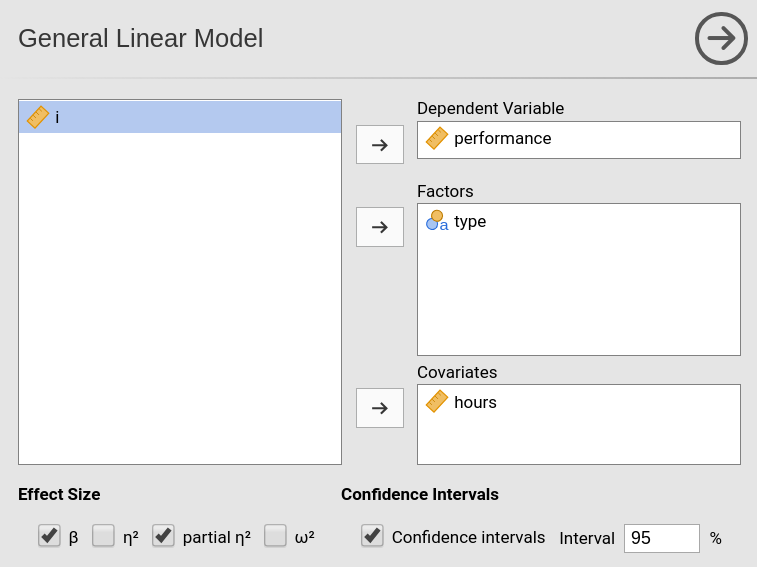

```{r echo=FALSE,results='hide'}
source("../R/functions.R")
```


`r keywords("Non-linear regression, Polynomial model, non-linear effects, linear model")`

`r version("1.5.0")`

In this example we work out an example of polynomial regression in the GLM, using jamovi GAMLj. Data are (simulated data) [here](https://raw.githubusercontent.com/gamlj/gamlj/master/data/qsport.csv). 

# The research design

The dataset has three variables of interest. Imagine we measured athletes performace in a match using a standard scale and the number of hours they trained in a week. The idea is to study the relationship between hours of training and performance. Because training can be good for performance but training too much may have detrimental effects on performance, we foresee a non-linear effect of training hours on performance. Furthermore, athletes are divided in two groups (variable `types`), professionals (`P`) and amateurs (`A`), and we want to check if the effects of training is different in the two groups.


# Non-linear (polynomial) effects

## Input

We first set up a linear regression with only linear effects. We launch `General Linear Model` from the `Linear Models` menu. We put `performance` in the dependent variable field and `hours` in the `covariate`. 


By defining the variables we obtain a simple regression in the output, but we want to specify a quadratic effect of `hours`, so we go to the `Model` panel. As soon as we select `hours` in the `Components` field, we can see on the right of the variable a little `1` appearing. 


That little number indicates the order of the effect that we want to insert in the model, that is, the exponent of the term we want to include. The number `1` (default) means `linear` effects.  To include a quadratic effect (second order), we should increase the number to `2`, as in the Figure. We can then push the arrow to move the quadratic term into the model.


If we want, for instance, also the cubic term, we should increase the number to `3` and move it to the model as well.


## Results


Results show that the polinomial (linear+quaratic+cubic) effects of `hours` on `performance` explain about 50% of the variance $R^2=.486$. 


BY inspecting the F-tests and the estimates (B coefficients) we can see that we have a _linear_ ($hours$) and a _quadratic_ ($hours^2$) effect of `hours` to `performance`, whereas the _cubic_ effect ($hours^3$) is trivial and can be disregarded (the $\eta^2p$ is practically zero).


When it comes to polynomial models, the best way to figure out the relationship between variables is to plot the effects. We can do that by selecting the `Plot` panel and by putting `hours` in the `Horizontal Axis` field (mind that in GAMLj default the IV is centered to its mean, to obtain a nice plot I changed the IV scaling to `none` in `Covariates scaling` panel).


We can see that, on average, up to 10 hours, one more hour of training is good for the performance, but after 10 hours, increasing training is not advantageous in terms of performance. That is, we have a curvilinear effect of the IV on the DV.

# Conditional polynomial effects

We can now analyze possible differences due the the type of athletes by introducing `type` as a factor in the model.



When we go to the `Model` panel, we see that the main effect of `type` is automatically inserted in the model terms. 


However, we want to see if the effect of `hours` depends on `type` so we need to include the interactions. We need two interactions: the interaction _linear hours_ by _type_, and _quadratic hours_ by _type_ (I removed _cubic hours_ based on the previous analysis).

For the _linear_ by _type_ interaction, we select both `type` and `hours` and we press the `arrow` to move the interaction term to the `Model Terms` field.


For the _quadratic_ by _type_ interaction, we select both `type` and `hours`, and we increase the exponent of `hours` to signal that we want the quadratic term to interact with `type`. We press the `arrow` to move the interaction term to the `Model Terms` field.


We have done setting the new model.

## Results

The model info table shows the actual R-syntax model we estimated and the $R^2$, the latter clearly larger than the $R^2$ of the previous model.


As regards the effects, we can see that we do have a _quadratic hours_ by _type_ interaction, so we can say that the effect of `hours` on `performance` has a different shape depending on the type of athlete.


Inspecting the plot makes the interpretation easier.


For professional athletes (`P`), the performace increases along hours of training almost linearly, thus the more hours they train, the better the performance. For amateur athletes (`A`) the performance is positively linked to training hours up to 9 hours, after which more training means a strong decrease in performance. Thus, for amateurs there's a U-shaped effect of training on performance, whereas for pro's the relationship is practically linear.

# Simple effect analysis (Advanced)

## Input

Assume we want to test groups differences along the training hours continuum. That is, we want to test the difference between the two groups at different levels of training length. To do that, it is convinient to rescale the variables: We standardize the independent variable and code the factor with `simple` coding, which yields coefficients associated with the factor equal to the groups difference in the expected value of the dependent variable.


We then ask for the simple effects of `type` for different levels (mean and mean plus/minus one SD) of `hours`.


## Results

The simple effects tables show that for low (-1SD) and high (+1SD) training the groups are statistically different and the difference is to the advantage of the Professional group ($P-A=2.977$ and $P-A=2.667$), whereas for average training the performance does not seem to be different between the two groups ($P-A=-0.0403$). By changing the covariate conditioning in the `Covariate Scaling` panel one can test these differences for all values of `hours` that one wishes.


To visualize what we are doing, let's see the plot after standardizing the IV.


In practice, the simple effects tests we have seen tested the difference between the blue and the yellow curve at `hours` equal to -1, 0, and 1 . Because we standardized `hours`, those values correspond to -1SD, mean, and +1SD of training hours.


# Related examples
`r include_examples("glm")`

`r issues()`