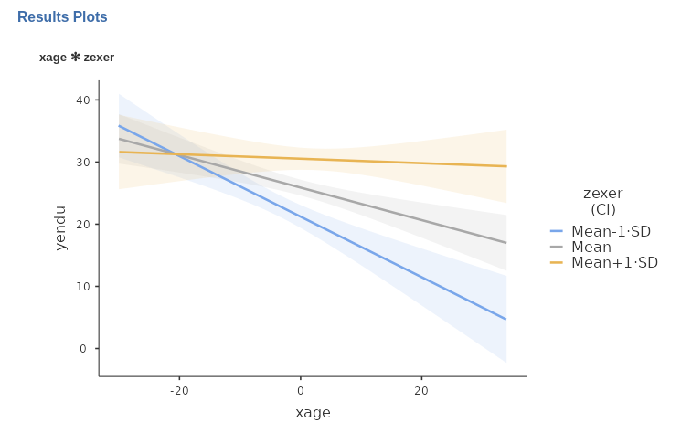

```{r echo=FALSE,results='hide'}
library(mcdocs)
mcdocs_init()
```


`r keywords("johnson-Neyman, moderation, simple slopes")`

`r version("3.3.4")` 


In  `r link_pages(nickname="exercise")` example we have seen how to estimate and interpret interactions with continuous variables in a linear model. Now we show an example of the Johnson-Neyman plot, useful when dealing with interactions among continuous variables. Data are from   [Cohen et al 2003](http://psycnet.apa.org/record/2002-18109-000) and can be downloaded  [here](https://github.com/mcfanda/gamlj_docs/blob/master/data/exercise.csv). We are going to show how Johnson-Neyman plot employing a General Linear Model, but the same reasoning (and software options) can be applied to interactions in  `r link_pages(nickname="gzlm")`,`r link_pages(nickname="mixed")`, and `r link_pages(nickname="gmixed")`. 

`r modulename()` implements the Johnson-Neyman plot employing code taken from the [R pacakge interactions](https://interactions.jacob-long.com/reference/johnson_neyman) by Jacob A. Long. We had to alter the code to fit `r jamovi` plotting methods, so some adjustments were required. This means that possible bugs are not to be associated with the original R package.

# The Johnson-Neyman procedure

The JN plot depicts the size of the effect (the simple slope) of an independent variable on a dependent variable as a function of the levels of a moderator. The same plot provides the two values (if any) of the moderator at which the slope of the predictor goes from non-significant to significant. 

# The example

The research is about physical endurance associated with age and physical exercise. 245 participants were measured while jogging on a treadmill. Endurance was measured in minutes ('yendu' in the file). Participants' age (`xage` in years) and number of years of physical exercise (`zexer` in years) were recorded as well. 

The researcher is interested in studying the relationships between endurance, age, and exercising, with the hypothesis that the effect of age (expected to be  negative) is moderated by exercise, such that the more participants work out (higher levels of `zexer`) the less age negatively affects endurance. 

# Results

We focus on the parameters estimates, the B coefficients.


The interaction term appears to be statistically significant, B=0.047, t(241)=3.48,p<.001,$\eta^2$=0.048, justifying interpreting the first-order effects as conditional effects. Because variables are centered to their means, we can interpret the first-order effect as "average" effects.


## Simple Slopes

One way to probe the interaction is to ask for simple effects. We go to `Simple effects` tab and select `xage`  as `Simple effects variable` and `zexer` as `Moderator`. In this way we obtain the effect of age computed for high exercise (`zexer` centered to 1 SD above average), the main effect of age (`zexer` centered to its mean) and the effect of age computed for low exercise (`zexer` centered to -1 SD above average). `r jamovi` GLM produces both the F-tests and the parameter estimates for the simple slopes. We focus on the latter table now.


## Simple Slopes Plot

We can get a clear picture of the interaction by asking for a plot. The plot module takes care of centering the variables in a way that makes the plot clearly understandable. 


The command plots the effect of the `Horizontal axis` variable for three levels (decided in `Covariate scaling`) of the `Separate Lines` variable. 



The nice plot we get shows the simple effects (simple equations to be precise) with the prediction confidence intervals indicated by the colored shades around the lines. If needed, the confidence intervals can be substituted with the standard errors of the estimates or they can be removed completely.

# Johnson-Neyman plot

We can now ask the question: For which range of values of the moderator `zexer` is the effect of age significant, and for which values is not? That is the aim of the Johnson-Neyman plot. We ask for it by going to panel `Plots`, ask for the plot  selecting `Johnson-Neyman plot`, and obtain the following:


`r pic("examples/glm4/plots.2.png")`

The X-axis shows the (centered) `zexer` values, and Y-axis shows the size of the effect (simple slope) of `age`. So, we can see that below `zexer=2.533` and above `zexer=13.93` the effect of `age` is significant at $p<.05$, whereas within that range the effect of `age` is not significant. We can also see that below `zexer=2.533` the effect of `age` is negative, whereas above `zexer=13.93` is positive.

When the scale of the moderator is untuitivelly clear, it is better to obtain the plot using the moderator original scale. We can do that by selecting `X original scale` in the `Plots` panel. 

`r pic("examples/glm4/plots.3.png")`

The plot now show the effect of `age` as a function of `zexer` not centered. So, we can see that the effect of age is significant for people that exercise for less than 13 years (recall that `zexer` is years of weekly work-out) the effect of `age` is negative and significant, whereas for people with more than 24 years of exercising the effect of `age` is positive and significant.

That's the Johnson-Neyman plot.

# Simple Johnson-Neyman plots

One nice feature of `r modulename()` is that allows for estimating the simple Johnson-Neyman plot at different levels of a third (or in general higher orders) moderator. Assume, for instance, that in these data there was a grouping variables, say `nationality`. The variable is not in the data so we simulate one for didactic purposes by randomly assigning the participants to two groups. 

`r pic("examples/glm4/input.1.png")`

and include it in the model, with all interactions.

`r pic("examples/glm4/input.2.png")`

We now plot again the results, broken down by `nationality`.

`r pic("examples/glm4/plots.4.png")`

(being groups at random we do not see much of a difference in the plots, but the idea is that the `xage*zexer` interaction may be different at different levels of the moderator).

We can also ask the question: for which levels of `zexer` is the effect `xage` significant, evaluating it at different levels of nationality? In other words, we would like to plot a JN plot for `age` and `exer` for each level of `nationality`.

We just need to select, `Johnson-Neyman plot` again, and we get the results.

`r pic("examples/glm4/plots.5.png")`

Again, being the groups randomly generated, we do not see much of a difference, but it can be seen that the two plots are indeed different. Obviously, the larger the three-way interaction, the more different will the plots appear.

With the _simple JN plots_ we can evaluate the range of significance of an effect, estimated at different levels of any combinations of moderators (any combination of levels of the variables listed in `Separate plots`).

# Another Example

A more (visually) compelling example can be examined using `manymodels` data in the `r jamovi` data library. That is a simulated dataset made on purpose to test `r modulename()`. In this dataset `x` and `z` are continuous variables and `cat3` is a three-group categorical variable. We need to estimate the GLM model as follows:

`r pic("examples/glm4/input.3.png")`

with all possible interactions.

`r pic("examples/glm4/input.4.png")`

In this case we have a (almost) significant 3-way interaction `x*z*cat3`, which indicates the the 2-way `x*z` interaction varies across levels of `cat3`. Asking the plot 

`r pic("examples/glm4/input.5.png")`

produces a nice set of JN plots, in which it is clear how the `cat3` moderator influences the way the effect of `x` varies for different levels of `z`.

`r pic("examples/glm4/plots.6.png")`

We can see that for `cat3=1` the effect of `x` is significant for `z` below -2.551 and above 0.035. For `cat3=2` the effect of `x` is significant only within `-1.969> z < .525`, whereas for `cat3=3`, the effect of `x` is significant for any `z>-1.63`.

Those are _simple JN plots_.


`r include_examples("glm")`

`r backto("glm")`

`r issues()`