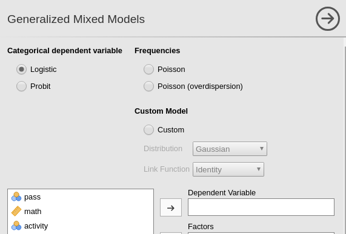
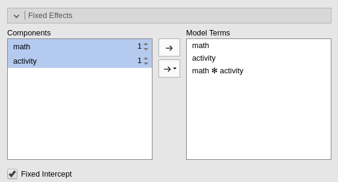
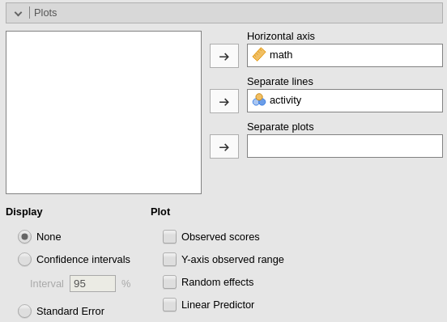
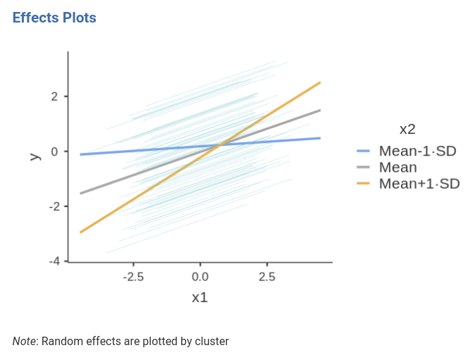

```{r echo=FALSE,results='hide'}
library(mcdocs)
mcdocs_init()
```


```{r echo=FALSE,results='hide'}
data<-read.csv2("../data/school_exam.csv")
```

`r keywords("jamovi, mixed models, generalized linear models, logistic mixed model, multilevel logist, moderated regression, interactions")`


In this example we estimate a multilevel logistic regression, with interactions, using `r jamovi` GAMLj module. 

One can follow the example by downloading the
`r datafile("cvs file","school_exam.csv")` and open it in [jamovi](https://www.jamovi.org/download.html). Be sure to install the new version of GAMLj module from within jamovi library. Data are simulated for educational purposes, and should be used only for exercising.

# The research design

Imagine a study conducted in `r length(unique(data$school))` schools. In each school the same exam is taken by students of equivalent age and grade. For each student, we recorded whether the student passed the exam, `pass`, the student's score in math test, `math`, and the number of extracurricular activities the student undertook during the semester.

The researcher wants to estimate the effect of the math test on the probability of passing the exam, and also test whether the amount of extracurricular activities may moderate the math effect.

Each school has a different number of students, ranging from `r min(table(data$school))` to `r max(table(data$school))`. Each student presents three values: the score in the `math` test, the number of `activity` undertaken and whether the exam was passed `pass=1` or not, `pass=0`.


Here are the frequency tables for the `pass` variable and an abridged table for the schools variable. `frequencies` -> `Contingency tables`.


...


# Understanding the problem

Because the outcome variable, `pass`, is a dichotomous one, we need a logistic model (generalized linear model). However, we have students clustered within schools, thus we need a mixed model (random intercepts and slopes) to account for clustering dependence. In other terms, we need to take into the account the _multilevel structure_ of the data, with students nested within schools.


# Mixed logistic model

Let's start by opening the `Generalized Mixed Models` sub-module in GAMLj menu.


Here we can choose which specific model we want to estimate. We can leave the selected option to `Logistic`, which is the module default.



We can now define the variables role in the model, by selecting the dependent variable `pass` and the covariates `math` and `activity`. We put the latter ones in `Covariates` because they are continuous variables. Notice that `r jamovi` recognizes `activity` as a nominal variable, because it lists only integer values. GAMLj automatically transforms it into a numerical variable and uses it as covariate.


## The model

We need to specify the model, in terms of fixed effects and random effects. First, we expand the `Fixed Effects` tab and include the interaction into the model terms, by selecting both variables on the left panel and pushing them on the right.



Then we expand the `Random Component` tab and fill in the intercept as random effects across school (we will add random terms later on, here we start with the intercept as random for the sake of simplicity).


## Results

The first table, `Model Info` recaps the model call (the formula used in R), the description of the model (family and link function), and some overall model index. Here we can look at the R-squared, for datail see [technical details](gzlm_specs.html) and [R piecewise package implementation](https://cran.r-project.org/web/packages/piecewiseSEM/) 


Based on the R-square indexes, we can see that our error of approximation of the data decreases of 4% ( ${R^2}_{marg}=.039$ ) thanks to the fixed effects, whereas all effects together decrease our error of approximation of 37% (${R^2}_{cond}=.378$). 

The other information in the table helps to interpret the results. In particulat, the row `Direction` is useful. It gives the definition of the logit that is used, including which is the reference group of the dependent variable. In the example, it indicates that we are predicting `pass=1` against `pass=0`. Thus we know that all the independent variables positively related with the logit are positively related with the odd of passing the exam.

## Random component


For this model, with only intercepts as random coefficients across schools, the random component table is pretty simply. It shows the variance of the random intercepts. It is non-zero, so we are happy.

## Omnibus test


The omnibus (Wald) Chi-Squared test tests the main effects of the independent variables and their interaction. Notice that in GAMLj the continuous variables are centered to their mean by default, and thus we can interpret the linear effects of `math` and `activity` as _average effects_ or _main effects_ . Based on the p-value, our results seem to support an interaction and two main effects.

## Parameter estimates

The same information can be extracted from the parameters estimates table.


Here we also obtain the `odd ratio` (exp(B)) of the effects, useful to interpret the effects in terms of rate of change in the dependent variable odd.

## Plots

For generalized linear models, mixed included, a good strategy is to visualize the effects by plotting the predicted values. GAMLj plots the predicted values after transforming them back to the original scale of the dependent variable, in this case probability.

Ask for the plot in the `Plots` panel. Add `math` as the variable whose values go in the `Horizontal axis` and `activity` as `separate lines`. 



Because `activity` is a continuous variable, the separated lines will show the effect of `math` for three _interesting_ values of the moderator `activity`. The defaul in GAMLj is to show effects for the moderator set at `Mean-1SD`, `Mean`, and `Mean+1SD`. This default can be altered in the `Covariates scaling` tab.


Thus, for the average level of `activity` (gray line) there's an increase of probability of passing the exam along the scores of `math`. The increase, however, is much stronger for students with one standard deviation above average of activities (yellow line), whereas for student with a few activities (blue line), the probability of passing the exam does not change much depending on the `math` score (recall the data are simulated, the interpretation is provided only as an exercise).

We can also visualize the random effects by asking them in the imput panel.


Notice that the random effects depict different curves for different schools, even though the only random effect is the intercept. This is not weird in generalized linear models. The random intercept is estimated for the logit, thus it is the intercept of the straight lines computed for predicting the logit. When the logit is transformed back to probabilities, the function relating Y to X is no longer a straight line, and its shapes changes depending also on the value of the interecpt. If we wish to appreciate how the random _linear_ effects vary, we can ask for the `Linear Predictor` plot, which plots the effects in the logit scale.




As expected, the random effects are all parallel, because we allowed only the intercepts to be random.

At this point, one can expand the model by allowing also the IVs effects to vary, and evaluate the goodness of the models, comparing them, and further investigate the relationships we observed, with simple effects analysis and additional plots.

# Related examples
`r include_examples("gmixed")`


`r issues()`