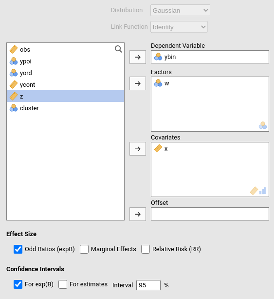
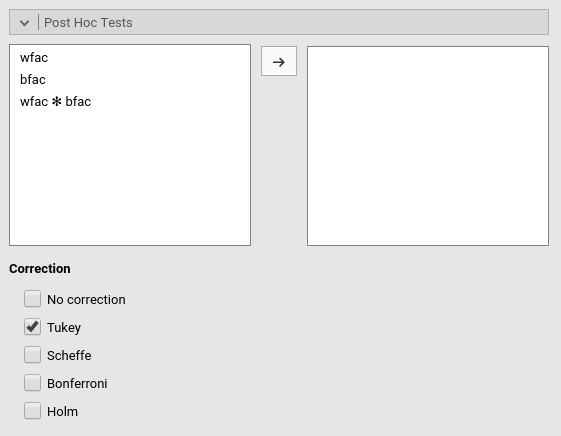
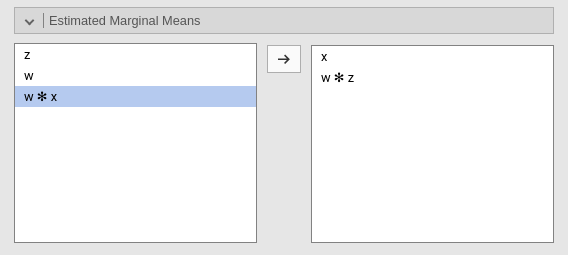

```{r echo=FALSE,results='hide'}
source("../R/functions.R")
```

**Generalized Linear Models** module of the GAMLj suite for jamovi

`r version("1.5.0")` 


The module estimates generalized linear models with categorial and/or continuous  dependent and independent variables, with options to facilitate estimation ofinteractions, simple slopes, simple effects, etc.

# Module
The module can estimate several linear models:

* Linear model
* Poisson model
* Poisson overdispersed
* Negative binomial model
* Logistic model
* Probit model
* Multinomial model





For each model, any combination of categorical and continuous variables can be set as independent variables, thus providing an easy way for multiple regression, ANOVA-like, ANCOVA-like and moderation analysis for categorical and count dependent variables. 

Models are defined by a link function (LF) and the dependent variable distribution, thus allowing to model different types of dependent variables:

* Linear model: identity LF, gaussian distribution, yielding a general linear model for continuous dependent variables.
* Poisson model: logarithm LF, Poisson distribution, modelling count dependent variables. This model is often called log-linear model when the independent variables are all categorical.
* Overdispersed Poisson model: logarithm LF, Poisson distribution, quasi-maximum likelihood estimation, with overdispersion, modelling count dependent variables. This model is often used for overdispersed data.
* Negative binomial model: logarithm LF, negative binomial distribution, maximum likelihood estimation, with overdispersion, modelling count dependent variables. This model is often used for overdispersed data.

* Logistic model: logit LF, binomial distribution, modelling dichotomous dependent variables.
* Probit model: inverse of the cumulative normal distribution link function, binomial distribution, modelling dichotomous dependent variables.

* Multinomial model: logit LF, multinomial distribution, modelling categorical dependent variables. 


# Estimates
The module provides Analysis of Deviance tables and parameter estimates for any estimated model. Variables definition follows jamovi standards, with categorical independent variables defined in "factors" and continuous independent variables in "covariates".


Effect size indexes are optionally computed by selecting `Odd rations (expB)`. Odd ratios apply the exponential function to the parameter estimates, thus they make sense in all models where the link function is based on the logarithm.


# Model 

By default, the model terms are filled in automatically for main effects and for interactions with categorical variables. 


Interactions between continuous variables or categorical and continuous ones can be set by selecting one or more variables and clicking the second arrow icon.

```{Call_child, child='commons/nonlinear_chunk.Rmd'}
```


The option `Fixed Intercept` includes an intercept in the model. Unflag it to estimate zero-intercept models (Regression through the origin, but see [here](https://dynamicecology.wordpress.com/2017/04/13/dont-force-your-regression-through-zero-just-because-you-know-the-true-intercept-has-to-be-zero/) before you do it ). 


# Factors coding


```{Call_child, child='commons/factorCoding_chunk.Rmd'}
```

# Covariates Scaling


Continuous variables can be centered, standardized or used as they are (`none`). The default is `centered` because it makes our lives much easier when there are interactions in the model, and do not affect the B coefficients when there are none. Thus, if one is comparing results with other software that does not center the continuous variables, without interactions in the model one would find only a discrepancy in the intercepts, because in GAMLj the intercept represents the expected value of the dependent variable for the average value of the independent variable. If one needs to _unscale_ the variable, simply select `none`.


```{Call_child, child='commons/covariateScaling_chunk.Rmd'}
```

# Post-hocs



```{Call_child, child='commons/posthoc_chunk.Rmd'}
```


# Plots


```{Call_child, child='commons/plots_chunk.Rmd'}
```

Plots interpretation varies depending on the model being estimated. All plots are, however, depicting predicted values in the response original scale (usually probabilities). See details and interpretation discussion.


# Estimated marginal means



```{Call_child, child='commons/emm_chunk.Rmd'}
```


# Examples

Some worked out examples of the analyses carried out with jamovi GAMLj GZLM are posted here (more to come)

`r include_examples("gzlm")`

`r issues()`