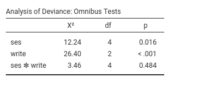

```{r echo=FALSE,results='hide'}
source("../R/functions.R")
```

`r keywords("jamovi, multinomial models, generalized linear models, post-hoc, moderated regression, interactions")`


In this example we study the relationships between a continuous independent variable, a categorical independent variable and their interaction on a categorical dependent variable. 

We run the analyses with the GAMLj module in Jamovi. One can follow the example by downloading the
`r datafile("cvs file","hsbdemo.csv")` and open it in [jamovi](https://www.jamovi.org/download.html). Be sure to install GAMLj module from within jamovi library. 

The data are from a [idre hsbdemo](https://stats.idre.ucla.edu/stat/data/hsbdemo.dta) example. You can find similar analyses in pure R and a nice explanation of them at the [UCLA idre web page](https://stats.idre.ucla.edu/r/dae/multinomial-logistic-regression/).


# The research design

The data set contains variables on 200 students. The outcome (dependent) variable is `prog`, program type. There are three programs that students can choose: general program, vocational program and academic program. The predictor (independent) variables are social economic status, `ses`, a three-level categorical variable and writing score, `write`, a continuous variable [UCLA idre web page](https://stats.idre.ucla.edu/r/dae/multinomial-logistic-regression/). 


The cross-tab of frequencies of participants combining social economical status and the outcome program is in the next table (in jamovi `frequencies` -> `Contingency tables`)  .


The descriptive of the continuous independent variable `write` are in the table.


# Understanding the problem

We want to understand if choosing a particular program out of the three available (general program, vocational program and academic program) can be linked to the student ability to write (`write`) and her/his social economical status. Because the two predictors can be correlated, we want (ultimately) to run a single model (multiple regression) such that the effect of each predictor is estimated while keeping constant the effect of the other, and a possible interaction can be assessed (moderated regression). We will run some preliminary models to warm up.

The dependent variable is a 3-level categorical variable, so we need a multinomial model. The aim of a multinomial model is straightfoward: Estimating how the probability of each category in the dependent variable varies as a function of the independent variable(s). In our example, we are going to estimate how the probability of choosing each program dependends on the ability to write (scores of `write`) and whether this probability is different for the three levels of social economical status (groups of `ses`).

## Details
The way the multinomial model does that is less straightforward ( _you can skip this if you are in a hurry_ ): The dependent variable is decomposed in K-1 dummy variables (where K is the number of categories in the dependent variable) and a (sort of) logistic model is estimated for each dummy. Thus, if we pick a reference group for the dependent variable, say `academic program`, the model estimates the influence of the independent variable(s) on the __logit__ (log of odd) of choosing each program over the academic program. Having three programs, our analysis will estimate two (K-1) set of coefficients: the effect of the independent variables on the (log) odd of choosing `general` program over choosing `academic`, and the (log) odd of choosing `vocation` program over choosing `academic`. The exact information about the change in odd (rather than the logit) can be obtained by looking at the __odd ratios__ (`exp(B)`).

To be clearer, let's consider the frequencies of the dependent variable:


The proabilities in the dependent variable are P(academic)=.525, P(general)=.225, P(vocation)=.25. To capture the "change" in probabilities and link it to the independent variable, the multinomial model starts with the odds: the general vs academic odd is P(general)/P(academic)=.225/.525=`r round(.225/.525,digits=3)`. Thus, on average, choosing the general program is less than half as likely as choosing the academic program. The model estimates how this odd depends on the independent variable. The same goes for the vocation vs academic odd, P(vocation)/P(academic)=.25/.525=`r round(.25/.525,digits=3)`. The model estimates how this odd is influenced by the independent variables. Remember that the B coefficients are expressed in the logit scale (log(odd)), the `exp(B)` in the odd scale.

## Interpretation

The overall test for each independent variable (Omnibus test Chi-squared) tests the null hypothesis that all the coefficients associated with an independent variable are zero, thus providing a "main effect" across all the dependent variable groups.

To simplify the interpretation, we can always look at the plots of the effects. In jamovi GAMLj the plots are on the probability scale, thus very easy to interpret: they show how the probability of each program changes for different levels of the independent variable.

The choice of the reference group is statisticaly immaterial, but can be adjusted for interpretational purposes. Here we use `academic` because in jamovi GAMLj  the default is to set the first group as the reference group: the `prog` variable is a string variable, thus the groups are alphabetically ordered. If one needs to change the reference group, a different coding of the dependent variable groups can be used.


# Simple Multinomial model

Let's start with predicting `prog` with the social economical status. In GAMLj `generalized linear model` we select the `multinomial model`,  push the `prog` variable in the `Dependent Variable` field and `ses` in `Factors`.  


## R-squared and Model info
As soon as we fix the variables, the results are there, with the first table showing some info about the model. 


Here we can outline the R-squared, that gives information about the goodness of fit of the model (see [technical details](gzlm_specs.html) for more info). Our error of approximation of the data decreases of 4% thanks to the `ses` variable. Put it in another way, our ability to predict `prog` increases of 4% thanks to `ses` over using only the observed probabilities.

The other information in the table helps to interpret the results. In particulat, the row `Direction` is useful. It gives the definition of the logit that is used, including which is the reference group of the dependent variable. In the example, it indicates that the there are two logits, one is comparing `prog=general` against `prog=academic`, the other `prog=general` against `prog=academic`. Thus we know that all the independent variables positively related with the first logit are positively related with the odd of being in program general over the academic one, the independent variables positively related with the rescon logit are positively related with the odd of being in program vocation over the academic one.  

## Omnibus test


The omnibus Chi-Squared test tests the null hypothesis that the probabilities of `prog` choice are the same for all `ses` groups. Based on the p-value, our results seem rare under the null hypothesis, so we can deem the effect of `ses` as statistical significant. Let's go straight to the interpretation of the results by visualizing the effects.

Ask for the plot in the `Plots` panel:


and see what we obtain:


The effec of `ses` is due to the fact that `high ses` group is much more likely to choose the academic program (`prog`=1) over the other two programs, while 
`low ses` and `middle ses` choose the three programs with more or less the same probability. The effect is not strong (recall R-squared=.04), but is at least visible in the plot.

An interesting note can be made for the omnibus test Chi-squared=16.8, p=.002. This test is equivalent to the standard Chi-squared one obtains by running a chi-squared test on the contingency table `prog X ses`. In fact (in jamovi `frequencies` -> `Contingency tables`) 


The standard chi-squared test is 16.6, but the `Likelihood ratio` is 16.8. QED, the multinomial omnibus test for categorical independent variables is exactly the chi-squared test obtained on a cross-tabs, only estimated with the maximum likelihood method. Accordingly, one can say that the frequencies of the cross-tab  `prog X ses` are not independent.

## Coefficients
If one needs (and seldom one does in these cases), one can look at the model coefficients, the regression coefficients. 


Skipping the intercept (recall that nobody interprets the interaction :-) ), the first coefficient, `ses1` is associated with the dependent variable contrast `general-academic` as predicted by the contrast `low ses` versus the average of the sample `(high, low , middle)`. The `exp(B)` is 1.938. This means that the odd of choosing `general` over `academic` for people of low social economical is 1.93 times higher than for the average person in the sample, and this effect is statistically significant (z=2.429, p=.001). Indeed, this is what the plot actualy shows.


The other coefficients can be interpreted along the same line.

# Multiple multinomial model.

Let's include `write` as independent variable and see the results.


Now we have two omnibus tests, indicating that the ability to write has a stistically significant effect on the probability of choosing a program, while keeping constant `ses`. The analysis also confirms an effect of `ses`, also when `write` is kept constant. As before, we can interpret the results by looking at the probability plot.


The better one writes, the higher the probability of choosing the academic program, and the lower is the probability of choosing the vocational program. Choosing the general program does not depends on the writing skills. 

Please notice in the plot that the independent variable `write` it is centered to its mean. This is a default of jamovi GAMLj in order to avoid unexpected results when interactions and other complex effects are estimated. However, it is only a default setting, so we can change it as we're pleased. 

By going to `Covariates scoring` tab, one can choose not to center the variable.


Obviously, the results are not different, but the plot x-axis looks nicer now.


# Moderated multinomial model

A question we can ask is whether the effect of writing abilities may be different at different levels of social economical status, thus putting forward a moderation hypothesis. 

After setting the `write` covariate back to centered, we can go to the `Model` tab and push the interaction term to the right field. We need this because GAMLj abides by an old rule of not estimating by default the iteraction between continuous and categorical variable (this default may change in future releases).




Results show very weak support for an interaction, because the Chi-square is low (3.46) and the p-value high (.484). This means that the probabilities profile along the `write` scores are not substantially different across social economical groups. We can verify that by eyeballing the plot of probabilities broken down by `ses` groups.


`r issues()`