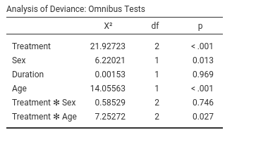

```{r echo=FALSE,results='hide'}
source("../R/functions.R")
```

`r keywords("jamovi, logistic models, generalized linear models, odd-ratios, ANOVA, ANCOVA, factorial designs, interactions")`

`r draft`, `r version('0.9.7')`


In this example we analyze a 3 X 2 X 2 design, with a dichotomous dependent variable. We employ logistic regression for modelling the dichotomous dependent variable.

We run the analyses with the GAMLj module in jamovi. One can follow the example by downloading the [csv file](https://github.com/mcfanda/gamlj_docs/blob/master/data/neuralgia.csv) and open it in [jamovi](https://www.jamovi.org/download.html). Be sure to install GAMLj module from within jamovi library. 

The data are from a [SAS User's Guide](https://support.sas.com/documentation/cdl/en/statug/63347/HTML/default/viewer.htm#statug_logistic_sect060.htm) example, 51.2. There you can find similar analyses in SAS.


# The research design

Here is the data description from [SAS User's Guide](https://support.sas.com/documentation/cdl/en/statug/63347/HTML/default/viewer.htm#statug_logistic_sect060.htm):

"The data set Neuralgia contains five variables: Treatment, Sex, Age, Duration, and Pain. The last variable, Pain, is the response variable. A specification of Pain=Yes indicates there was pain, and Pain=No indicates no pain. The variable Treatment is a categorical variable with three levels: A and B represent the two test treatments, and P represents the placebo treatment. The gender of the patients is given by the categorical variable Sex. The variable Age is the age of the patients, in years, when treatment began. The duration of complaint, in months, before the treatment began is given by the variable Duration."


The cross-tab of frequencies of participants `Treatment` by `Sex` is in the next table (in jamovi `frequencies` -> `Contingency tables`), and these are the first independent variables we analyze.


The base-rate frequencies for `Pain` (the dependent variable) are in the table.


Age and Duration are continuous variables (disregard the little icon indicating the variable format you see in jamovi variables list, we're are going to use them as continuous). Their descriptives are the following:


# Understanding the problem

We want to understand how the pain reported by the patients is affected by the Treatment and if this relationship is moderated by gender. Furthermore, the influence of Age and Duration is of interest as well.

We first start with `Treatment` and `Sex` and their interaction as predictors of  `Pain`. Then we include also `Age` and `Duration`. In the terminology of the general linear model, these two analyses correspond to an ANOVA and an ANCOVA, respectively. Because the dependent variable is a dichotomous variable, we employ a logistic model. In the logistic model there's no variance to be analyzed (is the deviance or likelihood that is analyzed), thus we should intend the terminology used here as meaning _ANOVA-like_ and _ANCOVA-like_ models.

The logistic model predicts the probability of being in one group defined by the dependent variable over the probability of being in the other group (the odd). Jamovi GAMLj predicts the probability of the group indicated by the last level of the dependent variable, in this example being `Pain=Yes`. If you are comparing the present results with the analyses in the  [SAS User's Guide](https://support.sas.com/documentation/cdl/en/statug/63347/HTML/default/viewer.htm#statug_logistic_sect060.htm), please keep in mind that SAS predicts `Pain=No`, so the results are equivalent but the effects go in the opposite direction. One can change the direction of the effects by re-coding the `Pain` variable.


## Interpretation

Recall that the predicted values of the models are the logit (logarithm of the odd) of being in pain (`Pain=Yes`) over not being in pain (`Pain=Yes`). Thus, the model coefficients are expressed in the logit scale ( _log(odd)_ ) . A clearer scale is obtained by removing the logarithm from the logit, obtaining coefficients expressed in the odd scale. This is the `exp(B)` column of the results tables:  `exp(B)` is an odd-ratio. The plots and the estimated marginal means are conveniently transformed in the probability scale, so they can be interpreted directly as the probability of being in pain (`P(Pain=Yes)`).

# ANOVA-like logistic model

Let's start with predicting `Pain` with `Sex` and `Treatment`. In GAMLj `generalized linear model` we select the `logistic model`,  push the `Pain` variable in the `Dependent Variable` field and `Sex` and `Treatment` in `Factors`.  


## R-squared and model info

As soon as we fix the variables, results are displayed in the tables, with the first table showing some info about the model. 


Here we find the R-squared, that gives information about the goodness of fit of the model (see [technical details](gzlm_specs.html) for more info). Our ability to predict pain increases of 26% thanks to the independent variables as compared to using the base-rate probabilities of `Pain`. 

## Omnibus tests


The omnibus Chi-Squared tests inform us on the main effects and interactions statistical significance. We can see there that we obtained a main effect of `Treatment` and one of `Sex`. Thus, on average, the probability of being in pain changes across treatments and it is different between women and men. There is clearly no interaction ($\chi^2$=0, p=1).

To interpret the main effects, let's ask for the plot in the `Plots` tab:


and see what we obtain:


The effect of `Sex` is due to the fact that the `men` group is much more likely to report pain than the group of  `women`. The effect of `Treatment` is mainly due to the higher pain report rate in the P treatment than in the other two conditions. The treatments are working.

  
## Leaving the comfort zone  (technical)
(_you can skip this if you're not interested in beautiful details and some fundamental laws of statistics_)

We should stop for a while and think very broadly about these results, because they have many things to teach us in general terms. We can see that `Sex` has a statistical significant effect on `Pain`, but in the plots the confidence intervals seem to overlap quite a bit. One may be inclined to believe that it is about the 3 by 2 design weird error deviance being included in the SE computation, but it is not. We can remove `Treatment` and still find that `Sex` is significant but the confidence intervals of the two means of gender overlap. 


Some people may find this strange, because of the common belief that two overlapping confidence intervals should correspond to a non-significant difference. However, this belief is wrong.

[Andrea Knezevic at the Cornell University](www.cscu.cornell.edu/news/statnews/Stnews73insert.pdf) and  [Prasanna Parasurama at Atipica](https://towardsdatascience.com/why-overlapping-confidence-intervals-mean-nothing-about-statistical-significance-48360559900a) explain this in a clear way. Here is a shorter version:

Take a z-test for simplicity. Given two means _a_ and _b_, their significance depends on the inequality ${a-b} > 1.96 \cdot \sqrt{{SE_a}^2+{SE_b}^2}$. The confidence intervals of the two means are not-overlapping if ${a-b} > 1.96 \cdot ( \sqrt{{SE_a}^2}+\sqrt{{SE_b}^2})$. Thus, as $a-b$ increases, the significance is reached first by the test with smaller right term of the inequality. By [Jensen inequality](https://en.wikipedia.org/wiki/Jensen's_inequality), we know that $\sqrt{{SE_a}^2+{SE_b}^2} < \sqrt{{SE_a}^2}+\sqrt{{SE_b}^2}$ therefore there will be some values of $a-b$ where the z-test is significant but the means confidence intervals overlap. Our examples shows exactly this.

From the same reasoning we can derive that the opposite is not true: If the confidence intervals do not overlap, the z-test must be significant. 


## Coefficients
If one needs (and seldom one does in these cases), one can look at the model coefficients, the regression coefficients. 


Skipping the intercept (recall that nobody interprets the intercept :-) ), the first coefficient is `Sex1`: B=0.896. The `exp(B)` is 2.449. This means that the odd of reporting `Pain=yes` over `Pain=No` for men (see `Contrast` column) is 2.499 times larger than for the average of the sample (`(M,F)`).
This comparison may sound awkward, but the awkwardness can be fixed. Recall that GAMLj default coding for factors is `deviations`, meaning that factors are coded such that each group (but the first) is compared with the average of the sample. When only two groups are present, a better coding is `simple`, that "simply" compares the two groups. We can set the coding in `Factor Coding`.


The B and exp(B) parameters associated with `Sex` have changed, although the z-test and p-value did not. The odd-ratio associated with `Sex` is now exp(B)=6, and the contrast says `M-F`- This means that the odd of reporting the pain is 6 times larger for men than for women.  

Indeed, if we ask for the estimated marginal means of Sex averaging across Treatment we see the probabilities of reporting pain for the two genders.


We can check that the probability of pain is .614 for men and .209 for women, which yields:

* odd for men ${odd_M}={.614 \over {1-.614}}=1.58$
* odd for women ${odd_F}={.209 \over {1-.209}}=.264$
* the odd for men is $\exp{B}={1.58 \over .264} =6$ times lager than the odd for women


The other coefficients can be interpreted along the same line.

# ANCOVA-like model.

Now we add `Duration` and `Age` as covariates, and we see how they influence `Pain`- We go back to the variables set-up and add them in the `Covariates` field.


## Omnibus tests


Results show that `Duration` does not have a significant effect on `Pain`, whereas `Age` does. We can check the direction of the `Age` effect by looking at the parameters.


The effect of Age is positive, B=0.268, and the odd-ratio is larger then 1, exp(B)=1.30. The older one gets, the more pain one reports.

As usual, a picture is worth a thousand words.


The older one gets, the more pain one reports, and the critical age seems to be around 70 years, where chanches of reporting pain considerably increase.


As regards `Treatment` we can state that `Treatment` has still an effect even when `Age` and `Duration` are kept constant.

# Moderation model

The last interesting question is whether treatment has a different effect depending on the patient's age. To answer this question we should simply add the interaction `Treatment*Age` in the model and plot the interaction plot. I find it easier to plot `Age` on the x-axis and show the probabilities of pain for different treatments. Let's do that.


## Set-up


## Omnibus tests



As suspected, there is an interaction between `Treatment` and `Age`, so it means that the efficacy of the treatments depends on the patient's age. The plot will tell us how. 

## Plot


First, the placebo group reports high rates of pain independently of age (blue line). For younger people (age<70) the two treatments A and B are beneficial, because the probability of reporting pain is very low. When patients get older, treatments are not so effective any longer, because the probabilities increase and converge to high rates for all three groups.

This may very well conclude the analyses.

# Related examples
`r include_examples("gzlm")`

`r issues()`