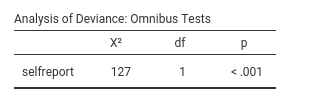
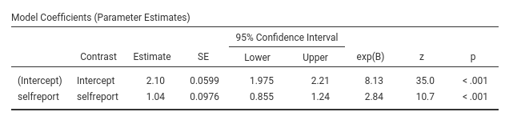
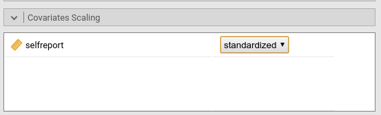

```{r echo=FALSE,results='hide'}
library(mcdocs)
mcdocs_init()
```

`r keywords("jamovi, Poisson models, generalized linear models, odd-ratios, regression, frequencies, count data, log-linear models")`

`r version("0.9.4")` `r draft` 

In this example we analyze a dependent variable featuring frequency of events, or count data. The indipendent variables are one continuous and one dichotomous. We employ a poisson regression model.

We run the analyses with the GAMLj module in jamovi. One can follow the example by downloading the `r datafile("csv file","cells.csv")`. Be sure to install GAMLj module from within jamovi library. 

The data are simulated, not real, so please do not cite them to argue about any issue. The reason of this is to provide an example where the Poisson model assumptions are surely met, so some of the difficulties of dealing with count data and frequencies are not present. For more elaborated examples see `r link_pages(nickname="overPoisson")`.


# The research design

Imagine a hypothetical study about addiction to mobile phones. Imagine a researcher developed a self-report questionnaire to measure participants mobile phone addiction (over-usage) and wanted to test whether the scores of the questionnaire predicts actual addictive behavior. Addictive behavior is measured in an experimental setting by counting how times the participants checked the mobile phone while waiting for the experimenters to arrive to start the measurement session (let's ignore the time spent on each checks and assume all participants waited for the same ammount of time). 

The variables are then: 

* _checks_: number of time spent checking the phones.
* _selfreport_: the total score of the self-report questionnaire
* _brand_ : brand of the participant's phone: either `Pears` or `Apples`

The descriptive and frequencies the independent variables show the sample charateristics.


The frequencies for `checks` (the dependent variable) are in the following plots.


It is clear that the average number of checks is about 10, but the distribution is following a Poisson distribution, with the majority of participants showing a low frequency of checks, and a few participants showing medium and high frequencies, with the rarity of a frequency being proportional to the frequency itself. As the data are simulated, we know that they come from a Poison ditribution.


# Understanding the problem

We want to understand how the frequency of checks is associated with the participant self-report questionnaire score (a sort of validity check of the questionnaire), if the brand of the phone makes a difference in the expected frequency of checking, and whether the questionnaire predictive ability varies for the two cell phone brands. Thus, we are looking for an effect of `selfreport` and a main effect of `brand` to answer the first two questions, and for the interaction between `selfreport` and  `brand` to answer the third question.

We employ the Poisson model because it is the classical model for modelling count dependent variables, and, being a special case of the generalized linear model,  can accomodate main effects and intereactions. This is equivalent to a linear model where the link function is the logarithm of the predicted frequencies $log(\hat{F})$, and the Poisson distribution is assumed for the dependent variable.

We first start with only `selfreport` as independent variable, then we estimate the full model with also `brand` and the interaction as predictors.


## Interpretation

Recall that the predicted values of the models are the logarithm of the frequencies of checking the phone. Thus, the model coefficients are expressed in the log(Freq) scale. A clearer scale is obtained by removing the logarithm from the coefficients, obtaining coefficients expressed in original frequency scale. This is the `exp(B)` column of the results tables:  `exp(B)` is the frequency rate of change: How many times should we multiply the expected frequency at $x_i$ to obtain the frequency at $x_{i+1}$. In other words, the rate of change of the frequency as one increases the independent variable of one unity (or move from one group to the other for categorical independent variables).

The plots and the estimated marginal means are conviniently transformed in the frequency scale, so they can be interpreted directly as the frequency of checking.

# Simple Poisson regression model

Let's start with predicting `checks` with `selfreport`. In GAMLj `generalized linear model` we select the `Poisson` model,  push the `checks` variable in the `Dependent Variable` field and `selfreport` in `Covariates`.  


The model yields its results.

## R-squared and model info

As soon as we fix the variables, results are displayed in the tables, with the first table showing some info about the model. 


Here we find several info, some noteworthy ((see [technical details](gzlm_specs.html) for more info):

* the R-squared, that gives information about the goodness of fit of the model . Our ability to predict the frequencies of checks increases of 33% thanks to the independent variable as compared to using the expected (average) frequency  alone. 
* AIC (Aikake Information Criterion)_ Based on the likelihood of the model, decreases with the goodness of fit of the model. Useful to compare the present model with alternative models (see below)
* Value/DF: This is the Pearson $\chi^2$ divided by the degrees of freedom. If the model fits well, its value should be around 1. This index is useful to evaluate the dispersion of the model. A model is overdispersed if the variance of the dependent variable is larger than what expected by the assumed distribution.  In this example, it's value is bourderline, as it is three times what it should be. However, we still have to include the `brand` variable which may explain variability of the dependent variable and thus capture dispersion.  More details in  [Advanced frequencies analysis with Poisson models](gzml_example4.html) and in  [technical details](gzlm_specs.html).

## Omnibus tests



The omnibus Chi-Squared test is showing a statistical significant relationship between the self-report score and the number of checks. If we go down to the `Model coefficients` table  we can interpret the direction of the effect by looking at the B and `exp(B)` coefficients. 



## Model Coefficients

There is a positive relationship between `selfreport` and `checks` (B=1.04, exp(B)=2.84), such that for one unit more in the self-report score, the frequency of checks _increases 2.84 times_. We just deduce this by looking at the `exp(b)`. Is that a big effect? Difficult to say, because we do not understand the units of the self-report score, so "one unit" does not say much. To overcome this interpretational limit, we can standardized the independent variable in `Covariated Scoring` panel,




We can now look at the new exp(B)=1.86 which says that the frequency of checks almost double for each standard deviation more in the self-report. It is not small as an effect: the average person in the sample checked the phone around 8 times (the intercept exp(B) is 8.13), and people one standard deviation above average round `r round(8.13*1.86,digits=2)` times.  

## Plot

Finaly, we can ask for the plot of the predicted score, along with confidence intervals and observed scores.


The graph shows a clear exponential relationship between `relfreport` and the frequency of check (which we took into the account thanks to the log() transformation): below the avergage of self-report score, the frequency does not change much, but when the score gets to one standard deviation above averare its increase intensifies and reaches very high frequencies for scores up to 2 standard deviations above average. We also see a reasonable fit of the predicted frequencies to the observed ones. 


# Full model.

Now we add `brand` as a factor in the model, and its interaction with `selfreport`


First, we push `brand` in the `Factors` field, then we go to the `Model` panel and select the interaction.

We need this second steps because jamovi GAMLj follows a somehow old tradition established by SPSS of automatically including continuous independent variables in the model without their interaction with categorical variables. 

## Model info


We first note that the $R^2$ rised up to .50, showing a strong effect of `brand`. We can also appreciate that the `Value/DF` index is now 0.987, practically 1: The model in now well in line with the assumptions of the  Poisson model, and no overdispersion is present.

## Omnibus tests


Results show a main effect of `brand` and confirm the main effect of `self-report`. No evidence of an important interaction is there.

## Model coefficients


The effect of `selfreport` is still (averaging across `brand`) positive but stronger than before, exp(b)=2.87. Keeping constant `brand`,  the frequency of checks increases around 3 times for each standard deviation of `selfreport`. 

To interpret the effect of `brand` first look at the `contrast` column. It says that the default coding of `brand` compares the `Pears` group with the average of the groups `(Pears,Apples)`. When there are only two groups, a direct comparison is clearer, thus we go to `Factor coding` panel and we ask for `simple` contrast, which does exactly that.


The exp(B) associated with brand is .437: the group `Pears` checks the phone .437 time more than the group `Apples`, which means (by taking the reciprocal of exp(B)) `r round(1/.437,2)` times less than `Apples`.

## Plot

As usual, a picture is worth a thousand words.


This concludes these set of analyses.


# Related examples
`r include_examples("gzlm")`

`r issues()`