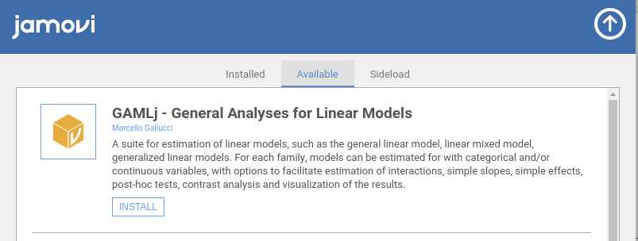

  

```{r echo=FALSE,results='hide'}
library(mcdocs)
mcdocs_init()
```
  

General, Mixed and Generalized Models module for `r jamovi()`


GAMLj offers tools to estimate, visualize, and interpret General Linear Models, Mixed Linear Models and Generalized Linear Models with categorial and/or continuous variables, with options to facilitate estimation of interactions, simple slopes, simple effects, post-hoc tests, etc.

* ANOVA and Regression approach
* Continuous and categorical independent variables
* F-test and parameter estimates
* Confidence intervals
* Moderation made easy
* Simple slopes analysis
* Simple effects
* post-hocs analysis
* Plots for up to three-way interactions
* Automatic selection of best estimation methods and degrees of freedom selection
* Type III estimation

Available models are:

* OLS Regression (GLM)
* OLS ANOVA (GLM)
* OLS ANCOVA (GLM)
* Random coefficients regression (Mixed)
* Random coefficients ANOVA-ANCOVA (Mixed)
* Logistic regression (GZLM)
* Logistic ANOVA-like model (GZLM)
* Probit regression (GZLM)
* Probit ANOVA-like model (GZLM)
* Multinomial regression (GZLM)
* Multinomial ANOVA-like model (GZLM)
* Poisson regression (GZLM)
* Poisson ANOVA-like model (GZLM)
* Overdispersed Poisson regression (GZLM)
* Overdispersed Poisson ANOVA-like model (GZLM)
* Negative binomial regression (GZLM)
* Negative binomail  ANOVA-like model (GZLM)
* Random coefficients logistic model (GlmMixed)
* Random coefficients poisson model (GlmMixed)

Please visit the sub-modules pages for details:

* [GAMLj GLM](glm.html)
* [GAMLj Mixed models](mixed.html)
* [GAMLj Generalized Models](gzlm.html)
* [GAMLj Generalized Mixed Models](gzlmmixed.html)

# Examples

Some worked out examples of the analyses carried out with jamovi GAMLj are posted here (more to come)

<div class="littletitle">General Linear Model</div>
`r list_pages(topic="glm",category = "example")`
<div class="littletitle">Mixed models</div>
`r include_examples("mixed")`
<div class="littletitle">Generalized Linear Models</div>
`r include_examples("gzlm")`

<div class="littletitle">Generalized Mixed Models</div>

`r include_examples("gmixed")`


# Details

`r  include_details(NULL)`


# Installation

If you didn't already, install [jamovi](https://www.jamovi.org/download.html) and run it. Select the jamovi modules library and install GAMLj from there



## Linux

If you are working in linux you can download [Jamovi](https://www.jamovi.org/download.html), then download the .jmo from this link [gamlj binaries](https://github.com/mcfanda/binaries/blob/master/gamlj_linux.jmo).


## Others

You will first need to download [Jamovi](https://www.jamovi.org/download.html). 


You can clone this repository and compile the module within R with 

```
library(jmvtools)

jmvtools::install()

```

# Install in R

To install it in R, simple use:

```

devtools::install_github("gamlj/gamlj")

```

# Troubleshooting

Please check out the  [troubleshooting page](https://mcfanda.github.io/gamlj_docs/troubles.html). 

# Release notes

Please check out the  [Release notes](release_notes.html). 

# Quality control

Please check the [rosetta store](rosetta.html) for alignment with other software results and possible discrepancies.

# Specs

`r list_pages(category="details")`

  
`r issues()`
