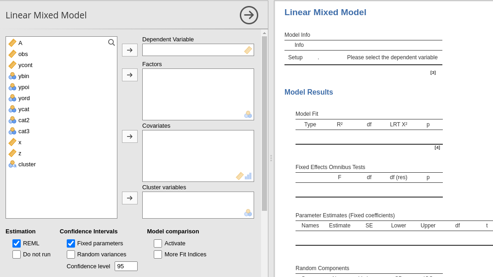

```{r setup, echo=FALSE,results='hide'}
library(mcdocs)
mcdocs_init()
```


`r version("1.5.0")` 


**Mixed Linear Models** module of the GAMLj suite for jamovi



The module estimates a mixed linear model with categorial and/or continuous variables, with options to facilitate estimation of interactions, simple slopes, simple effects, post-hoc, etc. In this page you can find some hint to get started with the mixed models module. For more information about how to module works, please check the [technical details](mixed_specs.html)
 

# Module
The module can estimates REML and ML linear mixed models for any combination of categorical and continuous variables, thus providing an easy way of obtaining multilevel or hierarchical linear models for any combination of independent variables types.

# Estimates
The module provides a parameter estimates of the fixed effects, the random variances and correlation among random coefficients.

Variables definition follows jamovi standards, with categorical independent variables defined in "fixed factors" and continuous independent variables in "covariates".


The grouping variable is simply set by putting the corresponding variable(s) into `cluster`. In this version, multiple clustering variables are possible, but not combinations of classifications ( see [Technical Details](mixed_specs.html) ). 

Confidence intervals for the parameters estimates and  REML or ML can be chosen.

The actual estimation occurs when the dependent variable, the clustering variable and at least one random coefficient (random effect) has been selected.

# Random effects


Random effects across clustering variables are automatically prepared by the module following R lmer() standards: `term | cluster` indicates that the coefficient associated with `term` is random across `cluster`. 

By default the module assumes correlated random effects. All the effects varying across the same cluster variable appearing in the `r opt("Random coefficients")` will be correlated. To obtain a _variance component_ model, select `r opt("Not correlated")`. A custom pattern of correlation can be obtained by selecting `r opt("Correlated block")`.  For instance, in Fig. below, a custom structure has been defined by allowing the intercept and the effect of `x` to be correlated, whereas the effect of `wfac` is independent from the others.   


The option `r opt("LRT for random effects")` produces a table of _Likelihood Ratio Tests_ for the random effects. The table is estimated with `lmerTest::ranova` command, documented [here](https://cran.r-project.org/web/packages/lmerTest/lmerTest.pdf). The test basically compares the likelihood of a model with the `effect` included versus a model with the `effect` excluded. For example, `x in (1+x|cluster)` means that the model with `(1+x|cluster)` random structure is compared with a model with `1|cluster)` random structure. If significant, the model with random effect `x` is significantly  better (in terms of likelihood) than the model with `(1|cluster)` structure.

# Fixed effects Model 


By default, the model fixed effects terms are filled in automatically for main effects and for interactions with categorical variables. 

Interactions between continuous variables or categorical and continuous can be set by clicking the second arrow icon.


```{r child1, child='commons/nonlinear_chunk.Rmd'}
```


# Factors coding


```{r child2, child='commons/factorCoding_chunk.Rmd'}
```

More details and examples `r link_pages("ros_contrasts")`.


# Covariates Scaling


Continuous variables can be centered, standardized, cluster-based centered, cluster-based standardized, log-transformed or used as they are (`none`). The default is `r opt("centered")` because it makes our lives much easier when there are interactions in the model, and do not affect the B coefficients when there are none. Thus, if one is comparing results with other software that does not center the continuous variables, without interactions in the model one would find only a discrepancy in the intercept, because in GAMLj the intercept represents the expected value of the dependent variable for the average value of the independent variable. If one needs to _unscale_ the variable, simple select `r opt("none")`.

`r opt("Centered clusterwise")` and `r opt("z-scores clusterwise")` center each score using the mean of the cluster in which the score belongs. For `r opt("z-scores clusterwise")` the score is also divided by the cluster standard deviation. `r opt("Log")` applies a simple natural logarithm transformation to the variable.

The same transformations can be applied to the dependent variable by selecting an option in `r opt("Dependent variable")` _scale_.


```{r child3, child='commons/covariateScaling_chunk.Rmd'}
```

# Post-hocs


```{r child4, child='commons/posthoc_chunk.Rmd'}
```


# Plots


```{r child5, child='commons/plots_chunk.Rmd'}
```

By flagging `Random effects` one obtains the random effects estimated values in the plot along with the fixed effects. In case of multiple cluster variables, the first cluster variable in the `cluster` field of "variable role" panel is used (if it is included in the model). To change the cluster variable used to plot the random effects, change the order of the variables in the "variable role" definition.

# Estimated marginal means


```{r child6, child='commons/emm_chunk.Rmd'}
```


# Examples

Some worked out examples of the analyses carried out with jamovi GAMLj Mixed models are posted here (more to come)

`r include_examples("mixed")`

# Details

Some more information about the module specs can be found here

`r include_details("mixed")`
