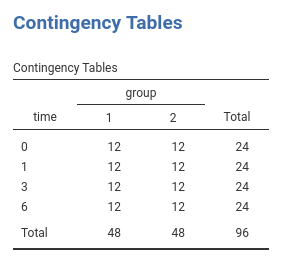
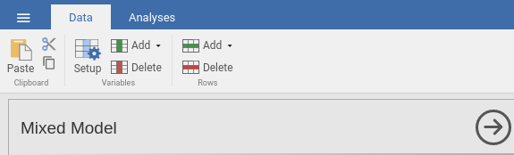
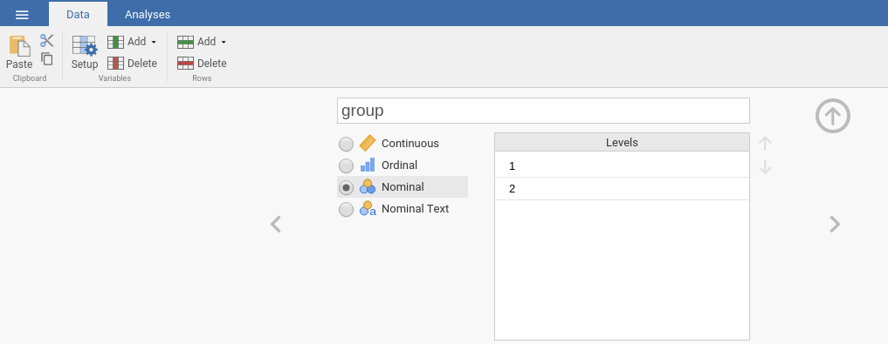
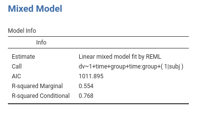
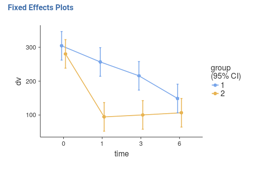
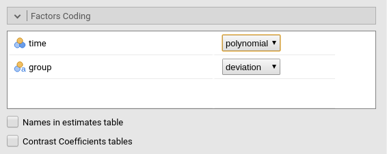
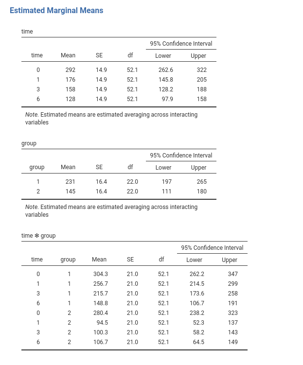

```{r echo=FALSE,results='hide'}
source("../R/functions.R")
```

`r keywords("jamovi, Mixed model, simple effects, post-hoc, polynomial contrasts")`

`r version("0.9.7")`,`r version("1.0.0")`

In this example we work out the analysis of a simple repeated measures design with a within-subject factor and a between-subject factor: we do a mixed Anova with the mixed model.

We use the GAMLj module in Jamovi. One can follow the example by downloading the file `r datafile("wicksell.csv","wicksell.csv")`. Be sure to install GAMLj module from within jamovi library. 

The data are from a [David C. Howell](https://www.uvm.edu/~dhowell/StatPages/More_Stuff/Mixed-Models-Repeated/Mixed-Models-for-Repeated-Measures1.html) website. You can find there a lot of very clear information and discussion of repeated measures mixed model analysis, in SPSS, SAS, and R. As you would expect from David C. Howell, the material is simply great.

Data can also be opened within jamovi in the jamovi data library, with the name `wicksell`.


# The research design


"[Howell] has created data to have a number of characteristics. There are two groups - a Control group and a Treatment group, measured at 4 times. These times are labeled as 1 (pretest), 2 (one month posttest), 3 (3 months follow-up), and 4 (6 months follow-up). I created the treatment group to show a sharp drop at post-test and then sustain that drop (with slight regression) at 3 and 6 months. The Control group declines slowly over the 4 intervals but does not reach the low level of the Treatment group. There are noticeable individual differences in the Control group, and some subjects show a steeper slope than others. In the Treatment group there are individual differences in level but the slopes are not all that much different from one another. You might think of this as a study of depression, where the dependent variable is a depression score (e.g. Beck Depression Inventory) and the treatment is drug versus no drug. If the drug worked about as well for all subjects the slopes would be comparable and negative across time. For the control group we would expect some subjects to get better on their own and some to stay depressed, which would lead to differences in slope for that group." ( [Howell](https://www.uvm.edu/~dhowell/StatPages/More_Stuff/Mixed-Models-Repeated/Mixed-Models-for-Repeated-Measures1.html) )

The design is thus a 2 (group) X 4 (time) design with the latter factor repeated within participants.




The depenent variable is a continuous variable. 


Data are in the long format: Each observation is a row, and the variable `subj` identifies the participant's data, `group` and `time` the design factors, and `dv` the dependent variable.


# Understanding the problem

Here we simple need to estimate the main effects of `time`, of `group` and their interaction, as one would do in a standard ANOVA. Because we have a repeated measures factor (`time`), we should take dependency in the data into the account. We do that by allowing the intercepts to vary from subject to subject. In this way, each participant is "allowed" to have a higher or lower overall response (average response over time), and thus the error term (the residuals) are computed as deviation from the participant's mean (and the fixed effects). This captures (for a good share) the dependency among data.

We can talk about "average response" because we are going to use `deviations` coding for the categorical variables (GAMLj does that by default), so the fixed intercept is the expected value of the dependent variable on average, and the random intercepts are individual deviations from it.

Later on, we also explore the possibility that the effect of time is different from participant to participant. This is done by setting also the effect of time as random effect. The data will suggest if there's enough variability in the effects to justify this model.

# Mixed model: Random Intercepts Model

To run a mixed model, we should answer three questions:

* Which is the cluster variable: in our case it is clearly the `subj` variable.
* What are the fixed effects: here they are the effect of `time`, of `group` and their interaction. Please notice that GAMLj automatically push the categorical variables and their interaction in the fixed effects definition (cf. panel `Fixed Effects`). If one needs a different set of fixed effects, that is the place to work.
* What are the random effects: for the first run on the estimation, we go for a random intercepts model, thus the random coefficients are the interectps.


## Set up

In order to estimate the model with jamovi, we first need to set each variable in the rigth field. 


First, we define `subj` as the clustering (grouping) variable, by putting it in the `Cluster` field.
Then we put `dv` in the `Dependent Variable` field and `time` in the `Factors` field. We should push also `group` in the `Factors` but this is not allowed because the file loading module sees the variable as a continuous variable (see the scale little icon in the picture). At the moment (this may change in future releases), GAMLj requires the `Factors` to be nominal, nominal text, or ordinal. To get around this nuissance, we go to the data tab and define `group` as a nominal variable.   

* Select the `Data` tab and click `Setup`



* Navigate to the `group` variable definition and select `nominal`



* Go back to the `Mixed Model` analysis and push `group` into `Factors`.


If we now look at the results panel, we see that the model definition is not completed yet.


We need to specify the random component by selecting what coefficients are random. We do that by expanding the `Random Effects` tab.


On the left side, under `Components` we find all possible random effects allowed in the model already prepared by jamovi. They are prepared based on the variables previously selected, so not all of them may be interesting. In our example, we need the `intercept` to vary randomly across participants, thus we simply select `Intercept|subj`. Jamovi uses the R formulation of random effects as implemented by the [lme4 R package](https://cran.r-project.org/web/packages/lme4/index.html). The bar `|` means __random across__, thus we can read the "components" as `Intercept` random across `subj`,  `group` effects random across `subj`,  `time` effects random across `subj`, and so on.


At this point, the model is estimated and the results appear in the results panel. Before inspecting the results, we have a look at the fixed effects definition, by expanding the `Fixed Effects' tab. 


As we mentioned above, jamovi automatically includes all independent variables defined in `Covariates` or in `Factor` in the fixed effects model. Obviously, when the models are complex, one can tweak the model terms to suits the analysis aim.


## Results

The first table in the output contains info about the model and the estimation.



* The `Call` row display the model in [lme4 R package](https://cran.r-project.org/web/packages/lme4/index.html) formulation. This can be useful to re-run the same analysis in R (not using GAMLj module). 
* The `AIC` row display the Aikeke Information Criterion, which can be useful to evaluate the model, especially in comparison with other models. Details can be found in [GAMLj docs](https://github.com/mcfanda/gamlj/blob/master/docs/mixed_specs.html) and in [Zuur et. al , 2009] al.](http://www.springer.com/la/book/9780387874579)
* R-marginal and R-conditional are proportions of reduced error, or pseudo-$R^2$. They are described in [Johnson (2014)](http://onlinelibrary.wiley.com/doi/10.1111/2041-210X.12225/abstract;jsessionid=2018A0141FC9ABFF1B654117812A8FCA.f03t01) and implemented in [piecewiseSEM](https://github.com/jslefche/piecewiseSEM/blob/master/README.md#get-r2-for-individual-models). For our purposes, we can interpret them as follows: __R-marginal__ is the variance explained by the fixed effects over the total (expected) variance of the dependent variable. The __R-conditional__ is the variance explained by the fixed and the random effects together over the total (expected) variance of the dependent variable. In our example, the fixed effects explain a good share of the variance (${R_m}^2$=.554), but the overall model (fixed+random) captures an even bigger share of the variance (${R_c}^2$=.768).


`Fixed effects ANOVA` gives the F-tests associated with the model fixed effects. Here we see that `time` has a statistical significant effect (on average), `group` has a statistically significant effect, and there's also an interaction between the factors.


As regards the degrees of freedom (nobody cares about them, I've been told before), jamovi mixed model tries to use Satterthwaite approximation as much as possible, but for complex models it may fail. When that happens, Kenword-Roger approximation is used and, if the latter does not fail, F-tests are computed. A note signals which approximation is used.


In the output there's also a `Fixed effects Parameters Estimates` table that gives the fixed B coefficients. For the moment the B coefficients are not interesting, so we skip the interpretation of this table (see further down this document what we do with it).


The **Random Component** display the variances and SD of the random coefficients, in this case of the random intercepts. From the table we can see that there is variance in the intercepts (${\sigma_a}^2$=2539), thus we did well in letting the intercepts vary from cluster to cluster. ${\sigma_a}^2$ can be reported as an intra-class correlation by dividing it by the sum of itself and the residual variace ($\sigma^2$), that is $v_{ic}={{\sigma_a}^2 \over {{\sigma_a}^2+{\sigma}^2}}$
(future releases will compute that for you).

## Mixed vs RM Anova

If one looks at the results discussed in [David C. Howell](https://www.uvm.edu/~dhowell/StatPages/More_Stuff/Mixed-Models-Repeated/Mixed-Models-for-Repeated-Measures1.html) website, one can appreciate that our results are almost perfectly in line with the ones obtained with SPSS, SAS, and with a repeated measures ANOVA. The latter it is not always true, meaning that depending on the data and model charateristics, RM ANOVA and the Mixed model results may differ. RM ANOVA and the Mixed model are different strategies to estimates effects in RM designs, thus they are not always overlapping.  

## Estimated Means Plots 

To interpret the results, we look at the means of the groups resulting from the combinations of the factors levels. We can go to `Fixed Effects Plots` and select `time` for the X-axis and `group` as the factor across lines.


Results show that for group 1 there is a slow decay of the dependent variable, whereas for group 2 there is a fast decay from time 0 to time 1, and a flat trend from time 1 on. On average, group 1 shows higher levels of the `dv`, and, on average, the `dv` decreases over time.



A clearer and more honest account of the model fit can be seen by looking at the estimated means over the actual observed scores (GALMj v. >= 0.9.3), option `Plot -> Observed scores`.


## Probing the effects

We can now ask several questions to the model. There are different strategies to probe the interaction, and usually one picks the one that better suits the researcher's hypotheses and interests. Here we use them all, mainly for showing how they can pursued in jamovi GAMLj.

### Simple effects analysis

We ask the question whether the effect of time is present in each group. We know from the significant interaction that `time` has a different effect in the two groups, we now test if it is present in each group. 

This means estimating the simple effects of `time` for different levels of `group`. We go to the `Simple Effects` panel and select the variables accordingly.


The results panel shows now a series of tables about the simple effects. We focus on "Simple Effects ANOVA" table.


We can see that for both groups time has a statistically significant effect, although for group 2 the effect appears to be larger (check the F-tests). A nice effect size index would be perfect here, but we still struggling with the literature. Future releases will fix this.

### Trend analysis

Let's now study how time changes the dependent variable and whether the two groups show different trends. We do a trend analysis by coding the `time` variable with __polynomial contrasts__: polynomial contrasts describe possible trends in the means (shape of the time-dependent trend). The most important shapes are _linear_ (means tend to increase or decrease over time), _quadratic_ (the trend tends to flat out or raise up over time), and _cubic_ (the trend shows a tendency to seesaw or fluctuate up and down) The size and the statistical significance (if one relies on it) of the polynomial contrasts inform us on what are the charaterstics of overall trend of means observed in the groups.

First, we set to `polynomial` the coding of `time` in the `Factors Coding` panel.



Then we look at the `Fixed Effects Parameters` table. 


Here are the B coefficients of the effects. Because `group` is centered, it is coded with `deviations` scheme, the B coefficients associated with `time` contrasts can be interpreted as average effects. Thus, on average time seems to have a linear, a quadratic and a cubic trend. Remember that trends should be combined while interpreting the pattern of means. Accordingly (see plots of the main effect of `time`), on average the dependent variable means tend to decrease over time (a significant linear trend), the decrease rate diminishes over time (the quadratic) but the flatting out of the trend fluctuates a bit from time to time (the cubic trend). Notice we asked for the confidence intervals to be plot along the means.  


Now we can interpret the interaction terms involving the contrasts. `Time1 * groups` corresponds to `linear * group` contrasts, and it is clearly small (compare the B=-.894 with the other B's) and not statistically significant (p=.934). This means that the linear trend is basically the same for the two groups defined by `group`. Indeed, the two groups starts more or less at the same hight and end up at the same level: same linear trend. Very different is the quadratic term, because the interaction `quadratic * group` is strong and significant (p<.001). Indeed, for group 1 there is no "bending" of the trend, whereas for group 1 the rate of change over time is much faster at the begining and very small at the end. The fluctuation captured by the cubic trend does not really differ in the two groups (p=.103)


We can be happy about this analysis, but let face the case that a reviewer frowns at us because we talked about a quadratic trend in group 2 and the absence of it in group 1, but we did not test these two sentences! Well, just look at the new results of the simple effects (recall that jamovi updates the results table when you change something in the setup).


`Simple Effects Parameters` table informs us whether the three trends are statistically significant in each group and how big they are. We can then say that the `linear` trend is present in both groups (we knew that already), the `quadratic` is present in group 2 but not in group 1. As for the cubic, it seems to be significant in group 2 (p=.006) but not in group 1 (p=.631). However, we know from the interaction `cubic * group` that this difference is not that large after all.

## Coding scheme

`r version("1.0.0")`

In case one has doubts about the meaning of the chosen coding scheme for the factors, one can ask for the table of contrasts weights. This is done in `Factor coding` by selecting `Contrast coefficients tables`.


This produces a table in the results panel as shown here.


More info about coding schemes `r link_pages(nickname = "ros_contrasts")`


### Post-hoc

Let now assume that we have no hypothesis and we are not interested in trends, by we just want to check which pair of means is different and which is not across times. The variable `time` has 4 levels, so ${(4 \cdot 3) \over 2}=6$ comparisons can be done. This is the task of post-hoc. GAMLj offers post-hoc comparisons with Bonferroni and Holm correction. The setup is easy: push from the left panel within the `Post-hoc tests` panel to the right panel.


Results are almost self-explanatory: 


Time 0 mean (on average across groups) differs from the mean of all the other three times, time 1 mean differs (based on NHST)  only from time 6, and time 3 and 6 are not differnt. That concludes the probing of the main effect of time. The same can be done for the interaction, which would produce  ${(8 \cdot 7) \over 2}=28$ comparisons. We stop here because post-hoc tests are very boring.

# Estimated Marginal Means

In any case, one can inspect the means involved in the main effects and of in the interaction by clicking `Estimated Marginal Means` in the `Estimated Marginal Means` panel.


Which yields:



# Related examples
`r include_examples("mixed")`

`r issues()`
