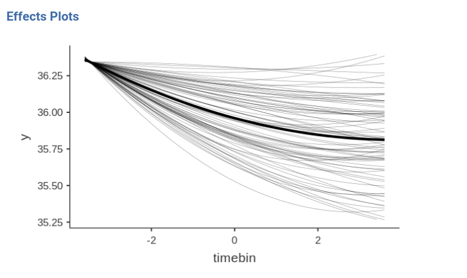
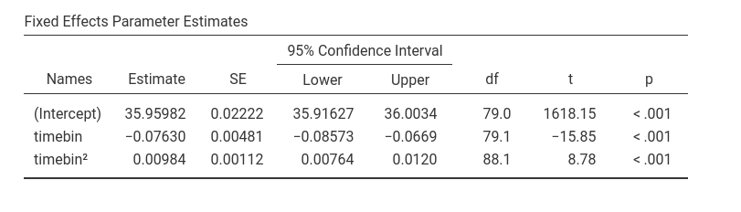
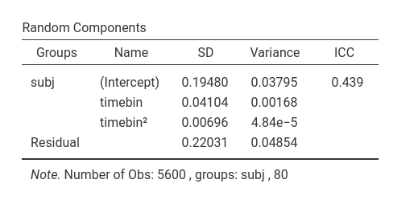
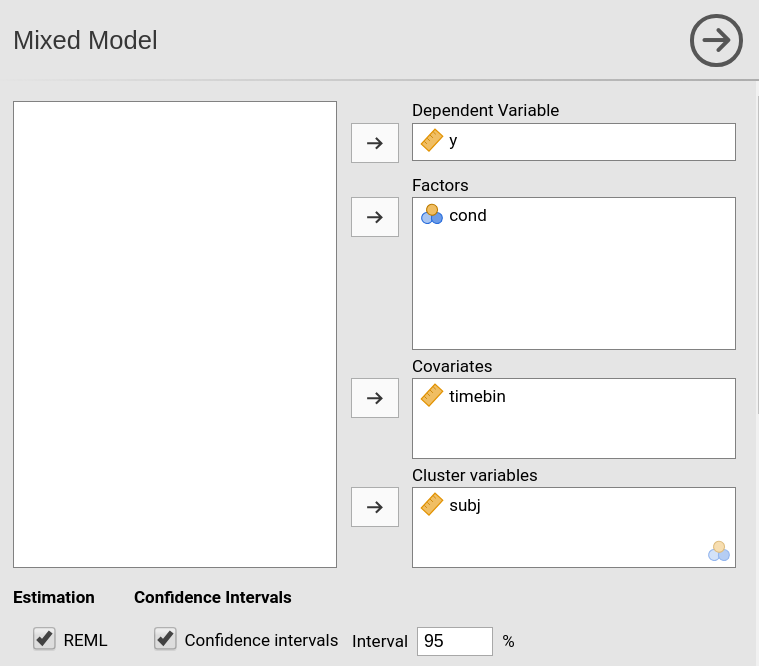
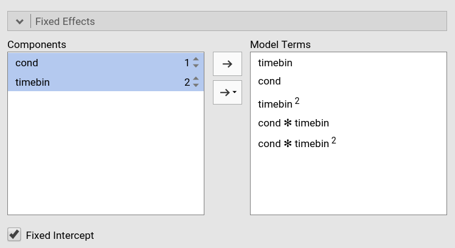
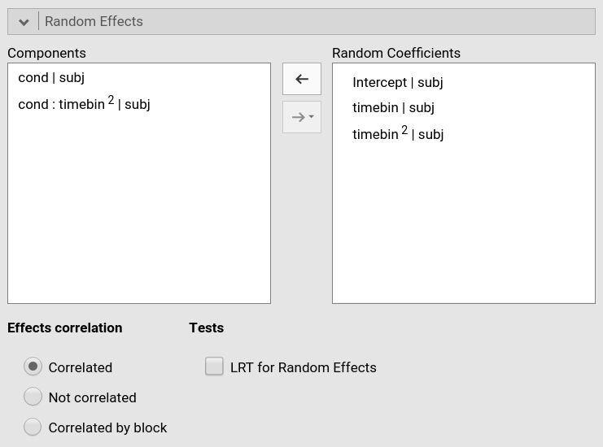
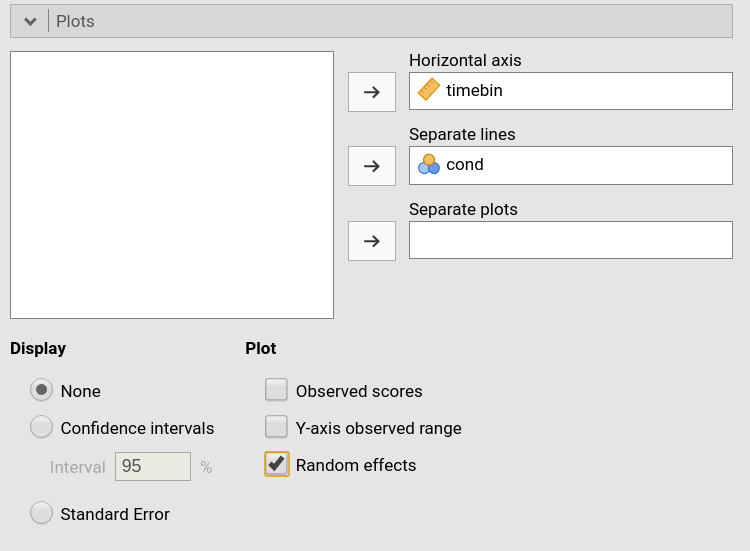
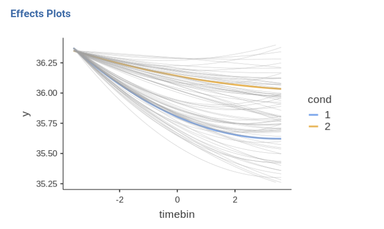
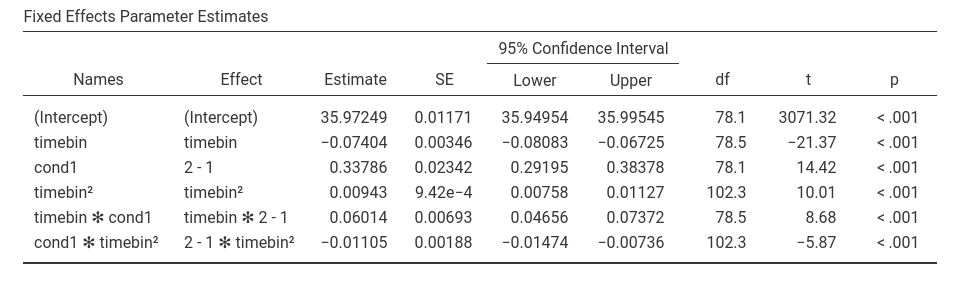

```{r echo=FALSE,results='hide'}
source("../R/functions.R")
```


`r keywords("Individual Growth Model, Polynomial mixed model, non linear effects, linear model")`

`r version("1.5.0")`

In this example we work out an example of individual growth model using polynomial effects in the mixed model, using jamovi GAMLj. Data are (simulated data) [here](https://github.com/mcfanda/gamlj/data/tempdata.csv). 

# Research Design

Imagine the following scenario. Two procedures to decrease the body temperature of the experiment participants are tested.  The two procedures are administered between-subjects to two different groups. Let's identify them as condition 1 and condition 2. Each participant's body temperature is measured for about 6 minutes every 6 seconds. Time is recorded in tenth of minutes (6 seconds=0.1, 12 seconds=0.2, etc.). We wish to establish whether the temperature decreases over time and if the decrease is different in the two conditions.

# Individual growth model

An individual growth model is a model in which a dependent variable is followed over time. Because the change in time is seldom only linear, the model usually involves non linear effects, such as quadratic and cubic effects. Moreover, the model allows each participant to have an individual trajectory over time, meaning that we allow participants to vary in the way time affects the dependent variable. 

The following plot shows the raw data we intend to model.

```{r, echo=FALSE}
data<-read.csv("../data/temptime.csv")
library(ggplot2)
gg<-ggplot(data,aes(y=y,x=factor(timebin),group=factor(subj),color=factor(cond)))
gg<-gg+  geom_line(linetype = "solid")
gg<-gg+xlab("Time")+ylab("Temp.")

gg<-gg+scale_x_discrete(breaks = c("1","2","3","4","5","6"))
gg<-gg+theme(panel.grid.major = element_blank(), panel.grid.minor = element_blank(),
panel.background = element_blank(), axis.line = element_line(colour = "black"))
gg+scale_color_manual(name="Condition",values=c(jmvcore::colorPalette(2, "jmv", 'color')))

```

# The mixed model

Mixed models are perfectly fit to model the data we are discussing. They allow time to be considered a continuous repeated independent variable for which we can compute polynomial effects (linear and quadratic effects, for instance). We can also estimate individual trajectories by allowing the effects of time to vary from participant to participant, by setting their coefficients as random across the cluster variable `subj`, that is participant.   

# Model 1: capturing the effect of time

## Input 
We start focusing on the effect of time, so we ignore for the moment the experimental conditions. We need to specify the dependent variable `y`, then `timebin` as continuous independent variable (`Covariates`) and then the cluster variable `subj`.


Then we go to the `Fixed Effects` panel to specify the fixed effects model. We need the linear effect of time, and (at least) the quadratic effect, so we capture the curvature of the mean trajectory of temperature over time. 


The quadratic term is set in the model by selecting the independent variable in the `Components` list, increasing the order number that appears on the right of the variable, and push it in the `Model Terms` field. If we want to include the cubic term, for instance, we select `timebin` again, increase the order number to 3, and push it to the right field. 

We now need to specify the random components. We want each participant to have her/his own intercept, linear trend and quadratic trend, such that each participant has an individual trajectory (individual growth curve). We can simply push each of these coefficients into the `Random Coefficients` field.


We can leave the random coefficients as correlated, the default option in `Effects correlation` options list.

## Results 1

As soon as we define the random components, results are displayed. Before interpreting them, let's see a plot of the model. We go to `Plots` and ask for the fixed effect of `timebin` and for the plot of the random effects.




The plot shows the average trajectory of temperature over time (solid line), and the individual trajectories (thin lines). It is clear that temperature goes down on average, but there are individual differences in the pace at which it decreases (variability in the linear effect) and in the way it stabilizes over time or even start to increase back (variability in the quadratic effect). We can notice that the plot x-axis is centered to zero because in GAMLj the independent variables are centered to zero by default. Other transformations, or no transformation, are available in the `Covariates Scaling` panel.


The coefficients composing the effect of time, and their associated inferential tests, can be seen in the `Parameters Estimates` table.



On average, there is a linear effect of time on temperature, B=-0.076,t(79.1)=-15.85, p.<.001, and a quadratic effect, B=-0.009,t(88.1)=87.8, p.<.001. The negative linear effect indicates a general tendency of the temperature to decrease in time, and the positive quadratic effect indicates that the temperature trend tends to become flat over time. 

Looking at the random effects variances (`Random Components` table) we can appreciate that participants are indeed different in the averge temperature in the middle of the experiment (variance of the intercepts), in the linear effects (variance of the effect of `timebin`) and in the bending of the individual curves (variances of othe `timebin^2` effect). The variance of the quadratic effect seems to be miniscule, but letting the parameter as random makes the model more sensible from a practical point of view: people may differ in the speed their termperature stabilizes and recovers back to normal!




This individual variability may be related to the condition, so we now add the condition variable to the model

# Model 2: Establish the effect of condition

## Input 

In the variable role panel, we simply add `cond` as a factor in the model.



This will update the `Fixed Effects` panel by adding the main effect of `cond` in the model. We need, however, to estimate also the interaction between condition and the effects of time (both linear and quadratic). That lets us check if the general decrease in time is different in the two conditions ($cond \cdot timebin$) and if the bending is different across groups ($cond \cdot timebin^2$)



Because _condition_ is a between-subjects variable, we do not need to update the random effects, they stay as there were in model 1.



Finally, we update the plot input to add the _condition_ as the moderator of the plot.



## Results

Let's look at the plot first. 



It is clear that the two conditions show an overall different average temperature. The decrease over time seems to be different as well, whereas the difference in bending is not that evident. We turn to the parameter estimates to support what we see in the plot.



Our interpretation of the plot is supported by the model parameters. We see a main effect of _condition_ and an interaction between _condition_ and _timebin_. So, the two conditions are different in the average temperature and the decrease over time seems to be different. Furthermore, the significant interaction  _condition_ times $timebin^2$ indicates that condition 1 bends more than condition 2, in which the quadratic term is smaller (the interaction B is negative).

# Conclusions

Individual growth models are pretty simple in GAMLj, or at least so it seems.


# Related examples
`r include_examples("mixed")`

`r issues()`