```{r setup, echo=FALSE,results='hide'}
library(mcdocs)
mcdocs_init()
```

`r keywords("jamovi, SPSS, R, contrasts, comparisons, planned comparisons, LMATRIX, contr.sum, emmeans")`

`r version("0.9.5")` 

  
# Introduction

Here you can find comparisons of  results obtained in `r modulename()`, `r jamovi` (jmv), pure R, and SPSS. When not explicitely discussed, the code of different software is written with the aim of obtaing identical results across programs.

Example data are [here](https://github.com/gamlj/gamlj/blob/master/data/fivegroups.csv) or in the `r jamovi` data library, under `General Analysis for Linear Models (3)`, named `fivegroups`. One continuous dependent variable, one factor with 4 groups.


Unfortunately, contrasts coding schemes get different names in different publications and they are implemented in different ways across software. Things can get a bit confusing because of this.  For partially overlapping coding scheme definitions see [UCLA idre web site](https://stats.idre.ucla.edu/r/library/r-library-contrast-coding-systems-for-categorical-variables/), [SPSS manual](https://www.ibm.com/support/knowledgecenter/en/SSLVMB_20.0.0/com.ibm.spss.statistics.help/contrasts.htm) and _Cohen, J., Cohen, P., West, S. G., & Aiken, L. S. (2013). Applied multiple regression/correlation analysis for the behavioral sciences. Routledge._  If you have familiarity with python, you can compare results also with [python statmodels results](http://www.statsmodels.org/dev/contrasts.html)

# Software

We use `r jamovi`, SPSS and R. In `r jamovi` we compare the ANOVA module in `r jamovi`   `jmv` and the `r modulename()` module. In R we use _pure R_, meaning that we estimate the contrast comparisons by estimating a linear model (`lm()` in particular), with the categorical variable properly coded. For more straigthforward estimation we employ `emmeans` R module. In SPSS we use the `UNIVARIATE` module. 

# More technical details

Contrasts can be computed in two different ways: 

* As the coefficients of a model where the categorical variable(s) is coded accordingly to a coding scheme. `r jamovi` `r modulename()` and standard R use this strategy. Understanding this approach opens to the possibility to test contrasts-based hypotheses in complex models, such as when interactions are involved, mediatiated effects or simple effects are of interest.

* As a comparison between sets of means tested with model-derived standard errors. `r jamovi` ANOVA, `emmeans` R and SPSS use this approach. This approach is simpler and straightforward. In simple models, it works perfectly fine.

* As a comparison between groups means, with group specific standard errors. None of the software used here uses this approach, so we do not deal with it here. 

The first two approaches give the same results if the contrasts are defined in the same way. However, the contrast coding displayed by the software may be different. The majority of software prints out the __contrast matrix__, which contains the coding scheme describing the tested comparisons. R model estimation requires the __model matrix__, which is generally different from the contrast matrix and represents the weights associated with the dummy variables needed to cast a categorical variable into the linear model estimating the contrasts. How they are related and how to obtain one from the other is explained in [contrast vs model matrix details](#contrast_matrix_and_model_matrix_details)

Furthermore, in simple models (such as one-way ANOVA), the two first approaches give exactly the same results. When models get more complex, results may diverge across software because they estimate different things. __The present results apply to one-way ANOVA, balanced factorial ANOVA with centered coding scheme, ANCOVA models with continuous covariates centered to their means__. 


# Terminology

To interpret a contrast, it is often necessary to refer to "the first group" or "subsequent groups". The order is always defined as the alphanumeric order.

Furthermore, different software packages have different rounding rules, so we say "the same results" when results agree apart for decimal rounding. 


# Contrast: Deviation

## Meaning

<b>Definition: </b><i> Compares each group mean to the grand mean. The grand mean is the mean of the groups means. The first group is omitted</i>

## `r jamovi` ANOVA

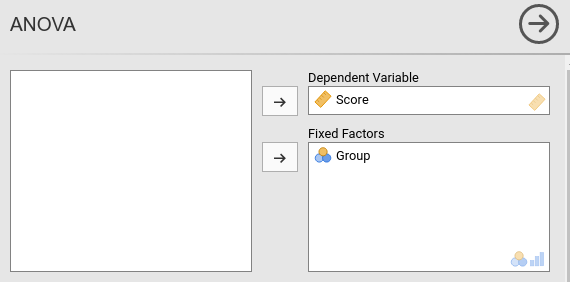

Setting the contrasts to `deviation`

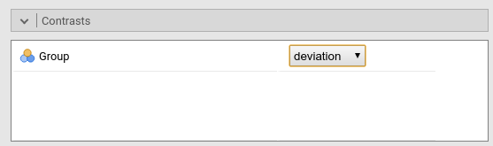

Results:

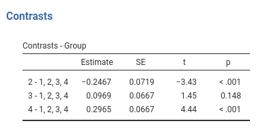


## `r jamovi` `r modulename()` GLM


Results:

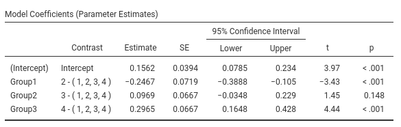

The expected means of the four groups are:

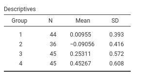

## SPSS

Please note that SPSS default sets the last group as reference group (the omitted group), thus to obtain the same results as before, we should set  `/CONTRAST(Group)=Deviation(1)`, mind the "1"", which corresponds to "first" in the GUI options.

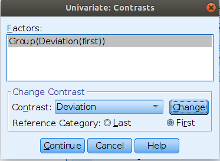


```
UNIANOVA Score BY Group
  /CONTRAST(Group)=Deviation(1)
  /METHOD=SSTYPE(3)
  /INTERCEPT=INCLUDE
  /PRINT=TEST(LMATRIX)
  /CRITERIA=ALPHA(.05)
  /DESIGN=Group.

```

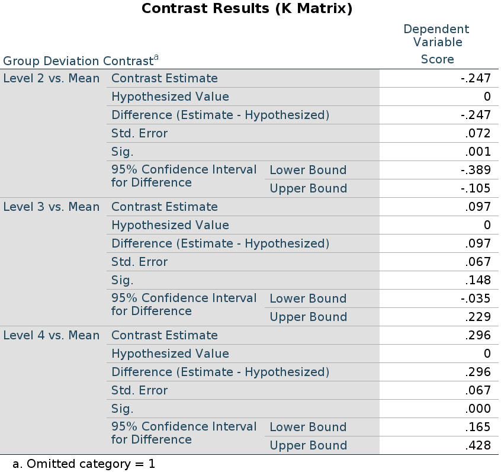


## R

In R, deviation contrast is called `contr.sum`. The function defaults to omitting the last group, so we reverse it to omit the first.


```{r}
file<-"../data/rosetta.contrasts.csv"
dat<-read.csv2(file,stringsAsFactors = F)
dat$Group<-factor(dat$Group)
dat$Score<-as.numeric(dat$Score)
### reverse contrast sum ###
contrasts(dat$Group)<-matrix(rev(contr.sum(4)),ncol=3)
contrasts(dat$Group)
model<-lm(Score~Group,data=dat)
summary(model)
## means
(mm<-tapply(dat$Score, dat$Group, mean))

```

## R emmeans

To employ `emmeans` package, we first estimate the model (which coding system we use does not matter), then we run the function `emm<-emmeans(model,specs)`, where `specs` is the factor for which we want to compare the means, and then we apply `contrast(emm,contrast_type)` to the emmeans object. `contrast_type` is a string equal to the contrast function we want to use. We add `adjust="none"` to obtain the same p-values as in the previous analyses, but any adjustment supported by `emmeans` can be applied here. If we omit the `adjust` option, the default multiplicity adjustment method is "fdr" , cf. [emmeans package](https://www.google.it/url?sa=t&rct=j&q=&esrc=s&source=web&cd=1&ved=0ahUKEwjqpImqvYLYAhVQpKQKHTcMBtUQFggqMAA&url=https%3A%2F%2Fcran.r-project.org%2Fweb%2Fpackages%2Femmeans%2Femmeans.pdf&usg=AOvVaw1kHsWAafZ1Rhf3b-f7uruS).

The `deviation` contrast it is named `eff` in emmeans.

```{r}
library(emmeans)
model<-lm(Score~Group,data=dat)
emm<-emmeans(model,~Group)
contrast(emm,"eff",reverse=T,adjust = "none")

```

Please notice that `emmeans` computes all possible comparisons: group 1 against the grand mean, group 2 against the grand mean, etc. 

# Contrast: Simple & Dummy

## Meaning

<b>Definition: </b><i> Compares each group with the first group.</i>


## `r jamovi` ANOVA

We set the contrasts to `simple`

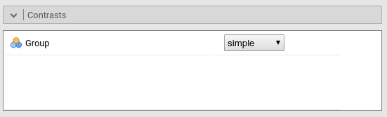

Results:

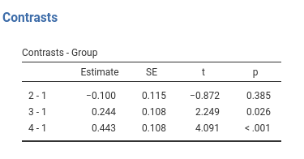


## `r jamovi` `r modulename()` GLM

This is `r modulename()` default (since version 1.5). The contrasts in `r modulename()` is identical to the ANOVA module.


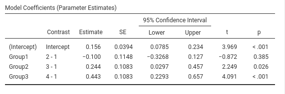


## SPSS

Please note that SPSS default sets the last group as reference group, thus to obtain the same results as before, we should set  `/CONTRAST(Group)=Simple(1)`, mind the "1"", which corresponds to "first" in the GUI options.

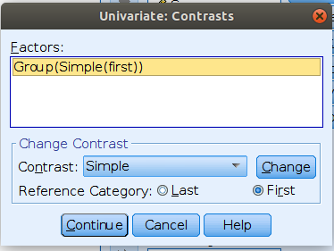


```
UNIANOVA Score BY Group
  /CONTRAST(Group)=Simple(1)
  /METHOD=SSTYPE(3)
  /INTERCEPT=INCLUDE
  /PRINT=TEST(LMATRIX)
  /CRITERIA=ALPHA(.05)
  /DESIGN=Group.


```


Results:

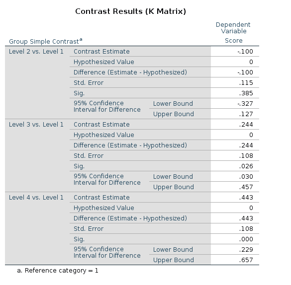


## R

In R, simple contrast can be obtained as follows:

```{r}

#### contrast=simple #######
dat$Group<-factor(dat$Group)
k<-4 # number of levels
contrasts(dat$Group)<-contr.treatment(k)-(1/k)
contrasts(dat$Group)
model<-lm(Score~Group,data=dat)
summary(model)

```

If one need the uncentered _dummy_ coding, it can be obtained in R using `contr.treatment(k)`.

## R emmeans

The `simple` contrast can be achieved in emmeans with `dunnett`.

```{r}
model<-lm(Score~Group,data=dat)
emm<-emmeans(model,~Group)
contrast(emm,"dunnett",adjust = "none")

```


## Simple vs Dummy

`r modulename()` distinguishes between _simple_ and _dummy_ coding schemes. They give equivalent results in means comparisons, simple effects, and contrast coefficients. The only difference is that the `Dummy` is not centered, and so when the codes are involved in interactions, the effects of the other variables have different meaning. In the presence of interactions, when _simple_ is used, the other variables effects are computed averaging across the sample; when _dummy_ is used, the other variables effects are computed for the reference group (the first group) defined by the _dummy_ coding. 

# Contrast: Repeated


<b>Definition: </b><i> Compares each group with the subsequent group</i> 


## `r jamovi` ANOVA

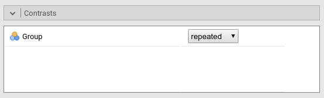

Results:

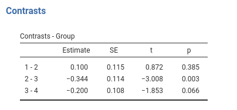


## `r jamovi` `r modulename()` GLM

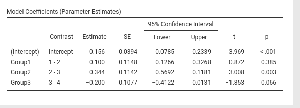

## SPSS

```
UNIANOVA Score BY Group
  /CONTRAST(Group)=REPEATED
  /METHOD=SSTYPE(3)
  /INTERCEPT=INCLUDE
  /PRINT=TEST(LMATRIX)
  /CRITERIA=ALPHA(.05)
  /DESIGN=Group.


```

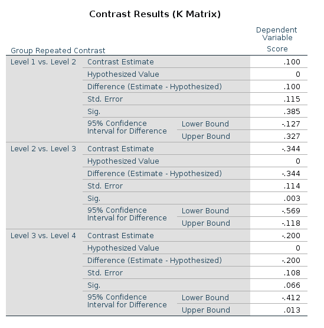

## R

R does not have an out-of-the-box contrast equivalent to `repeated` contrast. One can, howerver, uses the `contr.sdif()` function in `MASS` package. As compared with `r jamovi` and SPSS the comparisons are in the opposite direction, so we simply multiply the code by -1 (t-tests and p-values do not depend on this):

```{r}

library(MASS)
repeated<-(-1)*contr.sdif(4) 
repeated
contrasts(dat$Group)<-repeated
summary(lm(Score~Group,data=dat))

```

... and we're just fine.

## R emmeans

The `repeated` contrast can be achieved in emmeans with `consec`. To align the results to the `r jamovi` SPSS, we should reverse the contrast coding, with the option `reverse`.

```{r}
model<-lm(Score~Group,data=dat)
emm<-emmeans(model,~Group)
contrast(emm,"consec",adjust = "none",reverse=T)

```


# Contrast: Polynomial

<b>Definition: </b><i> Test polynomial (linear, quadratic, cubic, etc.) trends in the means pattern</i> 


## `r jamovi` ANOVA

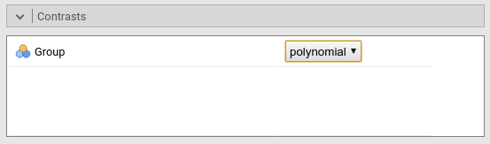

Results:

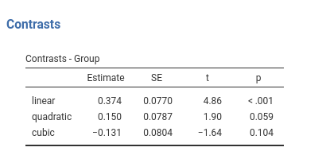


## `r jamovi` `r modulename()` GLM

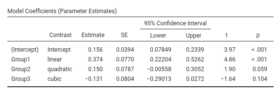

## SPSS

```
UNIANOVA Score BY Group
  /CONTRAST(Group)=POLYNOMIAL
  /METHOD=SSTYPE(3)
  /INTERCEPT=INCLUDE
  /PRINT=TEST(LMATRIX)
  /CRITERIA=ALPHA(.05)
  /DESIGN=Group.


```

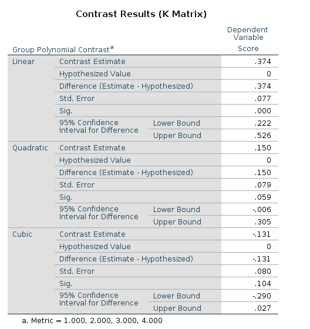

## R

R has an out-of-the-box contrast named `contr.poly()` contrast. It works like a sharm.

```{r}

contrasts(dat$Group)<-contr.poly(4)
summary(lm(Score~Group,data=dat))

```

... and we can sleep like babies.


## R emmeans

The `poly` contrast has a direct implementation in `emmeans` with `poly`.

```{r}
model<-lm(Score~Group,data=dat)
emm<-emmeans(model,~Group)
contrast(emm,"poly",adjust = "none")

```


# Contrast: Difference 

Difference and helmert contrasts are great source of confusion when one is comparing different software results. SPSS and `r jamovi` use the same definition for them, but R has a different implementation. Different authors uses different definitions, so be aware of which comparisons are implemented.


<b>Definition: </b><i>Compares each group with the average of previous groups.</i> 

This is sometimes named _Reverse Helmert Coding_ , cf. [UCLA idre web site](https://stats.idre.ucla.edu/r/library/r-library-contrast-coding-systems-for-categorical-variables/). 

## `r jamovi` ANOVA

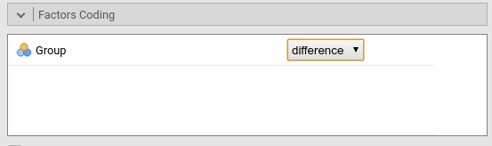

Results:

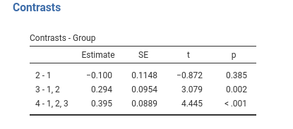


## `r jamovi` `r modulename()` GLM

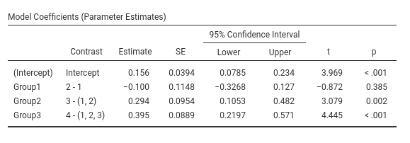

## SPSS

```
UNIANOVA Score BY Group
  /CONTRAST(Group)=DIFFERENCE
  /METHOD=SSTYPE(3)
  /INTERCEPT=INCLUDE
  /PRINT=TEST(LMATRIX)
  /CRITERIA=ALPHA(.05)
  /DESIGN=Group.


```

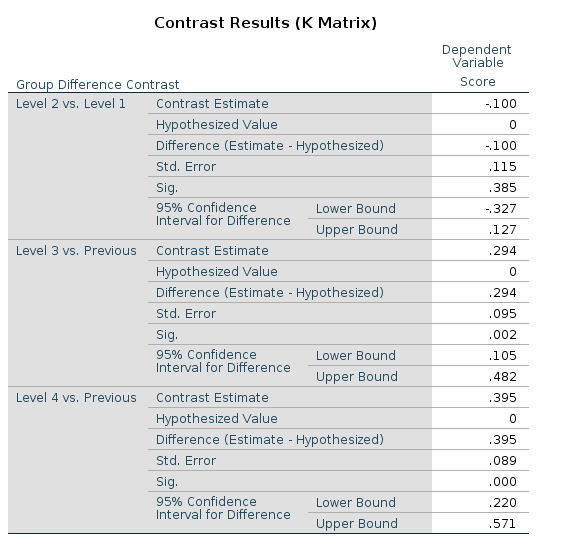


## R

The t-tests and p-values associated with the _difference contrast_ can be obtained in R using the `contr.helmert()` function. Despite the name, `contr.helmert()` implements what is usually named "Reversed Helmert contrast". Obviously, this is perfectly fine (cf. [ An R and S-Plus Companion to Applied Regression](http://www.amazon.com/gp/product/0761922806/ref=as_li_ss_tl?ie=UTF8&camp=1789&creative=390957&creativeASIN=0761922806&linkCode=as2&tag=curiousanduseful)), but one should be aware of this difference. The contrast weights in R are scaled differently than in SPSS or `r jamovi`, thus the contrast values (the coefficients) are not identical to the ones obtained in `r jamovi` and SPSS, but they are proportional to them (that is why the t-tests are the same).

```{r}

dat$Group<-factor(dat$Group)
contrasts(dat$Group)<-contr.helmert(4)
contrasts(dat$Group)
model<-lm(Score~Group,data=dat)
summary(model)

```

To obtain the `r jamovi`/SPSS estimate values in R, we should multiply the coefficients obtained in R by the index of the column of the contrasts (starting from 2 because 1 is for the intercept). To make things a bit more general, we can define a _conversion vector_ that works both for deviation and helmert contrasts. Let the _conversion vector_ be $\mathbf{cv}=max(c_i)+1$, where $c_i$ is a column of the contrast matrix.

```{r}
cv<-apply(contr.helmert(4),2,max)+1
cv
```
To obtain the same coefficients in R and in `r jamovi`/SPSS, we can multiply the model coefficients by $\mathbf{cv}$

```{r}

coef(model)[c(2:4)]*cv

```

Or divide the contrast weights by $\mathbf{cv}$

```{r}
### make a diagonal matrix with cv in the diagonal ##########
diag_cv<-matrix(rep(cv,each=4),ncol=3)
contrasts(dat$Group)<-contr.helmert(4)/diag_cv
contrasts(dat$Group)
model<-lm(Score~Group,data=dat)
summary(model)

```

... and we get the same values, t-tests and p-values as in `r jamovi` and SPSS.


## R emmeans

Difference and helmert are not implemented in emmeans package, but `emmeans` has a very clever way to implement custom contrast coding. We need to define a function whose name ends with `.emmc` and returns the coding as a data.frame, and then pass it to `emmeans` `contrasts` function. The coding weights are the one of the contrast matrix used in SPSS (see [contrast matrix vs model matrix](#contrast_matrix_and_model_matrix_details) for details).

```{r dif_emm}
library(MASS) ## needed for ginv(), see below 

difference.emmc<<-function(levs) {
  n<-length(levs)
  #### model matrix ########
  con_weights<-contr.helmert(n)
  cv<-apply(con_weights,2,max)+1
  diag_cv<-matrix(rep(cv,each=n),ncol=n-1)
  model_mat<-con_weights/diag_cv

  ##### contrast matrix ########
  cont_mat<-ginv(t(model_mat))
  M <- as.data.frame(cont_mat)
  names(M) <- paste(levs[-1],"vs previous")
  attr(M, "desc") <- "Difference contrasts"
  M
}
#### contrast matrix #########
round(difference.emmc(levels(dat$Group)),digits = 3)
#### results ##############
contrast(emm,method="difference",adjust="none")

```

Same results as before.


# Contrast: Helmert


<b>Definition: </b><i>Compares each group with the average of subsequent groups</i> 


## `r jamovi` ANOVA

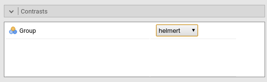

Results:

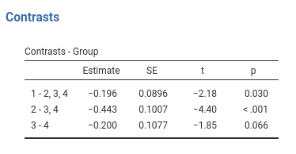


## `r jamovi` `r modulename()` GLM

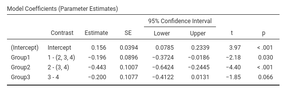

## SPSS

```
UNIANOVA Score BY Group
  /CONTRAST(Group)=HELMERT
  /METHOD=SSTYPE(3)
  /INTERCEPT=INCLUDE
  /PRINT=TEST(LMATRIX)
  /CRITERIA=ALPHA(.05)
  /DESIGN=Group.

```

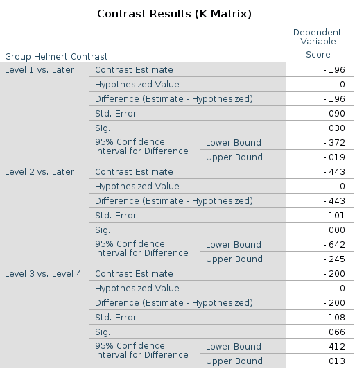

## R

R defines helmert contrast in the reverse order as compared with `r jamovi` and SPSS, and uses a different scaling. To obtain the helmert contrast as it is was defined above, we should reverse `contr.helmert()` and rescale the coding as we did for the `difference` contrasts. Without rescaling, the t-test and p-values are the same as in `r jamovi`/spss, but the estimated values are different (but proportional).

```{r}

dat$Group<-factor(dat$Group)
contrasts(dat$Group)<-matrix(rev(contr.helmert(4)),ncol=3)
con_weights<-contrasts(dat$Group)
#### not scaled contrast weights ######
con_weights
model<-lm(Score~Group,data=dat)
summary(model)

```

To obtain the `r jamovi`/SPSS values in R, we should compute $\mathbf{cv}=max(c_i)+1$, and multiply it by the model coefficients.

```{r}
cv<-apply(con_weights,2,max)+1
cv
coef(model)[c(2:4)]*cv
```

or divide the contrast weights by $\mathbf{cv}$

```{r}
### make a diagonal matrix with cv in the diagonal ##########
diag_cv<-matrix(rep(cv,each=4),ncol=3)
########  divide the contrast weights ##########
helm<-con_weights/diag_cv

### scaled contrast weights ############
helm
contrasts(dat$Group)<-helm
model<-lm(Score~Group,data=dat)
summary(model)
```

... and we're happy campers.


## R emmeans

We need to define a funtion whose name ends with `.emmc` which returns the contrast matrix, and then pass it to emmeans `contrasts`. The contrast matrix is the same used in SPSS and can be obtained from the model matrix used in standard R (see [contrast matrix vs model matrix](#contrast_matrix_vs_model_matrix) for details).

```{r}
library(MASS) # needed for ginv(), see below
helmert.emmc<<-function(levs) {
  n<-length(levs)
  #### build model matricx ######
  con_weights<-matrix(rev(contr.helmert(n)),ncol=n-1)
  cv<-apply(con_weights,2,max)+1
  diag_cv<-matrix(rep(cv,each=n),ncol=n-1)
  model_mat<-con_weights/diag_cv
  #### obtain contrast matrix #######
  cont_mat<-ginv(t(model_mat))
  
  M <- as.data.frame(cont_mat)
  names(M) <- paste(levs[1:(length(levs)-1)],"vs subsequent")
  attr(M, "desc") <- "Helmert contrasts"
  M
}

helmert.emmc(levels(dat$Group))
contrast(emm,"helmert",adjust="none")


```

Same results!


# Contrast matrix vs model matrix 

We have seen that `r jamovi`, SPSS and `emmeans` provide descriptions of the comparisons being estimated as labels of the contrast. However, if one needs to deepen the understanding of the contrast at hand, one needs to examine the contrast coding scheme. SPSS and `emmeans` can show the coding scheme in the form of  __contrast matrix__. 

To visualize the contrast matrix in in SPSS one uses the option   `/PRINT=TEST(LMATRIX)` , and in `emmeans` one can use the function `coef()` on the contrast object output by the `contrast()` function.

Let's see an example using the `repeated` contrast:    

This is the `LMATRIX` one gets in SPSS

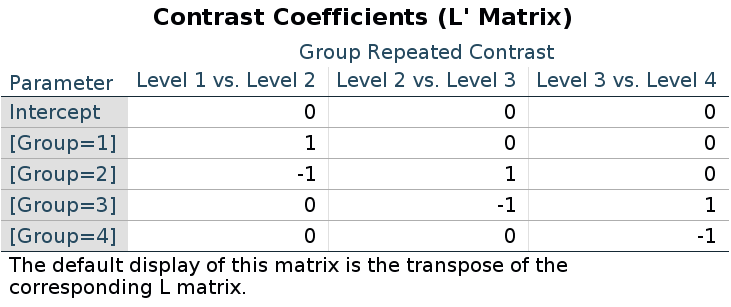

and this is the contrast matrix one gets from `emmeans`:


```{r}
library(emmeans)
model<-lm(Score~Group,data=dat)
emm<-emmeans(model,~Group)
cont<-contrast(emm,"consec",reverse=T,adjust = "none")
coef(cont)

```

When it comes to R model estimation ( `lm()`, `lmer()`, `glm()` ), however, we should notice that to obtain the same comparisons obtained by the other packages, one needs to code the comparisons in form of the __model matrix__, not the contrast matrix. This may be confusing, but that's the way it is.

In fact, upon inspecting the coding scheme generated by the `contr.*` functions, one see that the coding does not correspond to the _contrast matrix_ seen before.

For `repeated` contrasts in R we use:
```{r}
(-1)*contr.sdif(4)

```

Recall (cf. the repeated contrast results above) that the results are identical between the R, SPSS and `emmeans`, even thought the coding seems different.

Now, if you try to use the SPSS LMATRIX in R, you are not going to get the results expected by the `repeated` contrast. Indeed (coefficients were `.100,-.344,-.200`) :

```{r}

ones<-matrix(c(1,-1,0,0,0,1,-1,0,0,0,1,-1),ncol=3)
ones
contrasts(dat$Group)<-ones
summary(model)
```

The reason of this discrepancy is that the LMATRIX  is the contrast matrix, a matrix that shows the linear hypotheses implied by the contrast and represents the starting point of the coding system, not the model matrix itself. Thus, the constrast matrix (SPSS LMATRIX) is useful to understand what is going on in the comparisons: by inspecting the contrast matrix one can easily see that in column 1 groups 1 and 2 are compared, in column 2 groups 2 vs 3, and so on. 

A clear technical explanation is provided in [Venables 2017](https://cran.r-project.org/web/packages/codingMatrices/vignettes/codingMatrices.pdf), where you find the definition of the contrast matrix (**$C$** in the Venable's vignette) and the model matrix (**$B$** in the vignette).

Ok, but what is the relation between the contrast matrix and the R model matrix? or even better: How do I get from the contrast matrix to the R model matrix? Just __take the inverse of the contrast matrix and traspose it__. In R, one can take the inverse of a matrix by using `MASS::ginv()` function. Let's see:


```{r}
##### SPSS LMATRIX ####
ones
### take the inverse ####
iones<-ginv(ones)
### transpose it ###
t(iones)

```

and there you are: the R model matrix.

Does it work in general? Yes! Take `deviation` contrast, with group 1 omitted.

SPSS LMATRIX is:
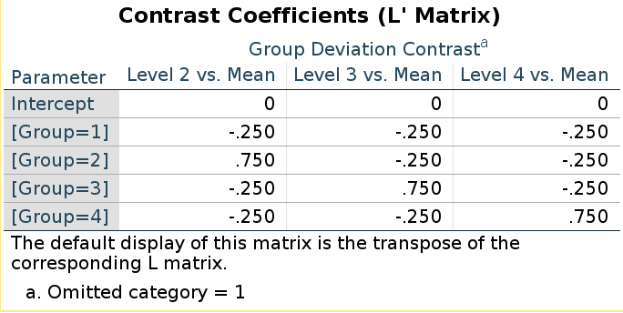

and R model matrix we have seen before:

```{r}
(deviation<-matrix(rev(contr.sum(4)),ncol=3))

```

They seem different, but taking the inverse of the LMATRIX and transposing it, we get the R coding system.

```{r}
##### SPSS LMATRIX ####
lmat<-matrix(rep(-.25,12),ncol=3)
lmat[2,1]<-.75
lmat[3,2]<-.75
lmat[4,3]<-.75
lmat
### take the inverse ####
ilmat<-ginv(lmat)
### transpose it ###
round(t(ilmat),digits = 3)

```

There you have the actual model matrix.

Let us be sure and check polynomial contrasts. 

SPSS LMATRIX is:
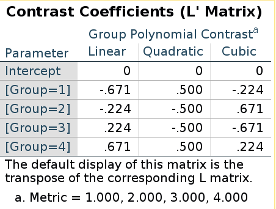

R model matrix:

```{r}
(polynom<-contr.poly(4))

```

They are the same this time! Does it means that in this case the "inversion" does not apply? Well, it does apply, but because the polynomial contrast codes are orthogonal, the inverse of the contrast matrix is equal to the transpose of the contrast matrix, thus taking the inverse and then transpose it gives back the same matrix (cf [orthogonal matrix](https://en.wikipedia.org/wiki/Orthogonal_matrix))

```{r}
ipoly<-ginv(polynom)
t(ipoly)
```

## Building custom contrast in emmeans

We have seen that `emmeans` allows to define custom contrast coding. When we do that, we should remember that we need to define the contrast matrix, __not__ the model matrix. Thus, for repeated contrast, in R we used `(-1)*contr.sdif(n)`:

```{r}
(rcodes<-(-1)*contr.sdif(4))
```
and `emmeans` uses:
```{r}
cont<-contrast(emm,"consec",referse=T,adjust = "none")
(weigths<-coef(cont)[,2:4])
```

To get the contrast matrix from the model matrix we neet to get the __inverse of the transpose__:

```{r}
#### model matrix ######
rcodes
#### transpose the R model matrix ######
tcodes<-t(rcodes)
#### invert it #####
round(ginv(tcodes),digits = 3)


```

Now we can build a custom contrast function for `emmeans`: let's do `helmert` as we defined above.

Let's start with the model matrix used in R.

```{r}
con_weights<-matrix(rev(contr.helmert(4)),ncol=3)
cv<-apply(con_weights,2,max)+1
diag_cv<-matrix(rep(cv,each=4),ncol=3)
helm<-con_weights/diag_cv
helm

```

Take the inverse of the transpose of it


```{r}
(contr_mat<-ginv(t(helm)))
```

This is the contrast matrix we can pass to `emmeans`. We just need to wrap it up in a function with `.emmc()` reference class and `levels` as input.

```{r}

helmert.emmc<<-function(levs) {
  n<-length(levs)
  con_weights<-matrix(rev(contr.helmert(n)),ncol=n-1)
  cv<-apply(con_weights,2,max)+1
  diag_cv<-matrix(rep(cv,each=n),ncol=n-1)
  helm<-con_weights/diag_cv
  model_mat<-ginv(t(helm))
  M <- as.data.frame(model_mat)
  names(M) <- paste(levs[1:(length(levs)-1)],"vs subsequent")
  attr(M, "desc") <- "Helmert contrasts"
  M
}
helmert.emmc(levels(dat$Group))
contrast(emm,"helmert",adjust="none")

```

and we get the contrast estimates as expected. For the `difference` contrast we can use `con_weights<-contr.helmert(n)` in the function and we get the correct codes.

:::{ .adm .adm-seealso}
# Rosetta's files
`r list_pages(category="rosetta")`
:::

`r issues()`