```{r setup, echo=FALSE,results='hide'}
library(mcdocs)
mcdocs_init()
```


`r keywords("jamovi, R, SPSS, logistic, generalized mixed, mixed models")`

`r version("2.0.0")` `r draft` 


Here you can find comparisons of results obtained in `r jamovi` `r modulename()`, R, and SPSS. When not explicitly discussed, the code of different software is written with the aim of obtaining identical results across programs (not necessarily with the most efficient strategy).

In this example we compare `r modulename()` results with R results obtained by IDRE on their [tutorial web page](https://stats.idre.ucla.edu/r/dae/mixed-effects-logistic-regression/), and with SPSS results.

# The research design

In this example, we are going to explore lung cancer remission using a simulated dataset. A variety of outcomes were collected on patients, who are nested within doctors, who are in turn nested within hospitals. There are also a few doctor level variables, such as _Experience_, that we will use in our example ([IDRE](https://stats.idre.ucla.edu/r/dae/mixed-effects-logistic-regression/)). Data can be downloaded [here](https://stats.idre.ucla.edu/stat/data/hdp.csv)

# R
The researcher is interested in studying the relationships between cancer remission and both patients and doctors characteristics. The analyst uses the R `glmer` command from the `lme4 Package`  to estimate a mixed effects logistic regression model with `Il6`, `CRP`, and `LengthofStay` as patient level continuous predictors, `CancerStage` as a patient level categorical predictor (I, II, III, or IV), `Experience` as a doctor level continuous predictor, and a random intercept by `DID`, doctor ID.

## Results

```r
# estimate the model and store results in m
m <- glmer(remission ~ IL6 + CRP + CancerStage + LengthofStay + Experience +
    (1 | DID), data = hdp, family = binomial, control = glmerControl(optimizer = "bobyqa"),
    nAGQ = 10)

# print the mod results without correlations among fixed effects
print(m, corr = FALSE)
```


```r

## Generalized linear mixed model fit by maximum likelihood (Adaptive
##   Gauss-Hermite Quadrature, nAGQ = 10) [glmerMod]
##  Family: binomial ( logit )
## Formula: 
## remission ~ IL6 + CRP + CancerStage + LengthofStay + Experience +  
##     (1 | DID)
##    Data: hdp
##      AIC      BIC   logLik deviance df.resid 
##     7397     7461    -3690     7379     8516 
## Random effects:
##  Groups Name        Std.Dev.
##  DID    (Intercept) 2.01    
## Number of obs: 8525, groups: DID, 407
## Fixed Effects:
##    (Intercept)             IL6             CRP   CancerStageII  
##        -2.0527         -0.0568         -0.0215         -0.4139  
## CancerStageIII   CancerStageIV    LengthofStay      Experience  
##        -1.0035         -2.3370         -0.1212          0.1201

```

The analyst goes on in computing the confidence intervals of the estimates applying the simple formula $\theta \pm 1.96 \cdot SE_{\theta}$.

```r
se <- sqrt(diag(vcov(m)))
# table of estimates with 95% CI
(tab <- cbind(Est = fixef(m), LL = fixef(m) - 1.96 * se, UL = fixef(m) + 1.96 *se))
```

```r
##                     Est       LL        UL
## (Intercept)    -2.05269 -3.09435 -1.011025
## IL6            -0.05677 -0.07935 -0.034196
## CRP            -0.02148 -0.04151 -0.001455
## CancerStageII  -0.41393 -0.56243 -0.265436
## CancerStageIII -1.00346 -1.19610 -0.810828
## CancerStageIV  -2.33704 -2.64683 -2.027241
## LengthofStay   -0.12118 -0.18710 -0.055261
## Experience      0.12009  0.06628  0.173895
```

Also the $e^B$ are computed.

```
exp(tab)
```
```

##                    Est      LL     UL
## (Intercept)    0.12839 0.04530 0.3638
## IL6            0.94481 0.92372 0.9664
## CRP            0.97875 0.95934 0.9985
## CancerStageII  0.66104 0.56982 0.7669
## CancerStageIII 0.36661 0.30237 0.4445
## CancerStageIV  0.09661 0.07088 0.1317
## LengthofStay   0.88587 0.82936 0.9462
## Experience     1.12760 1.06853 1.1899

```


# GAMLj 

`r jamovi` `r modulename()` module for `Generalized mixed models` can be used to estimate a random coefficient mixed model. First, it requires choose the specific model we want to run: the `Logistic` model.

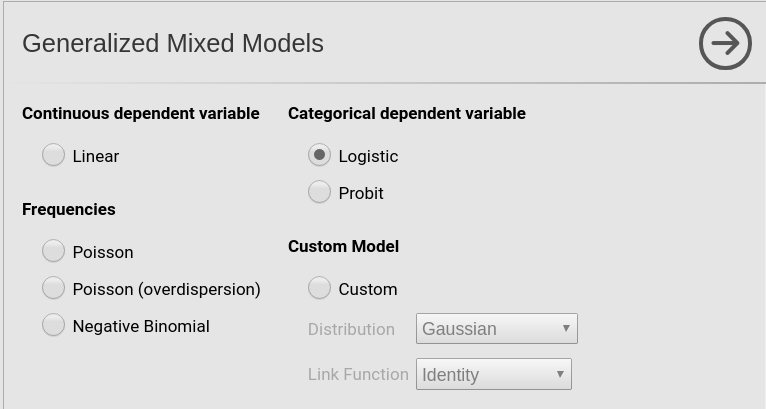

Then we set the variables in the right field depending on their role in the model and their type. 

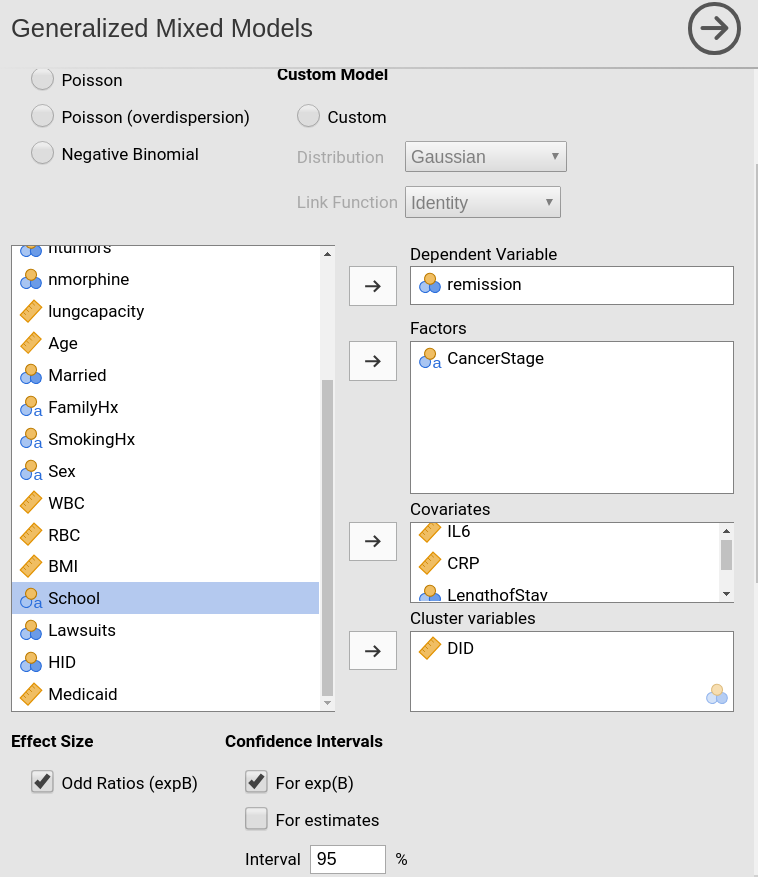

Please note that we put `LengthOfStay` in covariates because it is a continuous variable, even though `r jamovi` recognizes it a categorical. By putting it in `r opt("Covariates")`, we implicitly ask the module to treat it a continuous variable. The opposite holds for `DID` (doctors ID) which `r jamovi` recognizes as continuous but the module treats as categorical after we put it in the `r opt("Clusters")` field.

After the first setup, we need to specify the random effects. Following the IDRE analysis, we specify the intercept as random coefficient across doctors (`DID`).

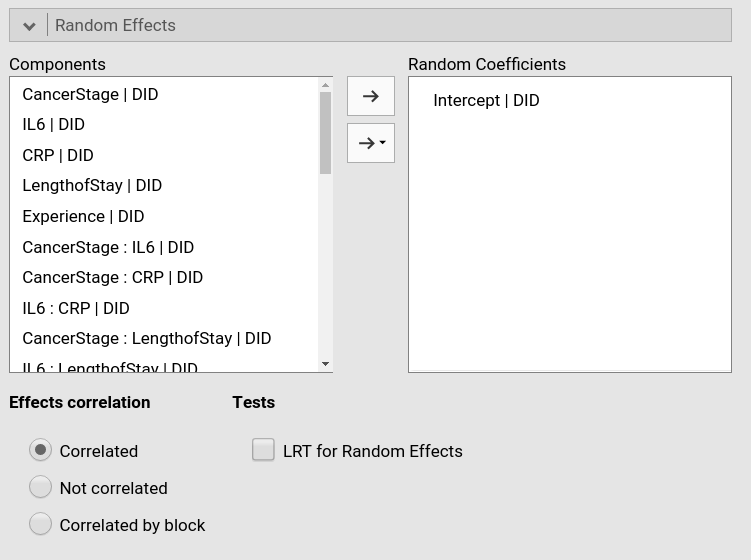

As soon as we include a random effect, the model is estimated

## Results

Let's us first focus on the fixed parameters estimates, the B coefficients.

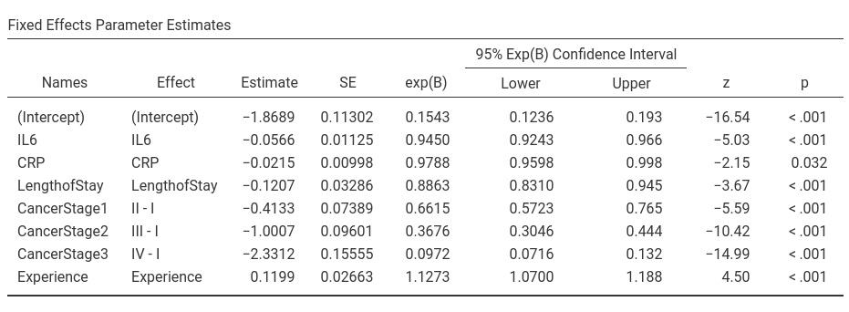

For the predictors coefficients we have substantially the same results as in R, apart from rounding. For the intercept  we have different results. The reason is the different default coding of the variables in `r modulename()` and in R. In R default, factors are coded with the _dummy coding scheme_, that is 

```
> contrasts(hdp$CancerStage)
    II III IV
I    0   0  0
II   1   0  0
III  0   1  0
IV   0   0  1
```

and continuous independent variables are not scaled. In `r modulename()` the default coding system for categorical variable is ``r opt("simple")`.

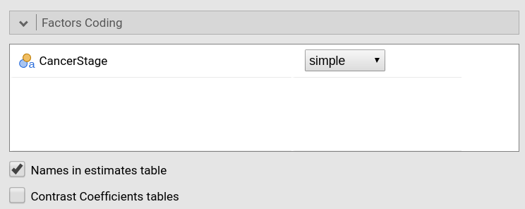

which results in a centered contrast.

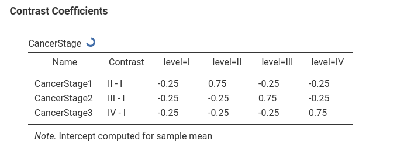

Continuous variables are centered by default. 


Thus, in GAMLj the intercept is the expected mean of the (transformed) dependent variable, whereas in R is the expected mean of the (transformed) dependent variable for all continuous independent variables equal to zero and the group scoring all zeros in the categorical variable.

Also the exp(B) and their confidence intervals are equivalent in the two analyses, apart from rounding.


As regards the random coefficients variance, `lme4::glmer` produced a `SD` of 2.01, thus a variance of `r 2.01^2`, which is noticeably different from the GAMLj results.

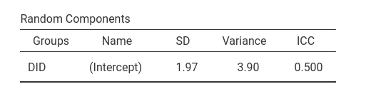

The reason of this difference is in the precision of the estimation. `lme4::glmer` estimates the model parameters evaluating the adaptive Gauss-Hermite approximation to the log-likelihood. How good the approximation will be is decided by the option `nAGQ`, specified in the `glmer` command above. The higher the number, the better the approximation, with a penalty in speed. Also GAMLj lets the user decide the precision level of the estimation with the equivalent parameter `precision/speed` in the `Options` tab.


GAMLj default is a value of 1 (fast but not highly precise estimation). If we set the `precision/speed` parameter to 10, we obtain exactly the same results obtained in R. The estimation will take some time, however.

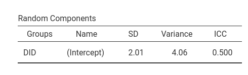

## Omnibus tests

The IDRE analysis did not report the omnibus tests. In R, one can obtain the omnibus tests employing the `car::Anova` command. The command lets us specify what Type of analysis to do. We can ask of the Type III analysis and we get the Chi-square tests. 

```r
library(car)
Anova(mod,type=3)

```

```r
Analysis of Deviance Table (Type III Wald chisquare tests)

Response: remission
               Chisq Df Pr(>Chisq)    
(Intercept)   14.918  1  0.0001123 ***
IL6           24.293  1  8.273e-07 ***
CRP            4.420  1  0.0355197 *  
CancerStage  256.523  3  < 2.2e-16 ***
LengthofStay  12.982  1  0.0003145 ***
Experience    19.135  1  1.218e-05 ***
---
Signif. codes:  0 ‘***’ 0.001 ‘**’ 0.01 ‘*’ 0.05 ‘.’ 0.1 ‘ ’ 1

```

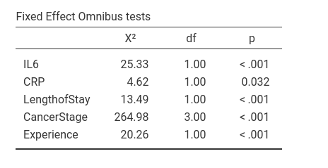


Compared with GAMLj results, there's substantial agreement even though the figures are not the same, apart from rounding. The reason is that the estimation of the deviance of the model, on which the omnibus tests are based, may be slightly influenced by the scale of the variables. It is well-known that in the general linear model (i.e. regression), the linear coefficients are invariant to linear scaling of the independent variables. That is, if you have centered or not centered the variables, the B's are the same (when no interaction is present in the model). In generalized mixed models, the scale may slightly influence the estimation, yielding different results for re-scaled variables. 

Thus, the small difference in the omnibus tests obtained with R and with GAMLj are due to the fact that in the R analysis the variables are not re-scaled, while in GAMLj they are centered. In fact, if we do not center the variables in GAMLj, results become identical to the R results.


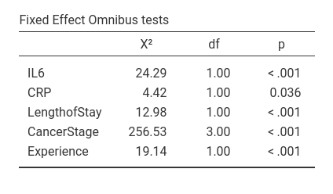

Notice, however, that the conclusions of the analyses are equivalent no matter the scale of the variables.

# SPSS

In SPSS we can run a logistic mixed models with `Generalized mixed models` menu. However, from within the `Generalized mixed models` module one cannot specify whether a variable is a continuous or categorical one, so we have to define variables types in the `Variable view` tab of the SPSS spreadsheet window. 

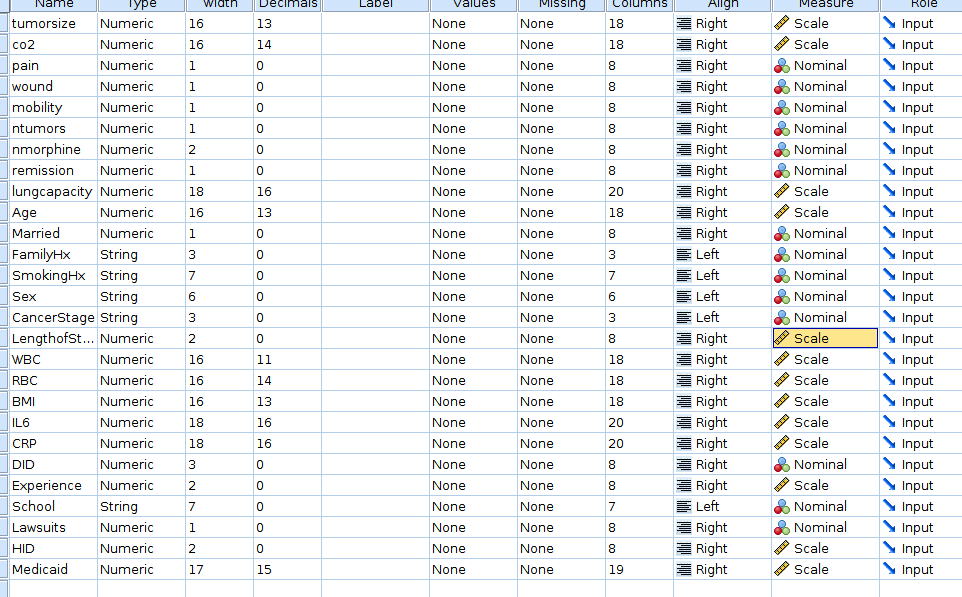

We want to be sure that `LengthOfStay`, `IL6`, `CRP` and `Experience` are set as `Scale` in the `measure` column, whereas `DID` and `CancerStage` should be `Nominal`.

Then we can go to the mixed models menu. 

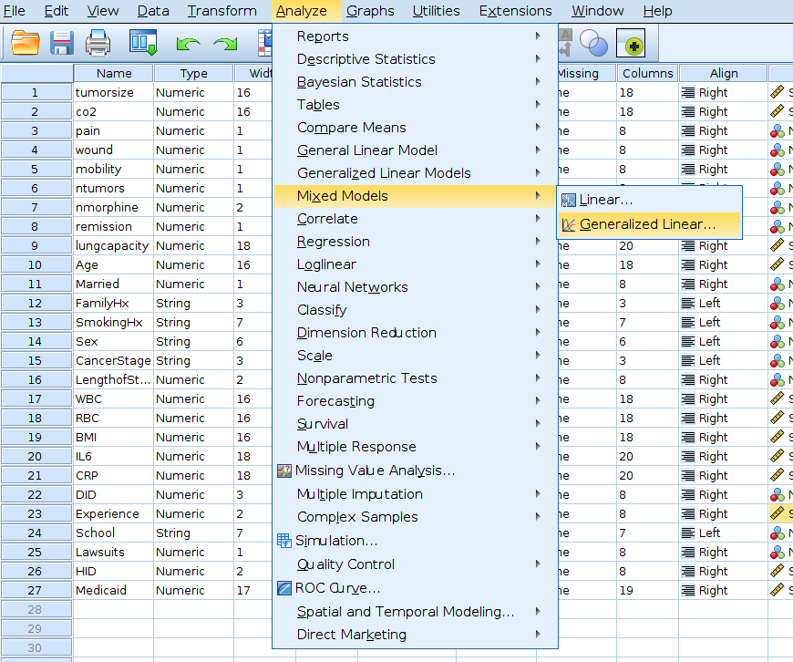

First, we should specify the cluster variable, by dragging `DID` into the `Subject` field, on the right, in the `Canvas` panel.

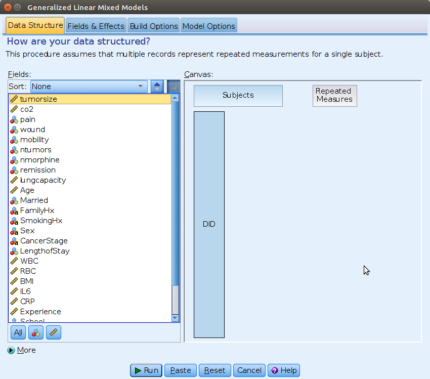

Then we can move to the `Fields & Effects` tab and specify the model type (`Binary logistic regression`) and the dependent variable (`remission`).

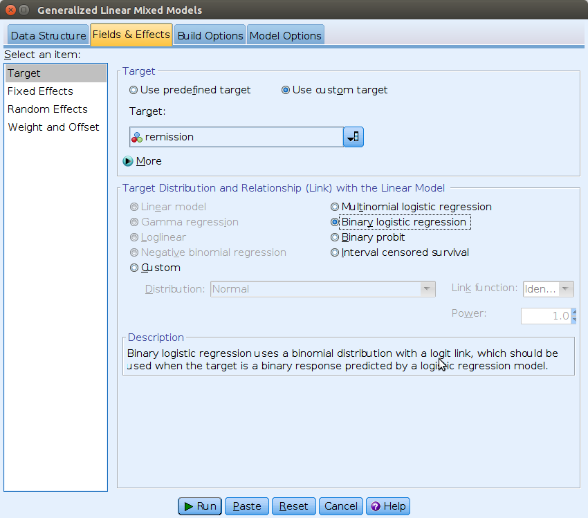

On the `Select an item` field we can then move to `Fixed Effects`, and set the independent variables.

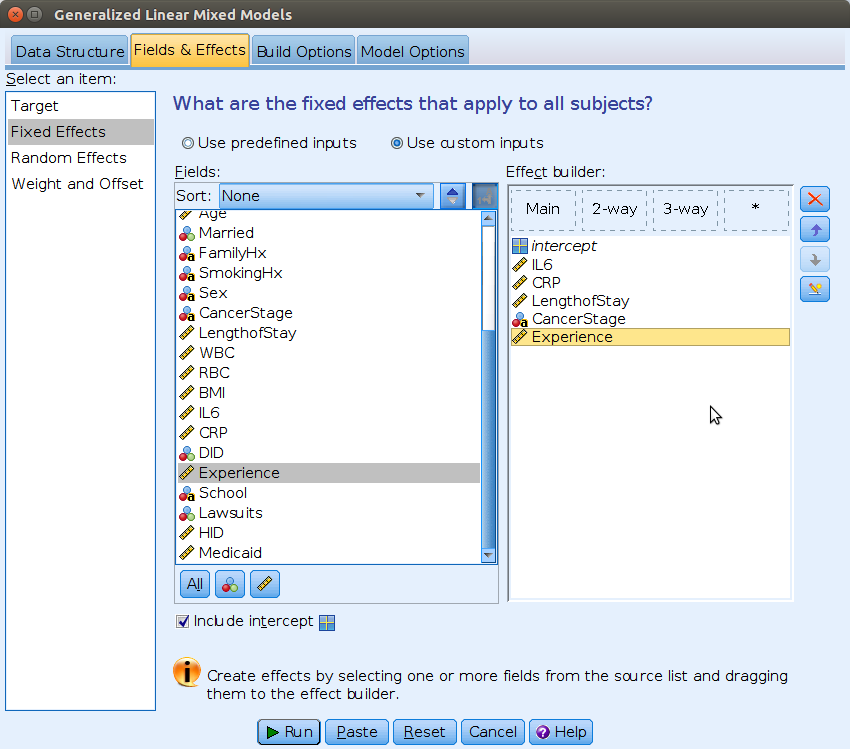

The random intercept can be specified in the `Random Effects` tab.

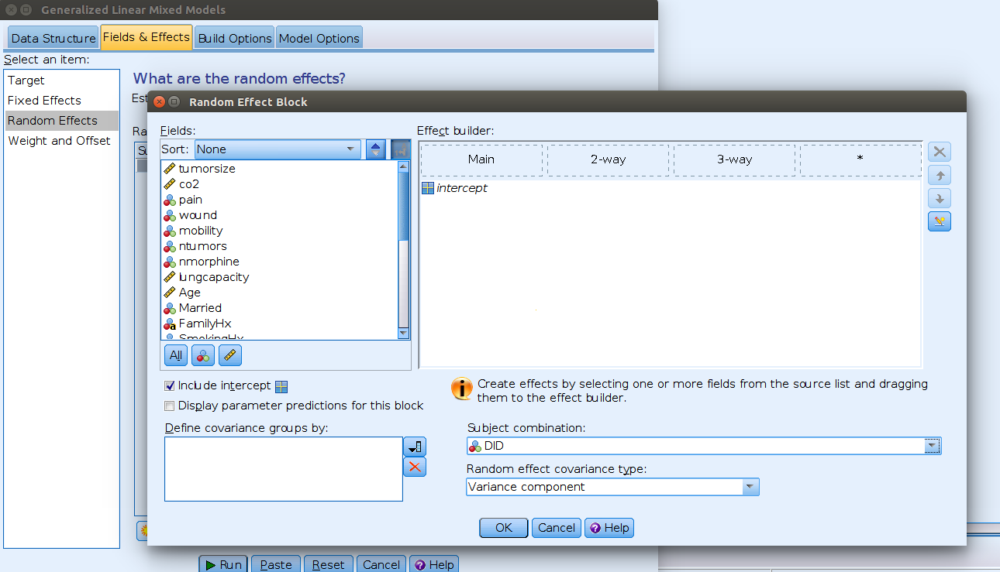

Here we need to flag the `Include intercept` option and select `DID` from the menu `Subject combination`. This means _allow intercepts to vary  across DID_.

We can then run the analysis.

## Results

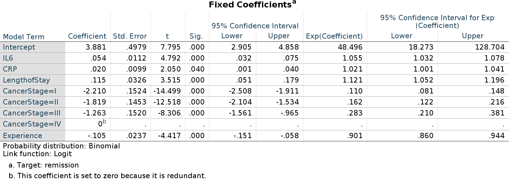


As regards the fixed effects coefficients, we notice that the continuous predictors show B's that are equivalent to R and `r jamovi` estimates, but with opposite sign. The intercept and the categorical predictor are clearly very differ. Those differences are due to way SPSS picks the reference level of the dummy coding for categorical variables. In R and `r jamovi`, the reference level is the first level in the standard ordering of the variable levels (such as the cardinal order or the alphabetical one). SPSS picks the last group! Thus, here we are predicting the probability of _not remission_, that is `remission=0`, because SPSS sets `remission=1` as the reference level. That explains the opposite sign. For the categorical independent variable `CancerStage`, SPSS picks the group `CancerStage=IV` as reference group, whereas GAMLj and R pick `CancerStage=I`. That explains the differences in the parameters.

In SPSS generalized mixed models we can change the reference level in the `Build Options` tab, selecting `Descending` in the `Sorting Order` options.


Now the interpretation of the coefficients is equivalent to the one for R and GAMLj estimation, although the numerical estimates are still different in SPSS. Not a big difference, but worth investigating the reason.


As regards the random coefficients variance, it is quite different from the R or GAMLj results.

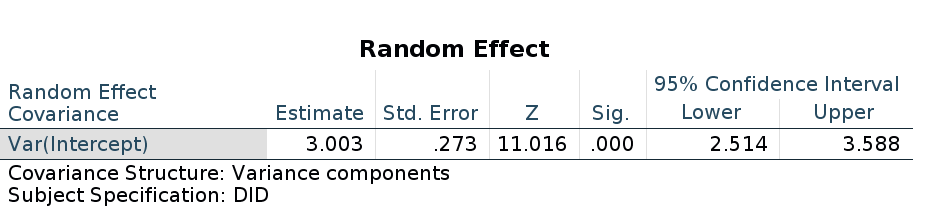

Finally, as regards the omnibus tests, SPSS outputs the F-tests, not the Chi-square. Nevertheless, the p-values associated with the tests are in line with the ones obtained in GAMLj and R.

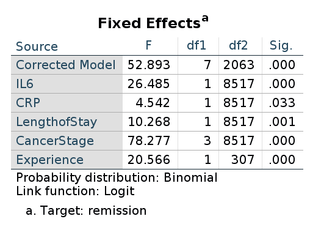

Thus, GAMLj and R `lme4::glmer` produce results that are numerically very close  and practically identical. SPSS produces results that are numerically different but substantially equivalent to the other software results.

# Rosetta's files

`r list_pages(category="rosetta")`


`r issues()`