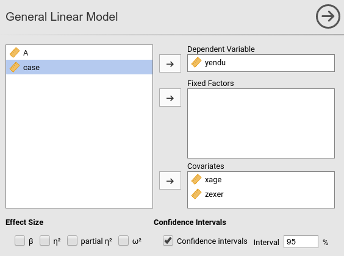
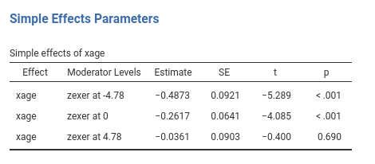
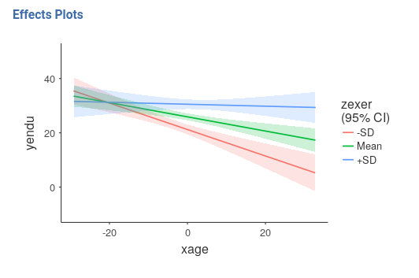

```{r echo=FALSE,results='hide'}
source("../R/functions.R")
```


`r keywords("jamovi, SPSS, R, Multiple regression, moderated regression, simple slopes, PROCESS")`

`r version("0.9.1")` `r draft` 


Here you can find comparisons of  results obtained in jamovi GAMLj, pure R, and SPSS. When not explicitely discussed, the code of different software is written with the aim of obtaing identical results across programs (not necessarely with the most efficient strategy).

In this example we tackle a moderated regression analysis with simple slopes analysis and simple slopes graphs. Data are from   [Cohen et al 2003](http://psycnet.apa.org/record/2002-18109-000) and can be downloaded  [here](https://github.com/mcfanda/gamlj_docs/blob/master/data/exercise.csv). GAMLj analyses on this dataset (without comparisons with other software) can be found in `r link_pages(nickname="exercise")`.

# The research design

The research is about physical endurance associated with age and physical exercise. 245 participants were measured while jogging on a treadmill. Edurance was measured in minutes ('yendu' in the file). Participants' age (`xage` in years) and number of years of physical exercise (`zexer` in years) were recorded as well (in jamovi `Exploration` -> `Descriptive`)  


The researcher is interested in studying the relationships between endurance, age, and exercising, with the hypothesis that the effect of age (expectedly negative) is moderated by exercise, such that the more participants work out (higher levels of `exer`) the less age negatively affects endurance. 

For a longer discussion please check out `r link_pages(nickname="exercise")`.

# GAMLj GLM

jamovi GAMLj module for GLM requires to set the variables in the right field depending on their role in the model and their type. 



Thus, we push `yendu` in the `Dependent Variable` field and both `xage` and `zexer` in the `Covariates` field, being both variables quantitative.

As soon as the variables are set, jamovi  fills in the tables in the output panel with the estimation results. However, it is worth noticing that the statistical model has been defined by default by the software: We can see that in the `Model` tab.


jamovi, following a somehow old tradition established by SPSS, automatically includes continuous independent variables in the model without their interaction. For categorical variables the default behavior is to include both main effects and interactions.

To include the interaction we simply add the interaction effect in the `Model Terms` under the `Model` tab.


The interaction is pushed in the `Model Terms` by selecting the variables on the left and click `interaction` in the "arrow" cascade menu.


## Results

Let's us first focus on the parameters estimates, the B coefficients.


GAMLj, by default, centers the variables and estimate main effects and interactions as expected by modern analysts. If one needs more advanced centering, `Covariates Scaling`  option panel can be of interest.

One can also report the betas (last column in the `Model Coefficients` table). Please notice that jamovi GLM the estimates of the betas are correct also in the presence of the interaction, because the variables are standardized before the interaction term is computed.

## Simple Slopes

We can now probe the interaction. We go to `Simple effects` tab and select `xage`  as `Simple effec variable` and `zexer` as `Moderator`. In this way we obtain the effect of age computed for high exercise (`zexer` centered to 1 SD above average, 4.78), the main effect of age (`zexer` centered to its mean, that is 0) and the effect of age computed for low exercise (`zexer` centered to -1 SD above average, -4.78).

jamovi GLM produces both the F-tests and the parameter estimates for the simple slopes. The parameters estimates are:



and the F-tests are:


## Simple Slopes Plot

We can get a clear picture of the interaction by asking for a plot. Also the plot module takes care of centering the variables in a way that makes the plot clearly understandable. 


It plots the effect of the `Horizontal axis` variable for three levels (-1 SD, mean, +1 SD) of the `Separate Lines` variable. 



The nice plot we get shows the simple effects (simple equations to be precise) with the prediction confidence intervals indicated by the colored shades around the lines. If needed, the confidence intervals can be substituted with the standard errors of the estimates or they can be removed completely.

Finaly, in order to give a more honest account of the model fit, we can visualize the simple slopes over the plots of the actual data (GAMLj v. >= 0.9.3). 


# Pure R

By pure R I mean using R-core with the minimum number of additional packages. Of course, there's always a package in R that wraps things up for us, but here we assume we do not know of any.

First load the data and center the independent variables

```{r}
dat<-read.csv("../data/exercise.csv")
dat$zexer<-dat$zexer-mean(dat$zexer)
dat$xage<-dat$xage-mean(dat$xage)

```

and then we estimate the model with the interaction between `xage` and `zexer`


```{r}

model<-lm(yendu~xage*zexer,data=dat)
(sumr<-summary(model))

```

If one requires the standardized solution, the same procedure can be done after standardizing the variables

```{r}

dat$zexer_z<-scale(dat$zexer)
dat$xage_z<-scale(dat$xage)
dat$yendu_z<-scale(dat$yendu)

model_z<-lm(yendu_z~xage_z*zexer_z,data=dat)
summary(model_z)


```

## Simple Slope

Recall that in a linear model with interaction, the simple slope (the B coefficient one gets from the model associated with the IV) is the effect of one independent variable estimated for the other variable equal to zero. Thus, by centering the moderator at different values, we can obtain the slope of a variable for any value of the moderator by centering the moderator to that value.

We use +- SD.

```{r}
# centering zexer to +SD and -SD
dat$zexer_high<-(dat$zexer)-(mean(dat$zexer)+sd(dat$zexer))
dat$zexer_low<-(dat$zexer)-(mean(dat$zexer)-sd(dat$zexer))

model_zh<-lm(yendu~xage*zexer_high,data=dat)
(sumr_zh<-summary(model_zh))

model_zl<-lm(yendu~xage*zexer_low,data=dat)
(sumr_zl<-summary(model_zl))


```

we can extract only the slopes we are interested in and show them in a table.

```{r}
## in the summary object, the effect of age is in the second row. ##

mat<-rbind(sumr_zl$coefficients[2,],sumr$coefficients[2,],sumr_zh$coefficients[2,])
rownames(mat)<-c("exer at -SD","exer at mean","exer at +SD")
mat
```

## Simple slopes plot

`ggplot2` is required for a nice graph.

```{r}
library(ggplot2)
p<-ggplot(dat, aes(x = xage, y = yendu)) + geom_point(color="gray") 
p<-p+ geom_abline(aes(color ="exer -SD",intercept = sumr_zl$coefficients[1,1],slope =sumr_zl$coefficients[2,1] ))
p<-p+ geom_abline(aes(color ="exer at mean",intercept = sumr$coefficients[1,1],slope =sumr$coefficients[2,1] ))
p<-p+ geom_abline(aes(color ="exer at +SD",intercept = sumr_zh$coefficients[1,1],slope =sumr_zh$coefficients[2,1] ))

p                                                                              
```

You can embellish the plots as any ggplot graph. For example:

```{r}
library(ggthemes) 
p+theme_tufte()+geom_rangeframe() 
```

# R emmeans

In R there are many ways to obtain the same solution ( see simple [slopes with laavan package](https://nickmichalak.blogspot.it/2016/07/reproducing-hayess-process-models.html) , for instance), but here I'd like to test `emmeans::emtrends`, because it makes things so easy that it is really worth mentioning. Furthermore, `emmeans` (the offspring of lsmeans) is very powerfull, and does a lot of cool things, so getting to know it is always a good idea. Details [here](https://cran.r-project.org/web/packages/emmeans/emmeans.pdf).


```{r}
library(emmeans)
### define the levels at which we want the simple slope #####
### in this case, -SD, mean, -SD
zlevels<-c(-sd(dat$zexer),mean(dat$zexer),+sd(dat$zexer))
### then we run emtrends where specs is the moderator, var= the IV, and "at" the levels ##
emmeans::emtrends(model,specs = "zexer",var = "xage",at=list(zexer=zlevels))

```

Pretty sleek!

By the way, you can condition the simple slopes to any value you want. Percentile? let's do it:

```{r}
library(emmeans)
### define the levels at which we want the simple slope #####
### in this case, 0, 25th, 50th, and 75th and 10oth percentile
(perc<-quantile(dat$zexer))
### then we run emtrends where specs is the moderator, var= the IV, and "at" the levels ##
emmeans::emtrends(model,specs = "zexer",var = "xage",at=list(zexer=perc))
```


# Pure SPSS

In SPSS we can follow the same procedure we used in pure R, estimating three models after centering the moderator at different levels. This is easy but tediuos , so we move to a different strategy. We can use something similar to `R emmeans` strategy, and estimate contrasts on the (centered) model coefficients using `GLM  contrasts` option. 

Before estimating the model, we center the independent variables, so we need to know their means.


```spss
compute cexer=zexer-10.67.
compute cage=xage-49.18.

```
and use the centered variable to estimate the model

```spss

GLM yendu WITH czexer cxage
  /INTERCEPT=INCLUDE
   /PRINT PARAMETER
  /DESIGN= cage cexer cage*cexer.


```

SPSS returns both the F-tests and the parameter estimates (with t-tests and p-value). We look at the latter ones.


Now we can play with the model for estimating contrasts on its parameters. Recall that a simple slope for $x$ is simple $B_x+ B_{xz} \cdot z_0$, for some value of $z_0$ of the moderator. Thus, for a centered model,the simple slope of $x$ for $z=+SD$ is  $B_x+ B_{xz} \cdot  SD_z$, and for  $z=-SD$, we get  $B_x+ B_{xz} \cdot -SD_z$.

Estimation and testing for combinations of  model parameters can be obtained in SPSS with `/LMATRIX` subcommand. `/LMATRIX` subcommand syntax is `/LMATRIX label term1 code1 term2 code2 etc `. In our case, `term1` is `cxage`, code1 is 1, term2 is the interaction `cxage*czexer` and code2 is one SD of `zexer`. 

```spss

GLM yendu WITH czexer cxage
  /INTERCEPT=INCLUDE
   /PRINT PARAMETER
   /LMATRIX ="Moderator -1 SD" cage 1 cage*cexer -4.77
   /LMATRIX ="Moderator +1 SD" cage 1 cage*cexer 4.77
   /DESIGN= cxage czexer cxage*czexer.

```

In the contrast results, we find the estimates, the confidence intervals and the p-values. There're also the F-test tables, which are in line with the GAMLj F-tests. 


## Simple slopes plot

To obtains a simple slope plot we need to write some numbers in the systax. That's a drag! The good news is that it works for any king of model, glm, generalized, EEM, mixed, hierarchical etc. etc.

We build a dataset with all combinations of  interesting levels (SD and mean) of the independent variables.

```spss

ORTHOPLAN /FACTORS=x (10 0 10) z (-4 0 4) /REPLACE.

```


then compute the expected values using the centered model coefficients.

```spss

compute a=25.86.
compute bx=-.262.
compute bz=.973.
compute bint=.047.
compute y=a+bx*x+bz*z+bint*x*z.
```

An then we plot the variable. Plotting can be done using standard plots and tweak the graph manually.

```
GRAPH
  /SCATTERPLOT(BIVAR)=x WITH y BY z.

```


You can manually change the plot, but it will come back ugly when you re-run it. To get  nice graphical results without manual intevention you can use SPSS GGRAPH with GPL (not explained here) and get something like this. 


```spss

string mod(a10).
recode z (-4="-1 DS" ) (0="Mean") ( 4="+1 DS") into mod.
execute.
GGRAPH 
  /GRAPHDATASET  NAME="Data" VARIABLES =ALL
   /GRAPHSPEC SOURCE=INLINE .
BEGIN GPL
SOURCE: s=userSource( id( "Data" ) ) 
DATA: x=col( source(s), name( "x" ) )
DATA: y=col( source(s), name( "y" ) )
DATA: mod=col( source(s), name( "mod" ) , unit.category())
GUIDE: legend(aesthetic(aesthetic.shape), label("Exercise"))
GUIDE: legend(aesthetic(aesthetic.color), label("Exercise"))
SCALE: cat(aesthetic(aesthetic.shape), map(("-1 DS",shape.dash_2x),("Media",shape.solid),("+1 DS",shape.half_dash))) 
SCALE: cat(aesthetic(aesthetic.color), map(("+1 DS",color.black),("Media",color.grey),("-1 DS",color.lightslategray))) 
GUIDE: axis(dim(1), label("Age"))
GUIDE: axis(dim(2), label("Endurance"))
ELEMENT: line( position(smooth.linear(x*y)),shape(mod),color(mod),size(size."5px")) 
END GPL.
```


# SPSS PROCESS

PROCESS is an add-on for SPSS that simplifies computation of simple slopes and does many more things (expecially mediation and moderated mediation). It is very well documented [here](http://www.processmacro.org/index.html). 

In order to check if the previous results are in line with PROCESS, we estimated the model again as follows:


and get the simple slopes we needed


Please notice that we estimated the centered model for the sake of comparability, but in PROCESS you do not need to center the variables because the macro will center them for you. PROCESS produces also the syntax for plotting the simple slopes, using the strategies we used in _pure SPSS_ section.


`r issues()`