--- 
title: "GAMLj Models"
author: "Marcello Gallucci"
date: '2025'
output: pdf_document
documentclass: book
bibliography:
- book.bib
- thisbook.bib
biblio-style: apalike
link-citations: yes
github-repo: mcfanda/gamlj.github.io
description: Examples of using GAMLj jamovi module to estimates different types of
  linear models
site: bookdown::bookdown_site
---

```{r results='hide', echo=FALSE}
library(mcdocs)
mcdocs_init()

IV   <-  tooltip("IV","Independent Variable")
IVs  <-  tooltip("IVs","Independent Variables")
DV   <-  tooltip("DV","Dependent Variable")

```

# Mixed Linear Models {#mixed}

## Introduction

The General Linear Model and the Generalized Linear Model both rely on the crucial assumption that the units of analysis, specifically the scores of the dependent variable, are sampled independently. This requirement is often referred to as "independent and identically distributed" observations assumption (`r ext_url("i.d.d,","https://en.wikipedia.org/wiki/Independent_and_identically_distributed_random_variables")`.
). This assumption is essential for these models to hold, as it ensures that each observation is independent of others and that the distribution of scores remains consistent across all observations. It allows for valid statistical inferences and meaningful interpretation of the model results.

Let's zoom in on the "independent" aspect of the assumption. When we refer to "independence," we mean that each individual score represents a case randomly sampled from a population of scores, and that each case is not influenced by the other scores in the distribution. To put it simply, if we measure a variable on a sample of people, each person is selected independently of the others, and their individual score is not influenced by the scores of others in the sample.

What if, instead of directly sampling individuals, we employ a hierarchical or multilevel sampling approach? For instance, in our cover story, what if we sample a set of bars and then within each bar, we further sample a subset of customers to measure our variables on? In a educational project, for instance, we may need to sample schools, and within each school select a number of pupils. In such cases, the assumption of independence among individual observations is violated, as individuals within the same bar or school may be more similar to each other in their variable scores compared to individuals from different bars or schools. This introduces a level of dependency or clustering within the data.

To account for this hierarchical structure and the potential dependencies among observations within the same cluster (e.g., customers within a bar, pupils within a school), a **mixed model**, also known as a _multilevel model_ or _hierarchical model_, is often employed. The mixed model allows taking into account the hierarchical nature of the data and adjusting for the dependencies within clusters. By utilizing a mixed model, we can appropriately model the within-cluster dependencies and obtain accurate estimates and valid statistical inferences for our analysis  [@verbeke2000linear; @stroup2013generalized; @mcculloch2001generalized].

## An example

Let us be practical and reason about an imaginary study, in which we want to study (again) the relationship between _smiles_ and _beers_. To carry out this study, imagine we sampled a set of bars in one city, and within each bar, we measured the average number of smiles and beers consumed over a given period of time. We utilized the Beers dataset, available in the `r jamovi` data library, which was specifically created to exemplify a multilevel sampling structure and its complexities.

Let us inspect the scatterplot representing the relationship between `beer` and `smile`. By eyeballing the cloud of points, it is clear that a negatively sloped line would represent the outcome of a simple regression.

<div style="text-align:center" class="pic">
```{r ,echo=FALSE, out.width="80%"}
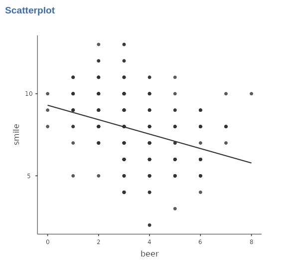
```
</div>

Indeed, the correlation between _beer_ and _smile_ would be $r=-.320$. However, this representation does not consider the fact that the sample is not a random sample of people, but a sample of bars, within each a sample of people is selected. Why should it matter? Well, being in a particular bar may influence the amount of smiles one smiles, for instance, or may influence the relationship between the two variables. 

To visualize this relationship, we can examine a scatterplot depicting the two variables, with the colors of the dots representing the bars.

<div style="text-align:center" class="pic">
```{r ,echo=FALSE, out.width="80%"}
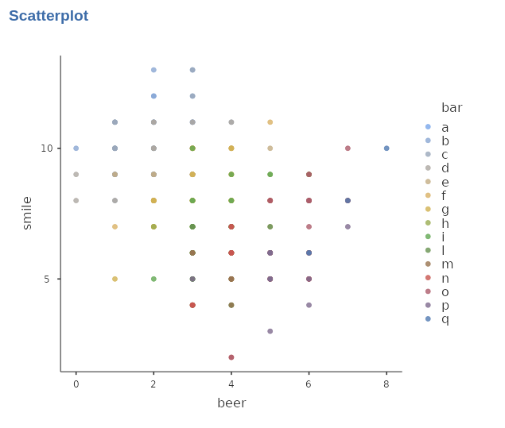
```
</div>

It appears that the choice of bar does influence the results, as certain bars tend to have higher average scores in terms of smiles. Additionally, within each bar, there seems to be a positive relationship between the number of smiles and beers consumed. This can be observed by plotting individual regression lines, estimated separately for each bar, which would exhibit a positive trend between the variables.

<div style="text-align:center" class="pic">
```{r ,echo=FALSE, out.width="80%"}
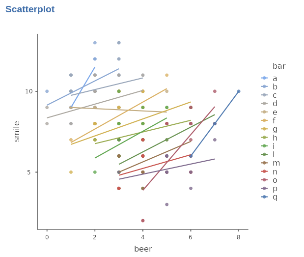
```
</div>

Indeed, when fitting a separate straight line for each bar, we can achieve a more accurate fit to the data. However, it appears that these regression lines have varying intercepts (starting heights) and different slopes (steepness), indicating differences between bars in terms of their average number of smiles and beers consumed.

This means, however, that a simple straight line, defined equally for all participants in the sample, would not work. We need to model the clustering created by bars as well.

## The statistical model

Let us continue our representation of cluster-specific regression lines with the help of some formulas, representing a regression line for each bar: 

$$ 
\hat{y}_{ij}=a_j+ b_j \cdot x_{ij}
$$
Here we have that the predicted value of participant $i$ in bar $j$ is predicted with an intercept of the bar ($a_j$) the participant belong to, and the participant score $x_{ij}$ multiplied by the cluster-specific coefficient $b_{j}$. In other words, the coefficient of the regression line vary from cluster to cluster.

Now, if we estimate this model, we will have a set of intercepts, one for each bar (cluster), and a set of slope coefficients, again one per bar. Since the bars represent a random sample of bar, also their coefficients would represent a random sample of coefficients. So, the coefficients have their own distribution. For instance.

<div style="text-align:center" class="pic">
```{r ,echo=FALSE, out.width="80%"}
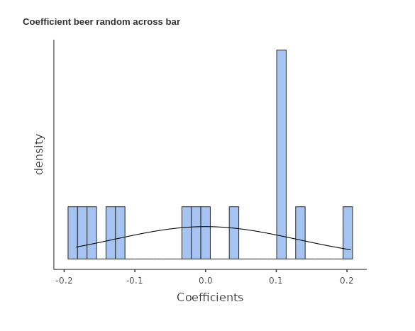
```
</div>

<div class="enf">
The coefficients in this case are referred to as **random coefficients** since they vary from cluster to cluster, with each cluster representing a sample from the population. These random coefficients capture the variability in the relationship between the variables across different clusters, specifically bars in this context
</div>

However, we need varying coefficients to capture possible effects of the clustering, but we are interest in the relationship between _beer_ and _smile_, not to the variability. The sensible action, therefore, is to take the average of the random coefficients across the $J$ clusters and use it to represent the "general" effect of _beer_ of _smile_
$$
\bar{b}=\frac{\sum_i{b_j}}{J} 
$$
Because in one distribution there is only one mean, we can call this a **fixed coefficient**. Now, to put everything in one model, let us express the random coefficients as a deviation from their mean, or fixed coefficient.

$$
\begin{aligned}
b'_j=b_j-\bar{b}\\ 
a'_j=a_j-\bar{a} 
\end{aligned}
$$
and write the model again


$$ 
\hat{y}_{ij}=\bar{a}_j+a'_j+ (\bar{b}_j+b'_j)  \cdot x_{ij}
$$
Indeed, in this model, the intercept is composed of the fixed (average) intercept plus a cluster-specific intercept deviation (random), representing the deviation from the average intercept for each particular cluster. Similarly, the effect of variable $x$ is comprised of the fixed (average) slope plus a cluster-specific (random) slope deviation, representing the deviation from the average slope for the specific effect of $x$ in each cluster.

<div class="enf">
A linear model that encompasses both fixed and random coefficients is called a **Linear Mixed Model**
</div>

## Outcome of the model

Generally speaking, when a mixed model is estimated the most important results are the fixed effects. We can interpret them as the coefficients in the GLM (`r cap("glm")`), keeping in mind that they are the average of the random distribution of coefficients. We also obtain the variances and covariances of the random effects, usually refered to as _the random component_, which may be of interest for the analyst. As for any other linear model, we can look at the results from the _variance angle_ and from the _coefficients angle_, because `r modulename()` offers results for both approaches.

Being the mixed model a linear model, we can operate all the techniques and methods we have explored within the GLM and the GzLM models, such as posthoc analysis, interaction,  simple effects,  model plotting, bootstrap inference etc.

## Building a Mixed Model

When confronted with a new design and the need to build a mixed model, some difficulties can arise. These challenges typically revolve around selecting the appropriate clustering variable and determining the status of effects as random, fixed, or both. Expert opinions on these matters have sparked extensive discussions and disagreements. However, in this context, we aim to offer straightforward solutions to these dilemmas.

First, when building a mixed model, one should ask three questions:
<div class="enf">
1) What is (are) the clustering variable(s)?
2) What are the fixed effects?
3) What are the random effects?
</div>

### Clustering variables?

<div class="enf">
A clustering variable is a categorical variable that represents a random selection of equivalent groups of cases (such as participants or observations) taken from a larger population of groups. These clusters are formed based on shared characteristics or grouping criteria. 
</div>

First, the groups of observations (or participants) defined by a clustering variables should represent a sample of a larger population. This means that the researchers did not pick any particular group on purpose, but the groups were chosen randomly (or very close to randomly). Second, the groups should be equivalent, meaning that no particular group is more interesting than others. They are just alternatives that came out from the sampling process.

Consider for instance a multinational study: the classification of the variable "country" as a clustering variable depends on the nature of the research design. If the aim is to collect data from as many countries as possible, and a sample of countries becomes available, then "country" can be considered a clustering variable. In this scenario, the focus is on capturing the variability between different countries.

On the other hand, if the research objective is to compare two or three specific countries chosen for their distinct characteristics, "country" would not be treated as a clustering variable. Instead, it would be included in the model as a categorical independent variable. In this case, the interest lies in examining the specific effects of the chosen countries and assessing the differences between them.

Finally, a clustering variable should define a sample of groups that is representative of the larger population. However, if the number of groups is insufficient to constitute a reliable sample, it may be more appropriate to designate the variable as a categorical independent variable rather than using a mixed model.

### Fixed effects?

The answer to this question is straightforward: all the effects of interest are considered fixed effects. Specifically, this includes the effects of the variables, along with the intercept, and any relevant interactions and higher-order effects that are appropriately included in the design under consideration.

### Random Effects?

Not all effects in a model can be considered random because not all effects exhibit variation across clusters. It is important to differentiate between potential variability and empirical variability.

<div class="enf">
The effects that can be  considered potential random coefficients are those that may exhibit variability across clusters. To exhibit variability across clusters, it should be possible to compute the coefficient within each cluster. If each cluster may express a different value for the coefficient, the coefficient may vary from cluster to cluster. If this condition is met, the coefficient can be included in the list of random coefficients.
</div>

Alternatively, one can identify potentially random coefficients as those effects associated with variables that vary within-clusters. If the variable varies within a cluster, than its coefficient can be computed for that cluster, and therefore it may have a different value from cluster to cluster ^[This latter definition does not apply well to intercepts, but intercepts can always be potentially random coefficients].

Let's consider an example within our cover story. Suppose in the sample we have two groups of supporters representing rival sport teams. The effect of the team variable represents the difference in the dependent variable between these two groups of supporters. This effect can be considered a fixed effect. However, whether the effect of the team should also be considered random depends on the design of the study.

If each bar in the sample hosts supporters of both teams, it becomes possible to compute the difference between the teams within each bar. In this case, the effect of the team can potentially be treated as a random effect. On the other hand, if each bar exclusively hosts supporters of only one team, it is not feasible to compute the team effect within each bar. Consequently, the coefficient has no potential to be random and should be estimated solely as a fixed effect.

Having said that, it is still possible that not all effects that are potentially random exhibit empirical variability in the data. In some cases, even though an effect could have theoretically varied, it may not show any actual variability in our dataset. Such effects that do not demonstrate empirical variation should be removed from the list of random coefficients. Including them can impede model convergence and potentially introduce bias into the results. When this is the case, the results of an initial estimation of the model would suggest which coefficients are not empirically random. 


## Model Estimation

We now show how to estimate a simple model with one continuous independent variable. The clustering variable is the $bar$ variable,featuring 15 clusters. After selecting `r opt("Linear Models -> Mixed Model")` menu, we can set the variables and their roles.

<div style="text-align:center" class="pic">
```{r ,echo=FALSE, out.width="70%"}
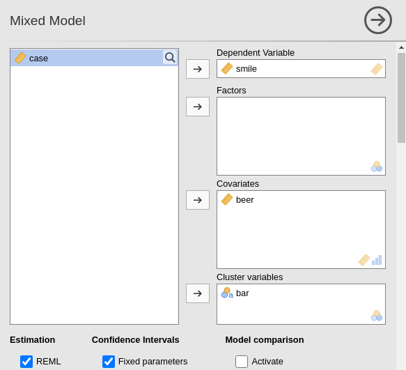
```
</div>

We notice that we insert $bar$ in the clustering variables. Now the model needs to be defined. The fixed effects are inserted by defaults as the effects of the independent variables. 

<div style="text-align:center" class="pic">
```{r ,echo=FALSE, out.width="70%"}
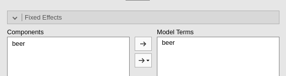
```
</div>

The random coefficients must be defined by the user. On the left side, all possible effects are listed, with the notation `coefficient | cluster`. Please notice that the listed coefficients are not only the potential random coefficients, but all possible coefficients. Thus, it is the user's responsibility to pick the correct potential random coefficients.  

<div style="text-align:center" class="pic">
```{r ,echo=FALSE, out.width="70%"}
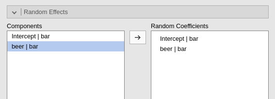
```
</div>

As soon as we define the random component, the estimation begins.

## Results

<div style="text-align:center" class="pic">
```{r ,echo=FALSE, out.width="70%"}
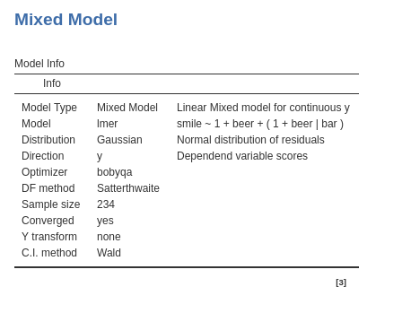
```
</div>

As observed with other models estimated using `r modulename()`, the `r tab("Model Info")` table provides a summary of information about the estimated model. One key statistic is \( N \), which indicates the number of units used in the analysis, corresponding to the non-missing rows in the dataset. In this specific example, \( N \) represents the number of individuals in the sample. However, in other applications, \( N \) might refer to the number of measurements or the total number of trials in an experiment.

The other pieces of information should be self-explanatory. For the `optimizer` row, it indicates what algorithm has been used to optimize the solution. Info about this can be found in `r  link_pages(nickname="mixed_specs", path="../docssource/")`.

Degrees of freedom refers to the method used to estimate the $DF$ of the effects. Again, details are in `r  link_pages(nickname="mixed_specs", path="../docssource/")`.

## Random component


Although the `r tab("Random component")` table is not at the top of the output panel, it is a good idea to examine it first. This table contains the variances of the random coefficients and the error variance. Checking these values is important because we need to ensure that each random coefficient has a positive variance, indicating that the model has identified some variability. If no variance is found for a random coefficient, the model may fail to converge. When this occurs—often due to a lack of variance in a random coefficient—we should remove the coefficient from the list of random coefficients and re-estimate the model. This step ensures that all remaining coefficients have meaningful variances. Variances of the random coefficients are typically reported in papers and statistical reports.

<div style="text-align:center" class="pic">
```{r ,echo=FALSE, out.width="70%"}
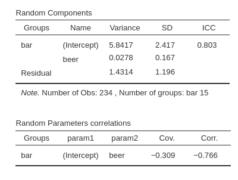
```
</div>


Another crucial check is to verify that the correlations among random coefficients are not $1$ or $-1$. If a correlation equals $1$ or $-1$, it indicates redundancy between random coefficients. In such cases, the redundant coefficient should be removed from the list. When deciding which coefficient to remove, prioritize removing the higher-order coefficient. If the correlated coefficients are of the same order, remove the one with the smallest variance.


## R-squares

R-marginal and R-conditional are proportion of reduced error, or pseudo-R2.

<div style="text-align:center" class="pic">
```{r ,echo=FALSE, out.width="100%"}
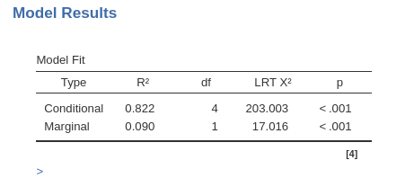
```
</div>


They are described in @nagawa2  and implemented in piecewiseSEM R package. For our purposes, we can interpret them as follows: R-marginal is the variance explained by the fixed effects over the total (expected) variance of the dependent variable. The R-conditional is the variance explained by the fixed and the random effects together over the total (expected) variance of the dependent variable. In our example, the fixed effects do not explain much (.090), but the overall model (fixed+random) captures a fairly big share of the variance (.822).

## Independent Variable effect

<div style="text-align:center" class="pic">
```{r ,echo=FALSE, out.width="100%"}
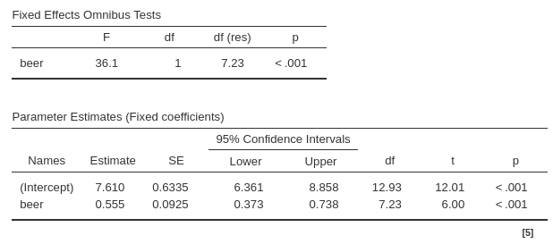
```
</div>

Next, we examine the `Omnibus Tests` and the `Parameter Estimates` tables, which provide the model's coefficients. Since we have only one continuous variable, `r IV`, we can focus on the parameter estimates table. The `Estimate` column reports the \( B \) coefficient of the model. From this, we see that the expected number of smiles increases by \( 0.555 \) units for every one-unit increase in `beer`, averaging across _bars_. This averaging is necessary to include in the interpretation because the fixed effect of _beer_ was estimated as the average of the random effects across bars. 

The `t-test`, `df`, and `p-value` can be interpreted as usual. Essentially, we interpret the \( B \) coefficient associated with `r IV` as in a simple regression, while understanding that the fixed effect represents the average result from a distribution of possible effects across clusters.

## Plots

Even for simple models such as the one in this example, it is helpful to visualize the effects by plotting them. This allows us to display both the fixed-effect line and the random-coefficient lines, providing a complete picture of the estimated model.

<div style="text-align:center" class="pic">
```{r ,echo=FALSE, out.width="70%"}
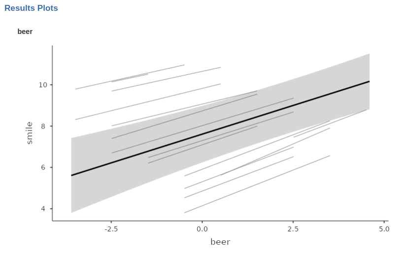
```
</div>

In this example, we can observe that bars generally exhibit a positive relationship between `beer` and `smile`, although the strength of the effect varies across bars. Additionally, the intercepts (i.e., the heights of the lines) differ substantially across bars, indicating significant variation in the average value of the dependent variable across clusters.


`r incomplete`
