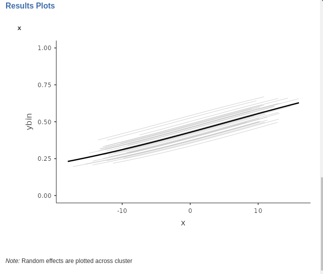

--- 
title: "GAMLj Models"
author: "Marcello Gallucci"
date: '2023'
output: pdf_document
documentclass: book
bibliography:
- book.bib
- thisbook.bib
biblio-style: apalike
link-citations: yes
github-repo: mcfanda/gamlj.github.io
description: Examples of using GAMLj jamovi module to estimates different types of
  linear models
site: bookdown::bookdown_site
---

```{r results='hide', echo=FALSE}
library(mcdocs)
mcdocs_init()
```

# Generalized Mixed Linear Models {#gmixed}

`r draft`

`r keywords("Generalized Linear Model, Logistic Regression, logit, Mixed Model, Multilevel Models")`

## Introduction

The generalized linear model (cf. `r cap("gzlm")`) is very convenient in analyzing models with categorical and non-normally distributed variables. The Mixed model (cf. `r cap("mixed")`) is useful to tackle designs with multilevel sampling, where units can be correlated due to the clustering of data. The _Generalized Mixed Linear Models_ (GZMM) allow us to predict categorical and non-normally distributed variables when data are clustered and dependent. 

From a theoretical point of view, we do not need to add much to what we have seen in the previous chapter. The setup of the GZMM is carried out exactly as it is done for the Mixed Model (cf. `r sec("mixedbuild")`). The choice of the particular application of the generalized model is carried out exactly as it is done for the generalized linear model (cf. `r cap("gzlm")`). Thus, we can estimate logistic, ordinal, multinomial, Poisson and negative binomial models when the data are clustered, in repeated-measure designs or in multilevel sampling designs.


Thus, we are not going to repeat the specific characteristics of each model, because they have been discussed in the previous chapters. We highlight the noticeable features that characterize each application of the generalized linear model with random coefficients and clustered data.

<div class="enf">
For the remainder of this chapter, we will not cover all the possible models provided by r modulename() in the generalized mixed model. This is because, when setting up the models, one can refer to the mixed model (r cap("gzlm")), and when interpreting the results, one can refer to the generalized linear model (r cap("gzlm")). HHowever, we will explore an example using the logistic mixed model and subsequently highlight certain features of other models that may yield unexpected results.
</div>

## Examples

For all the examples, we will utilize the 'clusteredmanymodels' dataset available in the r jamovi library. To add some appeal to the example, we will incorporate the same cover stories employed in the generalized linear model . Regarding the mixed model (see r sec("mixeddata")), we envision the data being collected by sampling a set of bars and, within each bar, sampling the customers.

## Mixed logistic model

The logistic model predicts a dichotomous variable by estimating the logit of belonging to one group instead of the other. This involves predicting the logarithm of the odds of belonging to that particular group rather than the other (refer to `r sec("logistic")` for more information). In the `clusteredmanymodels` dataset, we have a dichotomous dependent variable called `ybin` that includes two groups. In the cover story, `ybin` indicates whether the participant visited the restroom, with `1=YES` and `0=NO` (cf. `r sec("logisticestim")`). So we use a _Generalized Linear Mixed Model_.

We have a dichotomous variable that we want to predict using a continuous variable ($x$ for beers). However, it is important to consider that the data are not independent units drawn from a random sample. Instead, they are clustered due to bars (variable `cluster`).

### Model Estimation

First, we open the analysis by selecting `r opt("Generalized Mixed Models")` in the `r opt("Linear Models")` menu. Then, we select the `Logistic` model in the upper side of the input panel.

<div style="text-align:center">
```{r ,echo=FALSE, out.width="80%",  }
knitr::include_graphics("bookletpics/5_logistic_input1.png")
```
</div>

Then, we can set the variables in their variable role field, as we did for any other model. 

<div style="text-align:center">
```{r ,echo=FALSE, out.width="80%"}

```
</div>

The fixed effects are automatically included in the model, so our focus should be on the random effects. Building upon the reasoning discussed in r sec("mixedbuild"), we can designate both the intercept and the effect of $x$ as random coefficients. Since both coefficients can be estimated within each cluster, they have the potential to vary across clusters.

<div style="text-align:center">
```{r ,echo=FALSE, out.width="80%"}
knitr::include_graphics("bookletpics/5_logistic_input3.png")
```
</div>

### Model Info

The usual recap table is produced and filled as soon as we set the random component of the model. Here we find the type of information required to interpret the logistic regression (cf. `r sec("logisticrecap")`). 
`r tobecontinued`

<div style="text-align:center">
```{r ,echo=FALSE, out.width="80%"}
knitr::include_graphics("bookletpics/5_logistic_output1.png")
```
</div>

We want to be sure that the direction of the effects are clear, so we check in the `Direction` row that we are predicting belonging to group 1 over group 0.

### Model Fit

<div style="text-align:center">
```{r ,echo=FALSE, out.width="60%"}

```
</div>

Similar to the linear mixed model, in the current context, we have two indices of goodness of fit. Since we are dealing with a generalized linear model, the fit can be understood as the reduction in error or deviance attributable to the effects included in our model. The conditional $R^2$ provides an assessment of the overall fit, encompassing both fixed and random effects. The marginal $R^2$ informs us about the fit contributed solely by the fixed effects of the model. 

The inferential tests are based on the likelihood-ratio test (`r ext_url("LRT,","https://en.wikipedia.org/wiki/Likelihood-ratio_test")`): For the conditional $R^2$, the whole model is compared with a logistic model with only the intercept as parameter. So it tests all parameters of the model, fixed and random together. For the marginal $R^2$, the whole model is compared with a logistic model with a fixed intercept and the same random coefficients of the model, so the fixed effects are tested.

### Random Component

<div style="text-align:center">
```{r ,echo=FALSE, out.width="80%"}
knitr::include_graphics("bookletpics/5_logistic_output3.png")
```
</div>

In this analysis, our objective is to verify the accuracy of our estimated random structure, ensuring that each coefficient exhibits variance without encountering collinearity issues among them. In our specific example, we observe some variance for the intercepts ($\sigma^2 = 0.0865$), but a negligible variance for the random coefficients associated with $x$. This suggests that the random coefficients of $x$ do not make a substantial contribution to the model's fit, implying that they can potentially be excluded from the random component. Furthermore, the correlation between the $x$ coefficients and the intercepts across clusters indicate that the $x$ coefficients are redundant, because they correlate -1 with the intercepts, so they do not bring any additional fit to the model.

If the user needs to test these variances against zero, the LRT tests are available as well (cf `r sec("mixedre")`).

<div style="text-align:center">
```{r ,echo=FALSE, out.width="70%"}

```
</div>

As expected, the tiny variance of the $x$ coefficients does not appear to be statistically different from zero.

### Coefficients

<div style="text-align:center">
```{r ,echo=FALSE, out.width="80%"}
knitr::include_graphics("bookletpics/5_logistic_output4.png")
```
</div>

The model fixed effects can be interpreted as in a standard logistic regression. On average across _bars_ (clusters), for the average number of _beers_ drunk ($x$) the expected odd of visiting the restroom is $exp(B)=.750$. As we increases _beers_ ($x$) of one unit, the odd of visiting the restroom increases of $exp(B)=1.052$.

### Plot 

A plot of the predicted probability as a function of the independent variable is always a good way to have a clear picture of the relationship between the dependent and the independent variable.  Since we are dealing with a mixed model,  it instructive to ask for the `random effects` as well, so we can say the full model predicted values. Each gray line depicts the estimated values for a specific cluster, and the solid black like the fixed effect.

<div style="text-align:center">
```{r ,echo=FALSE, out.width="80%"}

```
</div>

### Other options and techniques

All other options available in the logistic generalized mixed model operate similarly to those in the generalized model or the mixed model. However, it is important to note that the r opt("Bootstrap") option, although functional, can be extremely time-consuming for this type of model. Therefore, it is advisable to be prepared for a potentially lengthy wait if utilizing this option.

## Other model charateristics

As mentioned, all other model within the generalized mixed model can be estimated and interpreted based on the material of the previous chapters. When setting up the models, one can refer to the mixed model (`r cap("gzlm")`), and when interpreting the results, one can refer to the generalized linear model (`r cap("gzlm")`).

A few notes are nonetheless interesting to mention.

### Multinomial mixed model

The multinomial model is undoubtedly the strangest of the linear models discussed in this book, and its mixed version is no exception. The set up poses no challenge, but in the results section one finds a different way to report the random coefficients variances.

Let's use the `clusteredmanymodels` dataset to predict the dependent variable ycat, which consists of three groups, using a continuous independent variable, denoted as $x$. Similar to the generalized multinomial model (`r sec("multinomial")`), the model estimates $K-1$ logistic regressions, where $K$ represents the number of groups or levels within the dependent variable. Each regression corresponds to a dummy variable required to incorporate the categorical dependent variable into the model. Consequently, the model comprises $K-1$ intercepts and $K-1$ effects of the independent variable.

<div class="enf">
If we set the intercepts as random coefficients, we will obtain a table displaying the variances and covariances among all the random intercepts. On the other hand, if we set both intercepts and slopes as random coefficients, we will obtain a table encompassing the variances and covariances of all the intercepts and slopes.
</div>

Let's see an example. The fixed effects are set as this:

<div style="text-align:center">
```{r ,echo=FALSE, out.width="70%"}

```
</div>

The random effects are set as this:

<div style="text-align:center">
```{r ,echo=FALSE, out.width="70%"}

```
</div>

Fixed effects results are:

<div style="text-align:center">
```{r ,echo=FALSE, out.width="90%"}

```
</div>

and the random coefficients variances and covariances are:

<div style="text-align:center">
```{r ,echo=FALSE, out.width="50%"}
knitr::include_graphics("bookletpics/5_multinomial_output2.png")
```
</div>
For each random coefficient, its variance is located on the diagonal of the random variance-covariance matrix, while the covariances are found in the off-diagonal cells. To provide more specific details, the 2~1 represents the intercept of the logistic regression model predicting the dummy variable for level 2 vs level 1. Similarly, the 3~1 corresponds to the intercept of the logistic regression model predicting the dummy variable for level 3 vs level 1, and so forth. The coefficient x~2 represents the random coefficient associated with the variable x predicting the first dummy, x~3 is the coefficient predicting the second dummy. Thus, the first diagonal value denotes the variance of the first logistic intercept, the second diagonal value signifies the variance of the second logistic intercept, and so on. 

`r tobecontinued`